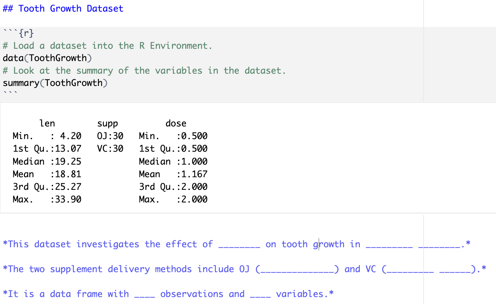
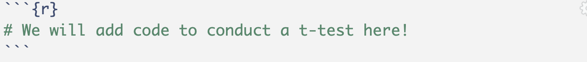

::: callout-tip
# Read and follow all lab instructions carefully!
:::

## Setup

### Make a Lab Directory

If you have completed the course setup, you have already completed steps 1 & 2 below.

1.  If you have not already, create a folder on your computer called "stat-331" or similar.

2.  Create an RStudio Project **inside** of this folder.

3.  Inside your stat-331 folder, create another folder called either "week-1" or "labs". Remember, we are trying to be organized and **not work out of our Downloads folder**!

4.  Inside of this folder, create another folder called "lab1" or similar.

### Create your Lab 1 File

To create a Quarto document, you first need to ensure Quarto is installed on your computer. (You should have already done this! If not, follow the instructions in the [Week 1 Reading](../../reading/week-1.1.qmd)). 

1.  Once you have Quarto installed, open RStudio on your computer.

2.  In RStudio, go to `File` \> `New File` \> `Quarto Document...` and click on `Create` in the dialog box **without changing anything**.

::: callout-warning
For the instructions in this lab, I am expecting that the .qmd document you just created will look *exactly* like the one shown in the [Quarto-Rendering](../../slides/week-1/w1-notebooks.qmd#/quarto---rendering) course slide. If your document is instead entirely blank other than a YAML header, some of these instructions will be confusing and you should talk to me!
:::

3.  Change the title of your document to be "Lab 1: Introduction to Quarto"

4.  Add additional lines to your YAML header:

-   add a line with `author: ` and your name.
-   add a line with `embed-resources: true`.
-   add a line with `code-tools: true`.
-   (optional) add a line to specify the `editor` as your preference for either source or visual.

5.  Save the Quarto file as "lab1.qmd" in your "week-1" or "labs" folder. You can change up the name of your document, but the name **cannot** have spaces and it should describe what the document is.

## Changing the Execution Options

Execution options specify how the R code in your Quarto document should be displayed. This [guide](https://quarto.org/docs/computations/execution-options.html) provides descriptions on the options you can specify in a document's execution.

To start, your YAML should look something like this:

```{yaml}
#| echo: true
---
title: "Lab 1: Introduction to Quarto"
author: "Dr. C"
format: html
embed-resources: true
code-tools: true
editor: source (or visual)
---
```

Similar to how you added an `author`, `embed-resources`, (and `editor`) line, you will first need to add an `execute` line to your YAML that includes multiple options.

**Use the [guide](https://quarto.org/docs/computations/execution-options.html) to specify execution options so that:**

1.  your source code is always output on the page.
2.  your document will render even if there are errors.

## Running the Provided Code

Next, click on the "Play" button on the right of the first auto-populated code chunk. Alternatively, you can highlight (or simply put your cursor on the line of) the code you want to run and hit <kbd>ctrl</kbd> + <kbd>Enter</kbd> or <kbd>⌘</kbd> + <kbd>Enter</kbd>.

You should see the code appear in the console, as well as the result of the code (`2`). Keep in mind the `[1]` before the `2` is vector notation. This means the result is a *vector* of length 1, whose first element is `2`. 

Let's spice this code up a bit. Delete `1 + 1` from the code chunk and write the following code:

```{r}
#| eval: false
#| echo: true
# Load a dataset into the R Environment.
data(ToothGrowth)

# Look at the summary of the variables in the dataset.
summary(ToothGrowth)

# Look at a frequency table of a categorical variable.
table(ToothGrowth$supp)
```

Now run this code. You should see a six-number summary of the variables `len` and `dose` included in the `ToothGrowth` dataset, as well as the frequency of the levels contained in the `supp` variable. Second, there is just the frequency table for the `supp` variable. Further, if you inspect the Environment tab, the `ToothGrowth` dataset should appear. You can click on the dataset name (not the blue play button!) to look at the data.


## Check the Data Documentation

In your **console** (*not* in the Quarto document), type `?ToothGrowth` (or alternatively `help(ToothGrowth)`.

1. Use the information that pops up in the *Help* pane in RStudio to fill in the blanks below. 

2. Add the questions and your responses *after* the R code chunk. 

3. *Before* the code chunk, create a section header (using `#`s) that describes the contents of the section (e.g., Tooth Growth Dataset).

*This dataset investigates the effect of \_\_\_\_\_\_ \_\_\_\_ on tooth growth in \_\_\_\_\_\_\_\_\_ \_\_\_\_\_\_\_\_.*

*The two supplement delivery methods include OJ (\_\_\_\_\_\_\_ \_\_\_\_\_\_\_) and VC (\_\_\_\_\_\_\_\_\_ \_\_\_\_\_\_).*

*It is a data frame with \_\_\_\_ observations and \_\_\_\_ variables.*


Your Tooth Growth Dataset section should look something like this (although it will also include the table of `supp`):

```{r}
#| out.width: "80%"

```

## Creating a Plot {#sec-creating-a-plot}

The second code chunk automatically provided is just as boring as your first, so let's spice it up! Replace the `2 * 2` code with the following (we will talk about graphics next week!):


```{r}
#| eval: false
#| echo: true
# make sure to load the package ggplot2
library(ggplot2)
ggplot(data = ToothGrowth, 
       aes(x = supp,
           y = len)) +
  geom_boxplot() +
  labs()
```


Now, run this code chunk! You should see side-by-side boxplots comparing tooth length between the two supplement delivery methods contained in the `ToothGrowth` data set.

Look back at the help documentation for the `ToothGrowth` dataset to determine what `len` represents (i.e., “Length of xxx”).

Next, look up the help file on the `labs()` ggplot2 function to find the arguments you can use to specify the $x$- and $y$-axis labels.
Change the $x$-axis and $y$-axis labels to display reader-friendly axis labels as found in the `ToothGrowth` help file. For example, “Supplement Type” is better than “supp”.

::: callout-tip
# Hint - help files for axis labels

Particularly, looking at the *examples* at the bottom of the help file and [this site](https://www.sthda.com/english/wiki/ggplot2-title-main-axis-and-legend-titles) may also be helpful.

You should not be using `xlab()` and `ylab()`, but arguments *in* the `labs()` function.
:::

Note that `#| echo: false` is an output option applied only to this specific code chunk. **Remove this line so the code appears in your final rendered document.**

Create another section header (like you did before) stating what is included in this section.

## Inserting a New Code Chunk

Navigate to the last sentence of the Quarto document. We're now going to insert a new `R` code chunk at the bottom of the document.

There are four different ways to do this:

1.  type <kbd>ctrl</kbd> + <kbd>alt</kbd> + <kbd>i</kbd> on Windows, or <kbd>⌘</kbd> + <kbd>⌥</kbd> + <kbd>i</kbd> on macOS,

2.  Click on the  symbol. This should automatically default to R code, but if you have a Python compiler on your computer, you might need to select "R" from the options.

3.  If you are using the Visual editor, click on the "Insert" button, then select "Code Chunk", and finally select "R".

4.  Manually add the code chunk by typing ```` ```{r} ````. Make sure to close your code chunk with ```` ``` ````.

```{r}

```


## Conducting Statistical Analyses 

Using R to conduct statistical analyses is an element of this course that we will mainly explore in labs before the end of the quarter. This will also help you practice reading R documentation.

::: {.callout-tip}
### Refresher on a two-sample independent t-test

While a second course in statistics is a pre-requisite for this class, you may want to go [here](https://openintro-ims.netlify.app/inference-two-means) for a refresher on conducting two-sample independent t-tests.

:::

In this section, we are going to conduct a **two-sample independent t-test** to compare tooth length between the two supplement methods in the `ToothGrowth` dataset. I have outlined the null and alternative hypotheses we will be testing:

::: {.callout-note icon=false}

### Null

The treatment mean tooth length for the OJ supplement delivery method is the same as the treatment mean tooth length for the VC supplement delivery method.

:::

::: {.callout-note icon=false}

### Alternative

The treatment mean tooth length for the OJ supplement delivery method is different from the treatment mean tooth length for the VC supplement delivery method.

:::


Carry out the following steps:

1. Look up the help documentation for `t.test()`. 

:::callout-tip
### Hint - Formula Syntax 
Look at the example for a two-sample t-test comparing `mpg` in morning and afternoon with the `mtcars` data. 

The most straight-forward approach (IMO) is using **formula** syntax, which is commonly employed in functions for statistical tests! I suggest you read more about [formula syntax](http://econometrics.blog/post/the-r-formula-cheatsheet/) as well. 
:::

2. Using the function `t.test()`, write code to carry out the analysis. You can assume unequal variances and a two-sided alternative.

3. Run your code chunk to obtain the output for your statistical test.

4. Write a numbered list (in Markdown, like what you see here) below the code chunk presenting:

    1.   Your conclusion (in the context of these data) based on the p-value. 
    2.   The confidence interval for the difference in treatment means making clear the direction of the difference (make sure to read what confidence level is used by default).

5. Create another section header, describing the contents of this section.


## Render your Document

Render your document as an **html** file. Use the "Render" button (the blue arrow!) at the top of your screen.

If you run into trouble rendering your document, try restarting R and running your code chunks in order, and see if you can find the problem.

Another common issue is deleting the tick marks (```` ``` ````) that surround your code chunks. If you notice that the code chunks are not showing a "Play" button, or that they are not highlighted in gray, double check your tick marks!

Recall we included `error: true` in our YAML execution options. This means that your document will still render even if there are errors. Make sure you are double checking your work!

You will notice that there is auto-generated text that is unrelated to the work that you completed. It is always a good idea to delete this extra text!


## Include an Image

1. Save an image of an activity, place, book, or movie that you enjoy. Save the image somewhere that makes sense to you in your course directory. 
2. Check out this [documentation](https://quarto.org/docs/authoring/figures.html) for how to include an image/figure in Markdown. 
3. Include your image at the end of your lab, along with a brief description.
  - The Markdown code will look something like: ``
  - You must use a **relative file path** to your image!
  - You may want to adjust the image size.
4. Add a new section header before your image.
5. Render your document again to make sure it worked.

{width=30%}


## Styling your Quarto Document

You can find a list of every option you can use to format an HTML document [here](https://quarto.org/docs/output-formats/html-basics.html) and [here](https://quarto.org/docs/reference/cells/cells-knitr.html). Further, [here](https://quarto.org/docs/output-formats/html-themes.html) are lists of different themes you can specify in your YAML to produce differently styled outputs.

Make the following changes to your document:

1. Specify **“Code Folding”** in your YAML document options.

2. Specify in the code chunk options that your boxplots of tooth length by supplement delivery method should be **center aligned**.

3. Write and include a **figure caption** for the boxplots using a code-chunk option.

4. Clean it up - delete the any automatically included headers or text in the file that are still there.

You might have fun playing around with other themes or options!

## Render again!

Notice that when you render the document, all of the code reruns again, producing the same output as before, but with your changes – this is called reproducibility!

You should render **often** while completing your practice activities and lab assignments. Make small changes, then make sure the file still renders rather than making a bunch of big changes and then realizing something is wrong.


## Turn it in!

Open the .html file on your computer to make sure it looks as you expected. Then upload the rendered (.html extension) document to Canvas!

::: {.callout-caution}
Double check that you have `embed-resources: true` in your YAML. Without this, your html will **not** be formatted correctly on Canvas. You should re-download what you submitted through your Canvas portal to ensure it all looks right!
:::

:::callout-tip
You'll be doing this same process for all your future Lab Assignments. Each of these will involve a Quarto file. Some weeks, I may have a template for you to copy into the Quarto file just as with the first practice activity.
:::
