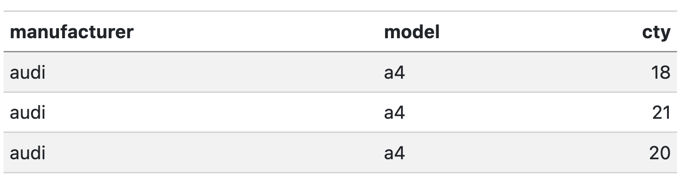
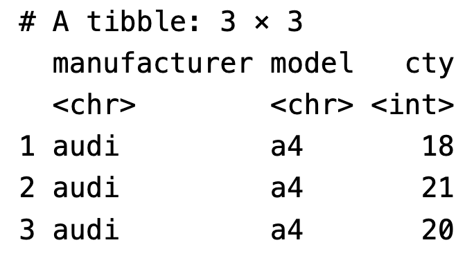
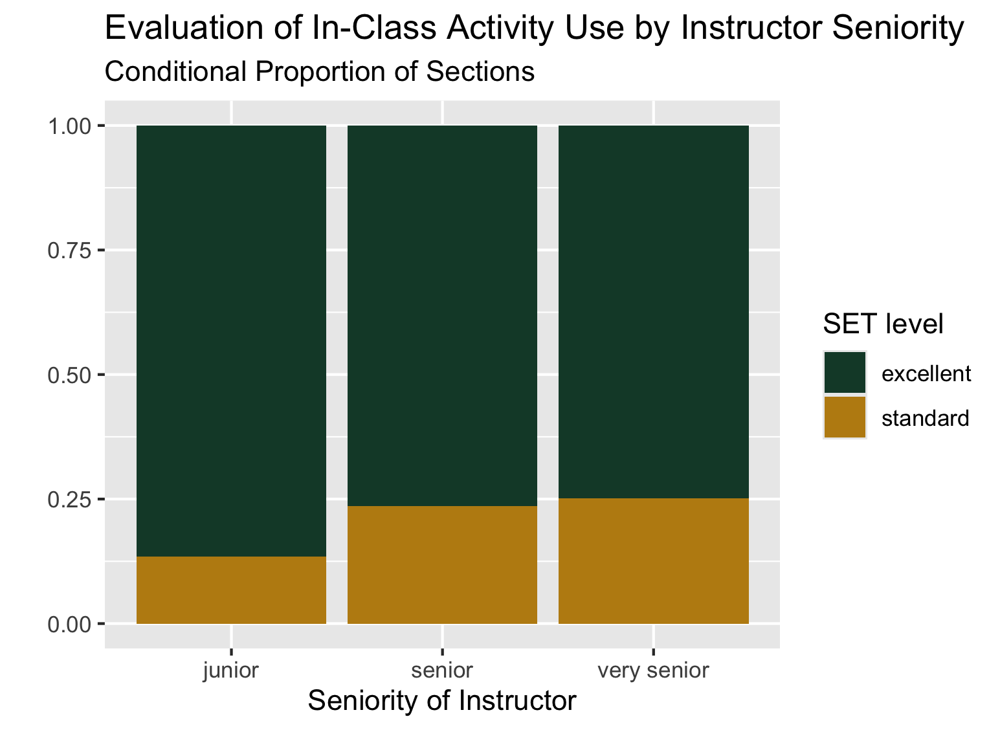

In this lab, we will be using the `dplyr` package to explore student evaluations of teaching data. **You are expected to use functions from `dplyr` to do your data manipulation!**

[Download starter .qmd file](../../student-versions/labs/lab3-dplyr.qmd)

[Download `teacher_evals.csv`](input/teacher_evals.csv)

::: callout-important
When showing rows of a data frame as a solution to a problem, use the `kable()` function from the `knitr` package to nicely format the data in your final rendered report. This means I want to see things like this:

{width=400}

Not this:

{width=200}

See the class slides for examples.

You can check out the `kableExtra` package if you want to further format any tables, but that is not necessary for this lab.
:::

::: callout-warning
Save **both** your .qmd file and your dataset in the same folder within your Stat 331 directory! **DO NOT** open the .qmd file straight from your downloads folder.
:::

::: {.callout-tip collapse="true"}
-   The first chunk of your Quarto document should be to *declare your libraries*.
-   The second chunk of your Quarto document should be to *load in your data*.
-   Make sure you address **all the questions** in these instructions.
-   If a question requires **any** type of calculation, **you should provide code for your answer!**
-   I have provided some hints about functions that might be useful to you. You are **not required** to use these functions.
-   You may have to Google to solve some of these!
-   Be sure to **save** your work regularly.
-   Be sure to **render** your file every so often, to check for errors and make sure it looks nice.
    -   Make sure your Quarto document does not contain `View(dataset)` or `install.packages("package")`, both of these will prevent rendering.
    -   Check your Quarto document for occasions when you looked at the data by typing the name of the data frame. Leaving these in means the whole dataset will print out and this looks unprofessional. **Remove these!**
    -   If all else fails, you can set your execution options to `error: true`, which will allow the file to render even if errors are present.
:::

### The Data

The `teacher_evals` dataset contains student evaluations of teaching (SET) collected from students at a university in Poland. There are SET surveys from students in all fields and all levels of study offered by the university. 

The SET questionnaire that students at this university complete is as follows:

> Evaluation survey of the teaching staff of [university name].
>
> Please complete the following evaluation form, which aims to assess the lecturer’s performance. Only one answer should be indicated for each question. The answers are coded in the following way: 5 - I strongly agree; 4 - I agree; 3 - Neutral; 2 - I don’t agree; 1 - I strongly don’t agree.
>
> Question 1: I learnt a lot during the course. 
>
> Question 2: I think that the knowledge acquired during the course is very useful.
>
> Question 3: The professor used activities to make the class more engaging.
>
> Question 4: If it was possible, I would enroll for a course conducted by this lecturer again. 
>
> Question 5: The classes started on time.
>
> Question 6: The lecturer always used time efficiently.
>
> Question 7: The lecturer delivered the class content in an understandable and efficient way.
>
> Question 8: The lecturer was available when we had doubts.
>
> Question 9. The lecturer treated all students equally regardless of their race, background and ethnicity.


These data are from the end of the winter semester of the 2020-2021 academic year. In the period of data collection, all university  classes were entirely online amid the Covid-19 pandemic. While expected learning outcomes were not changed, the online mode of study could have affected grading policies and could have implications for the data.

**Average SET scores** were combined with many other variables, including:

1. **characteristics of the teacher** (degree, seniority, gender, SET scores in the past 6 semesters).
2. **characteristics of the course** (time of day, day of the week, course type, course breadth, class duration, class size).
3. **percentage of students providing SET feedback.**
4. **course grades** (mean, standard deviation, percentage failed for the current course and previous 6 semesters).

This rich dataset allows us to **investigate many of the biases in student evaluations of teaching** that have been reported in the literature and to formulate new hypotheses.

**Before tackling the problems below, study the description of each variable** in the *data dictionary* [here](https://earobinson95.github.io/stat331-calpoly/lab-assignments/Lab3-dplyr/teacher_evals_codebook.pdf). You wil want to have this open and refer back to it!

::: {style="font-size: 70%;"}

Citation: journal, Under blind review in refereed. *University SET data, with faculty and courses characteristics.* Ann Arbor, MI: Inter-university Consortium for Political and Social Research [distributor], 2021-09-12. <https://doi.org/10.3886/E149801V1>

:::

**1. Load the appropriate R packages and the `teacher_evals` data.**

```{r setup}
# code chunk for loading packages
```

```{r}
# code chunk for importing the data
```

### Data Inspection + Summary


**2. Provide a brief overview (~4 sentences) of the dataset.**

::: callout-note
It is always good practice to start an analysis by getting a feel for the data and providing a quick summary for readers. You do not need to show any code for this question, although you probably want to use code to get some information about the data(e.g., `summary(data)`, `glimpse(data)`, `dim(data)`, etc.). Things to think about – where did the data come from? what sort of data are provided (context and data type)? how much data do you have? etc.
:::

```{r}
# you may want to use code to answer this question
```

**3. What is the unit of observation (i.e. a single row in the dataset) identified by?**

::: callout-warning
It is not one instructor per row! It’s also not just one class per row!

The data dictionary will be helpful here!
:::

```{r}
# you may want to use code to answer this question
```

**4. Use *one* `dplyr` pipeline to clean the data by**

 - **renaming the `gender` variable `sex`,**
 - **removing all courses with fewer than 10 students (participants),** 
 - **The `question_no` variable refers to the questions 1-9 in the survey, but weirdly takes the values 901-909. Update `question_no` so that it takes the values 1-9.**
 - **changing data types in whichever way you see fit (e.g., is the instructor ID really a numeric data type?), and** 
 - **only keeping the columns we will use -- `course_id`, `teacher_id`, `question_no`, `no_participants`, `resp_share`, `SET_score_avg`, `percent_failed_cur`, `academic_degree`, `seniority`, and `sex`.**
 
**Assign your cleaned data to a new variable named `teacher_evals_clean` – use this data going forward.**

::: callout-tip
The steps that I mention are not necessarily in the most efficient order.

Challenge yourself by using `across()` if applying the same function to many variables!
:::

```{r}
# code chunk for Q4
```

For the remaining questions in this section (Q5 - Q8), answer the question with at
least one sentence and include any code output that you used to answer the question. Your output should clearly answer the question.


**5. How many unique instructors and unique courses are present in the cleaned dataset?**

::: callout-tip

Helpful functions: `summarize()`, `n_distinct()`

:::

```{r}
# code chunk for Q5
```

**6. One teacher-course combination has some missing values, coded as `NA`. Which instructor has these missing values? Which course? What variable are the missing values in? Your code output should clearly answer this question.**

::: callout-tip
Helpful functions: `if_any()`
:::

```{r}
# code chunk for Q6
```

**7. What are the demographics of the instructors in this study? Investigate the variables `academic_degree`, `seniority`, and `sex` and summarize your findings in ~3 complete sentences.**

::: callout-tip

You’ll need to first manipulate your data to have each instructor represented only once.

You **do not** need to do this in only one line of code or pipeline. Explore the data!

Helpful functions: `distinct(___, .keep_all = TRUE)`

:::

```{r}
# code chunk for Q7
```


**8. Each course seems to have used a different subset of the 9 evaluation questions. How many teacher-course combinations asked all 9 questions? Your output should be a single number to answer the question.**

```{r}
# code chunk for Q8
```


## Rate my Professor

For the questions in this section (9 - 11), you don't need to write up any answers -- you only need to show the output of your code (nicely formatted with `kable()`) to respond to each. Your code output should clearly show the answer.

::: callout-tip
Helpful functions: `slice_max()`, `slice_min()` 
:::

**9. Which instructor(s) had the lowest average rating for Question 1 ("I learnt a lot during the course.") *across all their courses* (i.e. you should be looking at the mean of the `SET_score_avg` variable across courses for each instructor)? Include the number of courses the instructor(s) taught in your output**

**a. Sketch what the output to answer this question should look like and include an image of your sketch below. Write a plan for the steps to get from `teacher_evals_clean` to this output.**


**b. Implement your plan**

```{r}
# code chunk for Q9
```

**10. Which instructor(s), who had *at least five* courses reviewed in the data, had the highest average rating for Question 1 (I learnt a lot during the course.) across all their courses?**

```{r}
# code chunk for Q10
```


**11. Which instructor(s) with either a doctorate or professor degree had the highest and lowest average percent of students responding to the evaluation across all their courses? Include how many years the instructor had worked (seniority) and their sex in your output. You can use two pipelines to answer these questions.**

:::callout-tip
Thinking about how to include the seniority and sex of the instructor in your output is tricky!! There are a couple of ways to approach this. One hint is to think about how many distinct seniority levels / sexes there are for each instructor. Another hint is that you don't need any functions that we didn't learn in class...
:::

```{r}
# code chunk for Q11
```

## Chi-Square Test of Independence

::: callout-tip

## Refresher on Chi-square test of independence

While a second course in statistics is a pre-requisite for this class, [here](https://openintro-ims.netlify.app/inference-tables#inference-tables) is a refresher on Chi-square tests of independence.

:::

Let’s compare the level of SET ratings for *Question 3* (The professor used activities to make the class more engaging.) between senior instructors and junior instructors.

**12. Create a new dataset `teacher_evals_compare` that accomplishes the following with one `dplyr` pipeline:** 

1. **includes responses for Question 3 only,**
2. **creates a new variable called `set_level` that is “excellent” if the `SET_score_avg` is 4 or higher (inclusive) and “standard” otherwise,**
3. **creates a new variable called `sen_level` that is “junior” if the instructor has been teaching for 4 years or less (inclusive), “senior” if between 5-8 years (inclusive), and "very senior" if more than 8 years**
4. **contains only the variables we are interested in – `course_id`, `set_level`, and `sen_level`.**


::: callout-tip

Helpful functions:  `if_else()`, `case_when()`

:::

```{r}
# code chunk for Q12
```

**13. Using the new dataset and your `ggplot2` skills, recreate the filled bar plot shown below.**



::: callout-tip
Note that getting the general structure and reader friendly labels is good enough. I used Cal Poly's branded colors for fun, which use HEX codes `#BD8B13` and `#154734`.
:::

```{r}
# code chunk for Q13
```

**14. Use `chisq.test()` to carry out a chi-square test of independence between the SET level and instructor seniority level in your new dataset. You will want to look at the documentation and maybe Google a bit!**

::: callout-tip

Note that the `chisq.test()` function does not take a formula / data specification as we have seen before. You will either have to use `with()` or indicate the variables of interest using `$` syntax.

:::

```{r}
# code chunk for Q14
```

**15. Draw a conclusion about the independence of student evaluation of instructor's use of activities and seniority level based on your chi-square test.**


### Study Critique

Part of the impetus behind this study was to investigate characteristics of a course or an instructor that might affect student evaluations of teaching that are **not** explicitly related to teaching effectiveness. For instance, it has been shown that gender identity and presentation affect student evaluations of teaching ([an example](https://link.springer.com/article/10.1007/s10755-014-9313-4?nr_email_referer=1)).

**16. If you were to conduct this study at Cal Poly, what are two other variables you would like to collect that you think might be related to student evaluations? These should be course or instructor characteristics that were not collected in this study. Explain what effects you would expect to see for each.**
