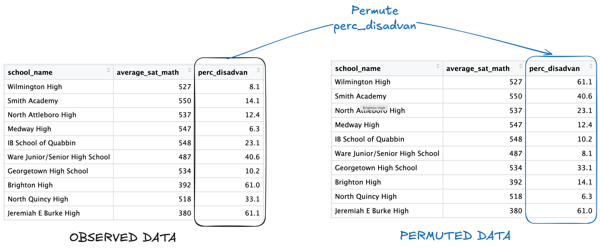
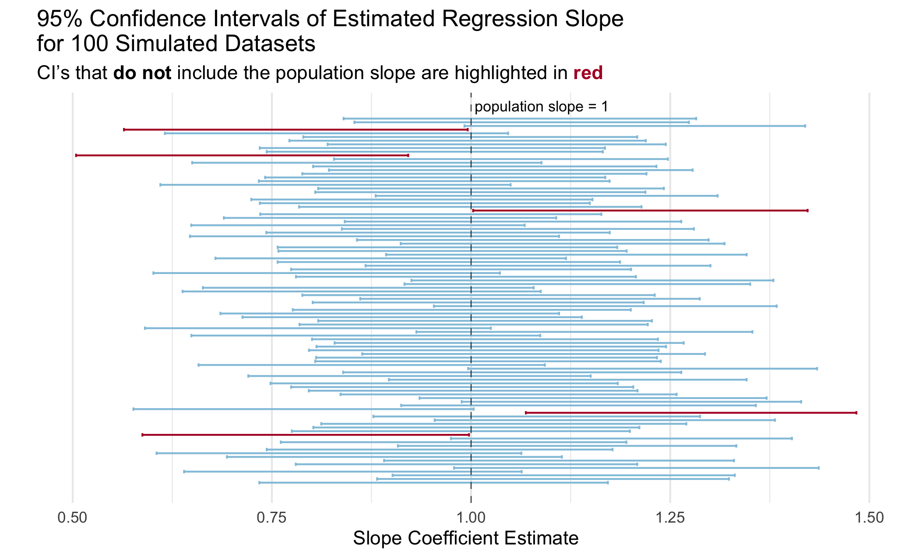

```{r, setup}
library(tidyverse)
library(broom)
```

[Download .qmd starter file](../../student-versions/labs/lab9-regression.qmd)

[Download MA_schools.csv](MA_schools.csv)

## What are standardized tests measuring?

There have long been critiques of standardized tests as a true measurement of student learning and "intelligence." Are standardized tests really measuring learning or are they catching other information about students like their class, circumstances at home, wealth of the school district, etc?? If a school has a higher average SAT Math score, does this indicate that the students and teachers at that score "better" than schools with lower SAT Math scores or are other factors at play?

We have data on 332 high schools in Massachusetts in 2017 (MA_schools.csv). The original source of the data are Massachusetts Department of Education [reports](https://profiles.doe.mass.edu/state_report/) and is provided in [ModernDive](https://moderndive.github.io/moderndive/reference/index.html).

You can find the data dictionary for the data through [ModernDive](https://moderndive.github.io/moderndive/reference/MA_schools.html).

I am interested in the relationship between the average SAT math score at schools in Massachusetts and the percent of the student body that are considered "economically disadvantaged."


**1. Create a well-formatted scatterplot of `average_sat_math` versus `perc_disadvan` along with the linear regression line. How would you describe the relationship between these two variables?**

:::callout-tip
Which variable is the explanatory variable and which is the response variable?? Pay attention to which should be plotted on the y-axis versus the x-axis.
:::

```{r}
#| label: scatterplot

# Q1 code
```


**2. Fit a simple linear regression model of average SAT math score on percent economically disadvantaged. Provide nicely-formatted table of the estimated model coefficients including some indication of variability (standard error or confidence interval) and a p-value.**

:::callout-tip
To make the table, you can either use a function from the `broom` package along with some of the table formatting techniques with `kableExtra` and `gt` we learned last week OR a function from the `gtsummary` package that we saw in class.
:::

```{r}
#| label: model

# Q2 code
```


**3. Conduct model diagnostics to check that the conditions for linear regression that we discussed in class are met (L.I.N.E.).** You may need multiple plots or output to check all diagnostics. You should be using techniques that we learned *in class* - not base R functions.

```{r}
#| label: diagnostics

# Q3 code
```


**4. Briefly discuss (2-3 sentences) what you learned about the relationship between average math ACT scores and socioeconomic status in Massachusetts schools from this analysis.**


:::callout-note
# Learn more

If you are interested in discussions of the use, history, and issues with standardized testing I would highly recommend the [Radiolab series G](https://radiolab.org/series/radiolab-presents-g).
:::

## Simulation-based Inference

The p-values that are provided in regression output for the slope coefficient is testing the hypotheses:

$H_0: \beta_1 = 0$ vs. $H_A: \beta_1 \neq 0$

As a reminder, the assumed linear model is $Y = \beta_0 + \beta_1 X + \varepsilon$, so $\beta_1 = 0$ is equivalent to saying *there is no relationship between the explanatory and response variables*.

The p-values provided in regression output in most software are based on a theory-based null distribution, which rely on the assumptions that we discussed in class. 

Another approach to generating a null distribution to test the null hypotheses above is through simulation! Assuming the null hypothesis is true, that *there is no relationship between the explanatory and response variables*, then the % of economically disadvantaged students for each school should have no impact on the mean Math ACT score. 

To emulate this null hypothesis of no reationsip in simulation, we **permute** the values of the explanatory variable between all schools, while leaving the response values the same. Here is an illustration with 10 observations from the data:




Let's generate a simulation-based null distribution and see if it aligns with the theory-based test!

**5. Fill in the function code below to conduct one simulation, generating a t-statistic for the slope coefficient, assuming the null hypothesis is true. This function should**:

- randomly permute/shuffle the values of the explanatory variable among the observations (⚠️ edit the variable - don't create a new variable)
- fit a linear regression model of the response variable on the explanatory variable
- return the value of the **t-statistic** for the slope coefficient.

:::callout-important

I have filled in some of this code for you! You should not have to edit the code I provided for Step 1 and Step 3. 

Getting a formula to work when providing bare variable names is sort of tricky, so I set that up for you in Step 1.

For example, if the function is called like so:

```
perm_slr(dat = penguins,
         resp = bill_len,
         exp = flipper_len)
```

Then the code in Step 1 will create a formula object `bill_len ~ flipper_len` that can then be used in the `lm()` function in Step 3, as provided.

:::

```{r}
#| eval: false

perm_slr <- function(dat, resp, exp){
  
  # Step 1: create a formula object with the provided
  # response and explanatory variables to be used with `lm()`
  form <- formula(
    str_c(
      deparse(substitute(resp)),
      "~",
      deparse(substitute(exp))
      ))
  
  # Step 2: create a new dataframe with the values of the explanatory
  # variable randomly permuted between the observations
  
  perm_dat <- 
  
  # Step 3: fit a regression model using the formula created in step 1
  # and the permuted data created in step 2
  
  mymod <- lm(form, data = perm_dat)
  
  # Step 4: return the t-statistic for the estimated slope coefficient 
  # from the model
  
  
  
}
```

Make sure that your function works by running this code! It should just output a single number.

```{r}
#| eval: false

perm_slr(dat = MA_schools,
         resp = average_sat_math,
         exp = perc_disadvan)
```

**Now let's generate a null distribution for the t-statistic!** I set up code for you to run 1,000 iterations of the simulation. 

```{r}
#| eval: false

set.seed(331)

perm_results <- map_dbl(.x = 1:1000,
                        .f = ~ perm_slr(dat = MA_schools,
                                        resp = average_sat_math,
                                        exp = perc_disadvan))
```

**6. Plot the simulation results!** Using `ggplot`, **create a histogram of the simulated t-statistics.** Theory tells us that the distribution of those t-statistics should follow a $t$ distribution with $n-1$ degrees of freedom, where $n$ is the number of observations in the data. **Add the theoretical density curve** for a $t$ distribution with $n-1$ degrees of freedom. Does it look like the theoretical curve matches the simulated curve? Is the observed t-statistic for the actual data (Question 2) unusual based on this null distribution?

:::callout-tip

You will need to convert the `perm_result` vector into a dataframe or tibble before passing it into `ggplot()`!

:::

```{r}
# Q6 code
```

You just implemented simluation-based inference for simple linear regression like in the [Rossman-Chance applets](https://www.rossmanchance.com/applets/2021/regshuffle/regshuffle.htm) 🥳!


## Simulating Coverage

Many students struggle with the definition of a confidence interval when first learning the concept. The interpretation that a lot of textbooks include is something like "if we were to repeat the study many many times, 95% of the confidence intervals would contain the true population parameter."

We are going to implement a simulation that illustrates this statistical concept using confidence intervals for the slope parameter in a linear regression model.

Let's break it down into a couple of steps.


As a reminder, the typical population model that we assume for a linear regression is:

$$Y = \beta_0 + \beta_1 X + \varepsilon$$
Where $\beta_0$ and $\beta_1$ are the population intercept and slope parameters and and $\varepsilon \sim N(0, \sigma^2)$ is random noise that is normally distributed with mean 0 and variance $\sigma^2$.


We will design a simulation that uses this "data generating model."

**7. Fill in the code below to generate a synthetic dataset with 100 observations. We will assume that the explanatory variable $X$ is uniformly distributed from 0 to 1 and that $\sigma^2$ = 1. The synthetic data should be a dataframe with 100 rows and two columns: `x` and `y`.**

```{r}
#| label: data-generation
#| eval: false

# define slope and intercept parameters
intercept = 2
slope = 1

# generate x vector


# generate noise `ep` vector


# generate outcome from population model
y = intercept + x*slope + ep


# create an "observed data" dataframe or tibble with only the x and y vectors

```

**8. Fit a simple linear regression model of the outcome `y` on `x`. Use `tidy()` from the `broom` package to extract a dataframe from the `lm()` output that includes the slope estimate and the lower and upper bounds for a a 95% confidence interval for the slope estimate. The output of this code should be a dataframe/tibble with one row  three columns: `estimate`, `conf.low` and `conf.high`**

```{r}
#| label: test-linear-model

# Q8 code
```


**9. Check whether the true population slope is inside of the estimated 95% confidence interval for that simulated dataset. Specifically, *add* a variable called `cover` to the dataframe of estimates you created in the last question (Q5) that is `1` if the population slope is in the interval and `0` if not.**  

::: callout-tip
As a reminder, we set `slope = 1` in the data generation (Q4) so the true population slope is $\beta_1 = 1$.
:::

```{r}
#| label: check-coverage

# Q9 code
```

**10. Now put this all together into a function called `mycifun`! Run the check provided to ensure that it works correctly**

- The function should have three required arguments: `beta0`, `beta1`, and `n` (the number of observations in the simulated data). 
- The function should complete the steps in Q7-9 given these arguments:
  
  1. generate one synthetic dataset based on the data generating model as above
  2. fit a linear regression model
  3. check that the **population slope** is contained in the estimated 95% confidence interval for the sample slope
  
- The output of the function should be a dataframe/tibble with one row and four columns: the slope estimate, lower bound of the CI, upper bound of the CI, and whether the population slope is within the CI.

```{r}
#| label: ci-sim-function

# Q10 code
```

```{r}
#| label: small-test-ci-fun
#| eval: false

mycifun(beta0 = 1, beta1 = 2, n = 1000)
```


**11a. Now run this simulation  1,000 times using `map_dfr()` and the function you wrote (`mycifun()`). Generate data with $\beta_0 = 3$, $\beta_1 = .5$ and $n = 100$. Make sure to add a line of code to make your simulation reproducible every time you run it.** 

```{r}
#| label: run-ci-sim


ci_dat <- map_dfr(.x =     ,
                  .f = 
                    )
```

**11b. What does one row in the resulting `ci_dat` represent?**


**11c. What is your simulated coverage rate? In otherwords, for what proportion of the iterations was the population slope within the estimated 95% confidence interval? Write your answer as a sentence in Markdown using inline code!**

```{r}
#| label: sim-cov


```


**12. Create a visualization to illustrate the coverage rate.**

You can create any visualization that effectively illustrates the concept. I included a plot below with my idea of an effective plot to illustrate the concept of coverage. Actually, a professor showed me a plot like this in undergrad and I have always remembered it! 


:::callout-tip
You do not need to exactly copy the plot, even if you choose to do something like it.  A couple of hints to get you started on making a plot like this one:

- Check out `geom_errorbar()`
- Check out `geom_vline()` for the line indicating the true population slope
- See [this slide](https://atheobold.github.io/ADS-course-materials/slides/week-9/iteration.html#/removing-your-legend) for code from Dr. Theobold to include colors in a title rather than a legend.
- I took a random sample of 100 simulations to make it easier to look at.
:::



```{r}
#| label: cov-plot

# Q12 code
```


