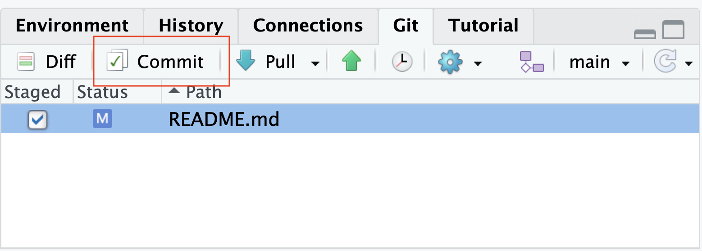
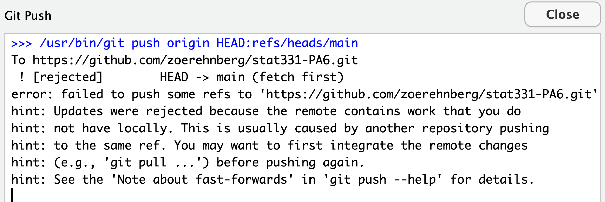
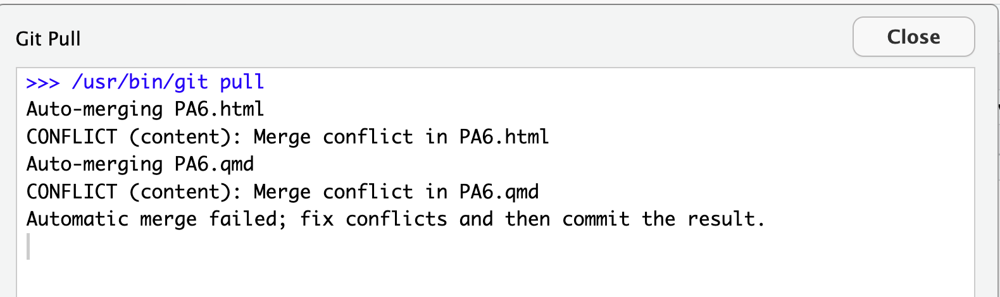
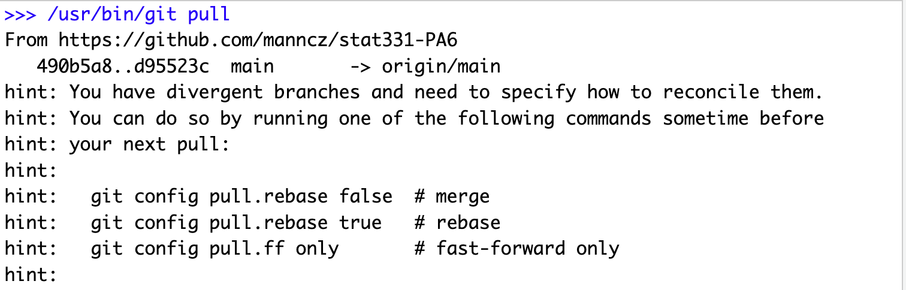
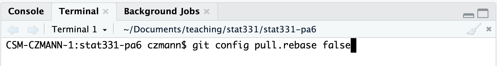
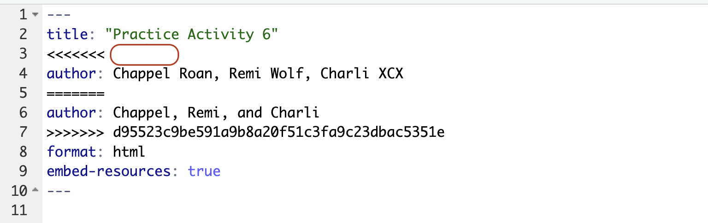
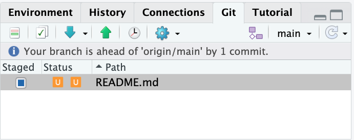
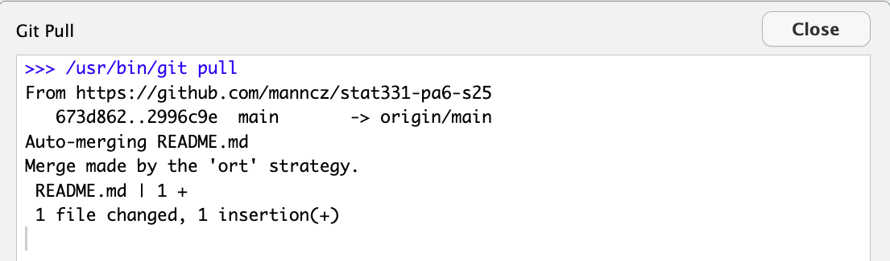

In this practice activity, you will be working in groups to create a new GitHub repository. You will practice pushing, pulling, and resolving conflicts as a team.

::: callout-warning

##    **IMPORTANT**

This activity will only work if you follow the directions **in the exact order** that I have specified them. **Do not work ahead of your group members!**

:::

## Get into Groups!

Form groups of four people. Designate each person one of the suits:

{width="20%"}

As you work through the activity, you will complete the steps assigned to your suit. Make sure you complete the steps in order and only complete the steps assigned to you!

::: callout-note

If you only have 3 group members here, assign one person both {width="3%"} and {width="3%"}.

:::

## Repository Setup

###  1. Create a Repo on GitHub.

{width="4%"} 

+ Create a new Github repo: `Repositories` > `New` .
  + Name the repo `stat331-PA6`.
  + You can choose to make it Public or Private.
  + Select `.gitignore template: R`.
+ After creating the repo, go to `Settings` > `Collaborators` > `Add people`.
  + Add your group members using their username or email.

### 2. Access the Remote Repo.

{width="4%"} {width="4%"} {width="4%"}

+ Accept the repo invite in your email -- `View invite` > `Accept invite`.
+ Open the repo on GitHub.

### 3. Clone the Remote Repo Locally.

{width="4%"} {width="4%"} {width="4%"} {width="4%"} 

+ In Rstudio: `File` > `New Project` > `Version Control` > `Git`.
+ In GitHub: click `<> Code` and copy the HTTPS address.
+ In Rstudio: paste the address as the `Repository URL`. Leave the directory name box blank.
+ Click `Browse` and create this new project on your **desktop**.
  + **Do not save this in your STAT 331 folder!!! We don't want to embed an Rproj within another Rproj.**
+ `Create Project`.

## Collaborating in GitHub

### 4. Add Documents to the Repo.

{width="4%"}

+ In RStudio, create a new Quarto file.
  + If the Quarto file is totally blank (no default content), then add a single code chunk with `1 + 1`.
  + Change the title to "Practice Activity 6".
  + **Resist** the urge to add authors.
  + Save as `PA6.qmd` in your **new** `stat331-PA6` folder on your desktop.
  + Add `embed-resources: true` to the YAML.
  + Keep the default template as is.
  + Render the document.
+ In RStudio, open and edit the `.gitignore` file to include `*.Rproj` and `*.html`.

Your directory `stat331-PA6` should have the following files:

  + `.gitignore`
  + `PA6.qmd`
  + `PA6.html`
  + `stat331-PA6.Rproj`
  
Your **Git** window, should **only** show the following files:

  + `.gitignore`
  + `PA6.qmd`

If more than this shows up, then your `.gitignore` was not completed correctly! Git should be ignoring `PA6.html` and `stat331-PA6.Rproj` for tracking.

### 5. Push Documents to GitHub.

{width="4%"}

+ Rstudio: `Git` pane.
  + `Stage` (checkmark) the `.gitignore`  > `Commit` ✅ > add a commit message (*"ignore all .Rproj files and .html files"*) > `Commit` > `Close`.
  + `Stage` (checkmark) `PA6.qmd` > `Commit` ✅ > add a commit message (*"create PA quarto file"*) > `Commit` > `Close`.
+ Rstudio: `Git` pane > `Push` (green arrow ⬆) the changes to the remote repo.

### 6. Pull Changes from GitHub.

{width="4%"} {width="4%"} {width="4%"}

+ Rstudio: `Git` pane > `Pull` (teal arrow ⬇) the changes that were made!

Everyone should now have the `.qmd` and updated `.gitignore` files in their local repo!

+ Look in your `Files` pane to make sure.

### 7. Make a Change.

{width="4%"} 

+ **Directly under** the `title:` line, add `author:` to the YAML and include everyone's **first** names.
+ Render the document.
+ Rstudio: `Git` pane > `Stage` (checkmark) files > `Commit` ✅ > add commit message > `Commit` > `Close`.
  + Use a commit message like *"add first names"*.
+ Rstudio: `Git` pane > `Push` ⬆ the changes.

### 8. Forget to Pull.

{width="4%"} {width="4%"} {width="4%"}

**Do NOT** pull the changes that were made!

### 9. Make the Same Change.

 {width="4%"}

+ **Directly under** the `title:` line, add `author:` to the YAML and include everyone's **first and last** names.
+ Render the document.
+ Rstudio: `Git` pane > `Stage` (checkmark) files > `Commit` ✅  > add commit message > `Commit` > `Close`.
  + Use a commit message like *"add first and last names"*.
+ Rstudio: `Git` pane > `Push` ⬆ the changes.

::: callout-warning

## Oh No!

You got an error! Ugh. We forgot to **pull** before we started making changes.

:::

### 10. Resolve the Merge Conflict.

 {width="4%"}
 
Rstudio: `Git` pane > `Pull` ⬇ the changes from the repo.

::: callout-caution
# 🚨 READ THIS - DO NOT IGNORE - did it work?? 🚨

If your Git Pull window does **NOT** look like this...

but maybe it looks like this:

**then...**

(a) copy-paste the first command: `git config pull.rebase false` into the **Terminal** pane (not the Console) in RStudio and hit Enter,

(b) and `Pull` ⬇ again.

:::

After sucessfully starting the pull and getting the message about a *merge conflict*...

Your **Quarto** file should now look like this...

::: callout-tip

Note how the conflicting lines are marked! You might need to submit this to Canvas...

:::

+ Edit the `.qmd` file to resolve the conflict with your preferred change.
    - This means deleting all of the symbols marking the conflict and just leaving your preferred change.
+ Render.
+ Note that in the Rstudio Git window, your files will be marked with "U"s to indicate a merge conflict.

+ ⚠️ the "Staged" box is also fully blue. This is a bit misleading -- **you still need to select the file to be staged** to `Stage` it -- make sure there is a CHECK mark in the staged box! The orange Us will then go away.
+ `Commit` ✅ your changes with a good commit message.
+ `Push` ⬆ your changes to GitHub.

### 11. Forget to Pull.

{width="4%"} {width="4%"} {width="4%"}

**Do NOT** pull the changes that were made!

### 12. Make a Different Change.

{width="4%"}

+ Edit the first code chunk to find the product of $13 \times 13$.
+ Render the document.
+ `Stage` and `Commit` ✅  your changes and `Push` ⬆  your changes to GitHub.

::: callout-warning
**You will get an error**, read it and `Pull` ⬇ .
:::

+ No merge conflicts should occur -- the changes were **auto-merged**!
    + Your merge may have been made by a different strategy, but that's okay.

+ `Push` ⬆  your changes again.

### 13. Forget to Pull.

 {width="4%"} {width="4%"} {width="4%"}

**Do NOT** pull the changes that were made!

### 14. Make the Same Change (Again).

{width="4%"}

+ Edit the first code chunk to find the product of $11 \times 11$.
+ Render the document.
+ `Stage` and `Commit` ✅  your changes and `Push` ⬆ your changes to GitHub.

::: callout-warning
**You will get an error.** Ugh!!!! We forgot to pull again!
:::

+ `Pull` ⬇ the changes from GitHub.
+ Edit the `.qmd` file to resolve the conflict with the preferred change.
+ `Stage` and `Commit` ✅ your changes and `Push` ⬆ your changes to GitHub.

### 15. Final Document

{width="4%"} {width="4%"} {width="4%"} {width="4%"}
 
 `Pull` ⬇  the changes and look at your final document.

::: callout-tip

## Canvas Quiz Submission

How does Git mark the start of lines with a **merge conflict**?

+ Specifically, I want the **four capital characters** with which every conflict is marked.

:::
