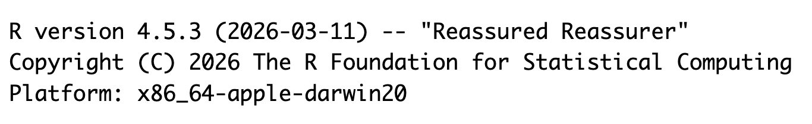
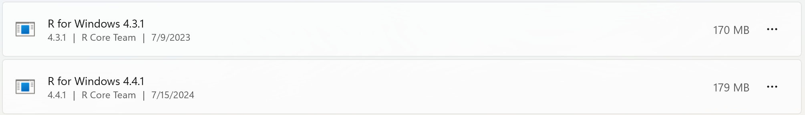
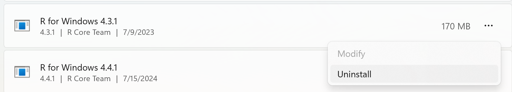
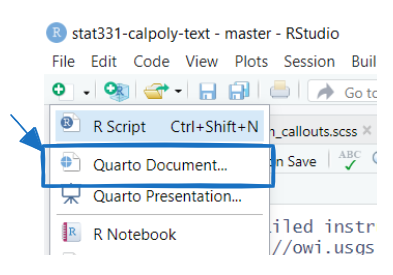

```{r}
#| include: false
#| label: packages-setup

library(tidyverse)
```

For the first portion of this week's coursework, we are going to learn about / 
refresh our memory on R and RStudio. This course is all about you learning
skills for working with data in R, so you will need to have **local**
installations of both R and RStudio on your computer.

::: callout-warning
# Cannot Install R or RStudio

If for any reason you cannot download R or RStudio onto your laptop, please let
me know as soon as possible so we can figure something out.
:::

#### 📖 Readings: 30 minutes

#### 📽 Watch Video: 20-30 min

#### 💻 Activities: 5-10 min

#### ✅ To-Do: 10-20 min

------------------------------------------------------------------------

# ✅ Installing `R`

As mentioned above, you will need to have local installations of both R (the
software) and RStudio (the interface for working in R). ***Do not skip this step
if you already have both R and RStudio installed on your computer***, as you need
to ensure you are using the most up to date version of R and RStudio.

## Updating Your Version of R

If you already have `R` downloaded, you need to confirm that you have the most
up to date version of `R`. **Do not ignore these instructions.** If you neglect
to update your version of R, you may find that updating a package will make it
so your code will not run.

-   Step 1: Open RStudio
-   Step 2: At the top of the the Console it will say what version of R you are
using

{fig-alt="A screenshot of what version of R should appear when you open RStudio. The version reads 'R version 4.5.3 (2026-03-11) -- 'Reassured Reassurer'."}

If the version **is not** 4.5.3 (like the image above), you need to update your
version of R! The simplest way to do this is to follow the instructions below to
install R.

## Installing R

Download and install R by going to <https://cloud.r-project.org/>. Here, you
will find three options for installing R---click on the option for your
computer's operating system.

::: {.column-margin}

:::


### If you are a *Windows* user:

-   Click on “Download R for Windows”

-   Click on “base”

-   Click on the Download link.

-   When you open the execution file (`.exe`) you will be prompted with a
variety of questions about installing R. Feel free to use the default features /
settings that come with R (continue to click "Ok" until the download starts).

::: callout-warning
# Multiple Versions of R

Beware that if you had a previous version of R downloaded on your PC, that old
version will not be deleted when you download the most recent version of R. We
do not want to have two versions of R installed, as your computer can get
confused what version of R to use. So, you need to remove the old version of R.

To do this you need to:

-   Navigate to your computer's settings
-   Click on the "Apps" option on the left-hand panel
-   Search for or scroll down to R
-   Find the older version of R

{fig-alt="A screenshot of a PC with two different versions of R installed---version 4.3.1 and version 4.4.1."}

-   Click on the `...` on the right side
-   Select "Uninstall"

{fig-alt="A screenshot of selecting the (...) option to uninstall the older version of R."}
:::

### If you are *macOS* user:

-   Click on “Download R for (Mac) OS X”

-   Under “Latest release:” click on R-X.X.X.pkg, where R-X.X.X is the version
number. For example, the latest version of R as of March 11, 2026 was R-4.5.3
(Reassured Reassurer).

-   When installing, use the default features / settings that come with R (click
Ok until the download starts).

::: callout-tip
# Troubleshooting for Macs

First, identify which version of OSx you are running. [How-to](https://support.apple.com/en-us/HT201260)

Next, find out which version of `R` your computer can run. [Link](https://cran.r-project.org/bin/macosx/)

If this version is 3.6 or later, download the latest version that your computer
can handle.

If this version is 3.4 or earlier, you're going to run in to some trouble. I
recommend updating your version of OSx, if you are willing. If you can't, then
you can use [Posit Cloud](https://posit.cloud/) to run `R` and RStudio on a free
server. However, I recommend strongly against this option; your files will not
be saved indefinitely, you will have limited hours to complete your work, your
computing power will be limited, and you will need an internet connection at all
times to do your work.
:::

### If you are a *Linux* user:

Click on “Download R for Linux” and choose your distribution for more
information on installing `R` for your setup.

# ✅ Install RStudio

RStudio is an Integrated Development Environment (IDE) for `R`. What does that
mean? Well, if you think of `R` as a language, which it is, you can think of
RStudio as a program that helps you write and work in the language. Back in the
dark ages, people wrote programs in text editors and then used the command line
to compile those programs and run them. RStudio makes programming in `R` much
easier and this course requires you to use it!

## Updating Your Version of RStudio

If you already have RStudio, you need to double check if you have the most
recent version. You **will not** have access to the newest features for Quarto
documents unless you have the most recent version of RStudio.

-   Step 1: Open RStudio
-   Step 2: Click on "Help" in the upper menu
-   Step 3: Click on "Check for Updates"

If there are no updates to RStudio since you installed it, you are good to go!
If you need to update RStudio, you will be sent to Posit (the parent company) to
download the most recent version of RStudio desktop.

## Installing RStudio

::: {.column-margin}



:::

Downloading the most recent version of RStudio works the same way regardless of
whether you've never downloaded RStudio before or if you just need to update
your version of RStudio. 

When you navigate to the RStudio download page
(<https://rstudio.com/products/rstudio/download/>), the website should
automatically detect your computer's operating system. So, you should be able to 
simply click the blue "Download RStudio Desktop for [insert operating system
here]" button. 

Clicking the button will begin installing RStudio. Once the download has
completed, you will need to open the application file (on a Mac this is a `.dmg`
file, on Windows this is an `exe` file). 


## ✅  Ensure Quarto is Installed

We will learn more about Quarto notebooks later in the week, so for now, just make sure that you have the software set up! It is likely that it was already installed automatically.

To check, open a new Rstudio window click the + icon in the top left of the Rstudio window and see if Quarto is an option. See screenshot below.

{fig-alt="A screenshot of the top left corner of RStudio with a box around text that reads Quarto Document"}

If you do not see Quarto, [download and install](https://quarto.org/docs/get-started/) the latest version of Quarto for your operating system.


------------------------------------------------------------------------


# Introduction to R

### 📖 Required Reading: [R4DS: Basics of R](https://r4ds.hadley.nz/workflow-basics)

::: callout-note
# The History of `R`

If you would like to learn more about the history of R, here is an [excellent article written by Roger Peng](https://bookdown.org/rdpeng/rprogdatascience/history-and-overview-of-r.html).
:::

### 💻 Required Tutorial: [R Programming Basics](https://r-primers.andrewheiss.com/basics/02-programming-basics)

::: {.callout-note}
# Programming in R

This tutorial gives you an overview of the foundations that make up the R 
programming language, including:

- functions and their arguments
- accessing help files
- making code comments
- object types (e.g., vectors, lists, )
- data types (e.g., numeric, integer, double, character) 
- R's package system
:::


------------------------------------------------------------------------

# Introduction to RStudio

### 📖 Recommended Video: [A tour of RStudio](https://youtu.be/kfcX5DEMAp4?si=okE0641GKkf8ZrSJ)

-   [Click Here](https://rstudio.github.io/cheatsheets/rstudio-ide.pdf) to download a "cheatsheet" (easy reference page) for navigating the RStudio IDE.

### Exploring the Panes

```{r}
#| echo: false
#| fig-cap: "The RStudio window will look something like this."
knitr::include_graphics("https://srvanderplas.github.io/stat-computing-r-python/images/tools/Rstudio-important-buttons.png")
```

::: panel-tabset
## Top-left

Includes the text editor. This is where you'll do most of your work.

```{r}
#| echo: false
knitr::include_graphics("https://srvanderplas.github.io/stat-computing-r-python/images/tools/Rstudio-editor-pane-buttons.png")
```
The logo on the script file indicates the file type. When an R file is open, there are Run and Source buttons on the top which allow you to run selected lines of code (Run) or source (run) the entire file. Code line numbers are provided on the left (this is a handy way to see where in the code the errors occur), and you can see line:character numbers at the bottom left. At the bottom right, there is another indicator of what type of file Rstudio thinks this is.

## Top-right

In the top right, you'll find the environment, history, and connections tabs. The environment tab shows you the objects available in R (variables, data files, etc.), the history tab shows you what code you've run recently, and the connections tab is useful for setting up database connections.

## Bottom-left

On the bottom left is the console. There are also other tabs to give you a terminal (command line) prompt, and a jobs tab to monitor progress of long-running jobs. In this class we'll primarily use the console tab.

```{r}
knitr::include_graphics("https://srvanderplas.github.io/stat-computing-r-python/images/tools/Rstudio-terminal-R.png")
```

## Bottom-right

On the bottom right, there are a set of tabs:

+ **files** (to give you an idea of where you are working, and what files are present),

```{r}
#| echo: false
#| fig-align: center
#| out-width: 80%
knitr::include_graphics("https://srvanderplas.github.io/stat-computing-r-python/images/tools/Rstudio-file-tab.png")
```
    
+ **plots** (which will be self-explanatory),

+ **packages** (which extensions to R are installed and loaded),

```{r}
knitr::include_graphics("https://srvanderplas.github.io/stat-computing-r-python/images/tools/Rstudio-packages-tab.png")
```

+ the **help** tab (where documentation will show up), and

```{r}
#| echo: false
#| fig-align: center
#| out-width: 80%
knitr::include_graphics("https://srvanderplas.github.io/stat-computing-r-python/images/tools/Rstudio-help-tab.png")
```

+ the **viewer** window, which is used for interactive graphics or previewing HTML documents.

:::
# Installing Packages

### 📽Required Video: [Installing R Packages (4 minutes)](http://youtu.be/tXZDoMlXfTE?hd=1)

### ✅ Install / Update the **tidyverse**

Now that you have the hang of working in RStudio, let's install / update the packages we will use in the course. In this course, we will make heavy use of the `tidyverse` suite of packages.

If you **have not** used the tidyverse before, type the following into your **console** or use the drop down menu in the **Packages** tab (as seen in the video above):

```{r}
#| eval: false
#| label: installing-package

install.packages("tidyverse")
```

The `tidyverse` package actual includes a bunch of other packages! So it is normal that it might take a couple of minutes to install and you will see a lot of text printed out in the console.

If you **have** used the tidyverse before, you only need to update packages.\
Type the following into your console:

```{r}
#| eval: false
#| label: updating-package

library(tidyverse)
tidyverse_update()
```

Then follow the instructions that print out to update a few of your tidyverse packages.
