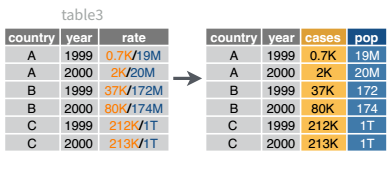
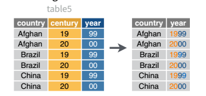

```{r}
#| include: false
#| label: packages-setup

library(tidyverse)
library(knitr)
```


## Learning Objectives


- Determine what data format is necessary to generate a desired plot or statistical model.
- Understand the differences between “wide” and “long” format data and how to transition between the two structures.
- Understand relational data formats and how to use data joins to assemble data from multiple tables into a single table.

#### 📖 Readings: 75 min

#### 📽 Optional Videos: 25 min

------------------------------------------------------------------------

## Relational Data and Joins

#### 📖 Required Reading: [R4DS 19.1-19.4: Joins](https://r4ds.hadley.nz/joins.html)

- Note: don't read 19.5! We will not cover non-equi joins in this course


## Data Transformation

### Data Pivots

#### 📖 Required Reading: [R4DS 5: Data tidying](https://r4ds.hadley.nz/data-tidy.html)

#### 📽 Optional Videos

- [Pivot Longer](https://www.youtube.com/embed/2rQZNlH2734 )
- [Pivot Wider](https://www.youtube.com/embed/NKnl2WoNpK0)

### Splitting Cells

Expanding on what we talked about in class, there’s a task that is fairly commonly encountered with functions that belong to the `tidyr` package: separating variables into two different columns `separate_xxx()` and it’s complement, `unite()`, which is useful for combining two variables into one column.

The datasets used in the examples below are included in the `tidyr` package! 


::: panel-tabset

### `separate_wider_delim()` and `separate_wider_position()`

Table 3 from before is a great example of when you would want to separate 
the values of a column into different columns. In this dataset, the variable
`rate` is recorded as `745/19987071`, where the first number is the amount of
cases and the second number is the population. 


```{r tidy-separate-pic}
#| echo: false
#| out-width: 50%
#| fig-cap: "A visual representation of what separating variables means for data set operations."
#| fig-alt: "A diagram labeled 'table3' shows two tables side by side with an arrow pointing from left to right. On the left, a table has columns country, year, and rate. The rate column contains combined values such as 0.7K/19M, 2K/20M, 37K/172M, 80K/174M, 212K/1T, and 213K/1T, where the first part represents cases and the second part represents population. On the right, the data is transformed by separating rate into two distinct columns labeled cases and pop. Each row now shows the same country and year with the cases value (for example 0.7K, 2K, 37K) in one column and the corresponding population value (19M, 20M, 172M, etc.) in the other. The visual demonstrates how splitting a combined column into multiple columns clarifies the data."


```

```{r}
table3 |> 
  kable()
```


```{r separate-demo}
table3 |>
  separate_wider_delim(cols        = rate,
                       names       = c("cases", "population"),
                       delim       = "/",
                       cols_remove = FALSE
           ) |> 
  kable()
```

I've left the `rate` column in the original data frame (`cols_remove = FALSE`)
just to make it easy to compare and verify that yes, it worked.

### `unite()`

And, of course, there is a complementary operation, which is when it's necessary to join two columns to get a useable data value.

```{r tidyr-unite-pic}
#| echo: false
#| out-width: 50%
#| fig-cap: "A visual representation of what uniting variables means for data set operations."
#| fig-alt: "A diagram labeled 'table5' shows two tables side by side with an arrow pointing from left to right. On the left, a table has three columns: country, century, and year. Each country appears twice, once with century 19 and year 99, and once with century 20 and year 00. On the right, the data is transformed by uniting the century and year columns into a single year column that contains full values such as 1999 and 2000. Each row now shows the country alongside the combined year. The visual demonstrates how uniting multiple columns can merge partial values into a single meaningful column."

```

```{r}
table5 |> 
  kable()
```

```{r tidyr-unite-demo}
table5 |>
  unite(col = "year",
        c(century, year),
        sep = ''
        ) |> 
  kable()
```
:::

<br>


