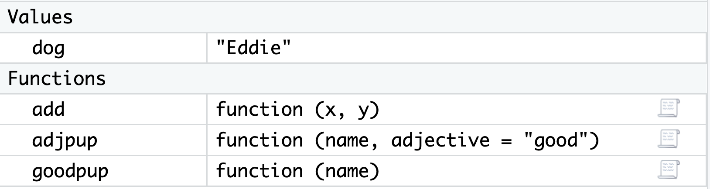

# Learning Objectives

This week, we’re going to learn about how we can write our own user-defined functions in R. We’re going to start with writing functions that operate on vectors.

By the end of the week, you should have a grasp of:
+ Writing your own functions in R

+ Making good decisions about function arguments and returns

+ Including side effects and / or error messages in your functions

+ The differences between vectorized and non-vectorized functions

#### 📖 Required Readings: 60 min

------------------------------------------------------------------------

Much of the content here comes from Dr. Allison Theobold's [nice writing](https://atheobold.github.io/ADS-course-materials/weeks/week-7-vector-functions.html) for this class.

# Why Write a Function?

You might be coming into this chapter wondering, "Why would I write a function?".
Especially, if thus far you've been able to do everything with built-in
functions and / or reusing your code a few times.

The critical motivation behind functions is the "don't repeat yourself" (DRY)
principle. In general, "you should consider writing a function whenever copied
and pasted your code **more than twice** (i.e. you now have three copies of the
same code)" (Wickham & Grolemund, 2020).

*Best Practices for Scientific Computing* (Wilson et al, 2014), summarizes
this idea in a slightly different way:

> Anything that is repeated in two or more places is more difficult to maintain.
> Every time a change or correction is made, multiple locations must be updated, 
> which increases the chance of errors and inconsistencies. To avoid this, 
> programmers follow the DRY (Don't Repeat Yourself) Principle, which applies to
> both data and code.

The DRY Principle applies at two scales: small and large. At small scales,
researchers (**you**) should work to modularize code instead of copying and
pasting. Modularizing your code helps you remember what the code is doing as a
single mental chunk. This makes your code easier to understand, since there is
less to remember! Another perk is that your modularized code can also be more
easily re-purposed for other projects. At larger scales, it is vital that
scientific programmers (**you**) re-use code instead of rewriting it (Wilson et
al., 2014).

# Writing Functions in R

#### 📖 Required Reading: [R4DS 25.2: Vector Functions](https://r4ds.hadley.nz/functions#vector-functions)

This reading goes over the basics of user-written functions in R. I want to go over a couple of additional trickier points as well.


## Input Validation

When you write a function, you often assume that your parameters will be of a certain type. But you can't guarantee that the person using your function knows that they need a certain type of input. In these cases, it's best to **validate** your function input. The idea here is that it is better for you to validate the input first and supply an error with a helpful error message, rather than let an error occur within the mechanics of your function. You want your function to work as long as the correct things are being supplied!

The heart of input validation are two functions---`stopifnot()` and `stop()`. 
While these functions have similar behavior, they have rather different syntax. When you are doing more advanced function writing, there could be compelling reasons to use one over the other, but for this course, you can just choose which you prefer. 

Before we explore these differences, let's do a refresher on conditional
statements and learn about the `if()`, `else()`, and `else if()` functions in
R. 

#### 📖 [Required Reading: Data Wrangling with R -- Conditional Statements](https://bradleyboehmke.github.io/uc-bana-7025/lesson-6a-conditional-statements.html)

::: panel-tabset

### `stopifnot()`

In R, you can use `stopifnot()` to check for certain essential conditions.

```{r}
#| error: true

add <- function(x, y) {
  x + y
}

add("tmp", 3)

add <- function(x, y) {
  stopifnot(is.numeric(x), 
            is.numeric(y)
            )
  x + y
}

add("tmp", 3)
add(3, 4)
```

You can also privide a specific error message for users:

```{r}
#| error: true

add <- function(x, y) {
  stopifnot("argument input for x is not numeric" = is.numeric(x), 
            "argument input for y is not numeric" = is.numeric(y)
            )
  x + y
}

add("tmp", 3)
```
That's a lot more helpful than `is.numeric(x) is not TRUE`!

### `if(){stop()}`

`stop()` provides a slightly easier way to provide a helpful error message. It needs to be combined with an `if(){}`  or `if(){ } else{ }` statement.

```{r}
#| error: true

add <- function(x, y) {
  if(!is.numeric(x) | !is.numeric(y)) {
    stop("Argument input for x or y is not numeric")
  }
    x + y
}

add("tmp", 3)
add(3, 4)
```
:::


## Arguments

You get to decide what the arguments to your function are called, what order they are in, and whether they should be required or not. 

### Argument Names

You should always give your arguments concise, descriptive names. A user should be able to tell what the arguments to your function mean, and at the same time, you will be writing all of your function body with those arguments, so making them too long will be annoying! 

### Argument Order
When you have many arguments to a function, the order does not matter, although it is convention to put the "main" arguments first and optional arguments later. As long as you name arguments when you **run** the function, it doesn't matter what order they were in when the function was written!

### Required versus Optional Arguments
You should have noticed throughout the class that for some functions, we sometimes use certain arguments and other times we don't. For example, we have used `mean(x)` and `mean(x, na.rm = T)`. This is because arguments to a function can be **optional**. To make an argument optional, a default value must be provided when the function is first defined. 

:::panel-tabset

## Required Arguments

Let's write a function that takes a puppy's name and returns `"<name> is a good pup!"`.

```{r}
goodpup <- function(name) {
  paste(name, "is a good pup!")
}
```

The argument `name` is a required argument since no default value is provided. If we try to run the function without providing a value for `name`, we will get an error:

```{r}
#| error: true

goodpup()
```
## Optional Arguments

We can edit and add an optional argument to this function by adding an argument that takes a default value.

```{r}
adjpup <- function(name, adjective = "good") {
  paste(name, "is a", adjective, "pup!")
}
```

I can either provide an `adjective` I want to use:

```{r}
adjpup(name = "Baxter", adjective = "sweet")
```

Or leave out the `adjective` argument and the default `"good"` will be used.

```{r}
adjpup(name = "Baxter")
```


:::

## Functions, Environments, and Scope

As we learned early in the quarter, variables that you create in R using assignment `<-` are then available in your Global Environment. This is true of functions too! User-defined functions show up in their own part of your Global Environment window in RStudio:

{width="70%" fig-alt="Screenshot of my Global Environment window in RStudio. Under Values there is a variable called dog that dates the value `Eddie`. Under another header called Functions, there are three functions that we created so far in this reading, add, adjpup, and goodpup."}

While the function itself is saved in the Global Environment, when you actually **run** a function, the variables you create and manipulate inside the function will not be added to your Global Environment. Instead, they exist in a **local environment** that only exists for the function call. Let's look at an example to make this more concrete.

Speficially, let's take a closer look at what is going on "under the hood" with our `goodpup()` function. The function `goodpup()` has one argument called `name`. Each time we run the function, we can pass in different values for that argument.  

Here we have saved, separately, a variable `dog` that takes the value `"Eddie"`. What is happening inside the computer's memory as
`goodpup(dog)` runs?

```{r}
dog <- "Eddie"

goodpup <- function(name) {
  paste(name, "is a good pup!")
}

res <- goodpup(name = dog)

res
```

{fig-alt="The image illustrates the concept of function environments versus the global environment in R. It starts by showing a variable dog in the global environment, set to 'Eddie', and a function goodpup defined as function(name) { paste(name, 'is a good pup!') }. When res <- goodpup(dog) is called, the function creates a temporary local environment where the variable name is assigned the value 'Eddie'. The paste function combines name with the string 'is a good pup!, returning 'Eddie is a good pup', which is then stored in res in the global environment. The image emphasizes that the local environment of the function only exists during the function call. The variable name is never defined in the global environment, meaning it cannot be accessed outside of the goodpup function. Annotations highlight that variables in the global environment, such as dog and res, are accessible globally, while local variables, like name, are temporary and exist solely within the function’s scope."}

The variable `name` never exists in our Global Environment, just in the temporary function environment. We also need to explicitly assign the outpu of the function `res` to add the result to our Global Environment.

### Scope

Scope refers to a set of rules that determines how R looks up the value of a variable. This can get quite complicated, but there is just one rule that we need to keep in mind for now!

Within a function, R will first look for a name (variable) within the local function environment. If that name isn't defined within a function, it will look one level out, into the Global Environment.

What this means is that you can run into issues or get unexpected results if there is **name masking**. Name masking occurs when you use the same variable name inside and outside a function. Note that this is 1) **bad programming practice**, and 2) fairly easily avoided if you can make your names even slightly more creative than a, b, and so on.

Let's see what happens.

:::panel-tabset


## example 1

Here we have a variable `a` in both the global environment and the function call.

```{r}
a <- 10

myfun <- function() {
  a <- 20
  a
}

myfun()
```

But remember that since everything within a function happens in a temporary local environment, the variable `a` still has the value `10` in the Global Environment:

```{r}
a
```

## example 2

Here we accidentally forgot to include `x` as an argument to our function, so the variable `x` does not exist in our actual function call.

```{r}
#| error: true

myfun <- function() {
  mean(x)
}

myfun()
```

However, if we happend to have `x` saved in our Global Environment, the function will run, with that value of the variable.
```{r}
x <- 10

myfun()
```

:::

Hopefully these examples convinced you that name masking is very bad practice and will result in errors and weird results! **It is always good to clear your Global Environment before testing functions.**


:::callout-note
These are tricky concepts -- I don't expect that they will all be clear immediately! As you start to work more with functions, these will make more sense.

:::

**References:**

- Wilson G, Aruliah DA, Brown CT, Chue Hong NP, Davis M, Guy RT, et al. (2014) Best Practices for Scientific Computing. PLoS Biol 12(1): e1001745. https://doi.org/10.1371/journal.pbio.1001745
