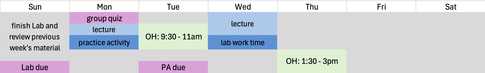
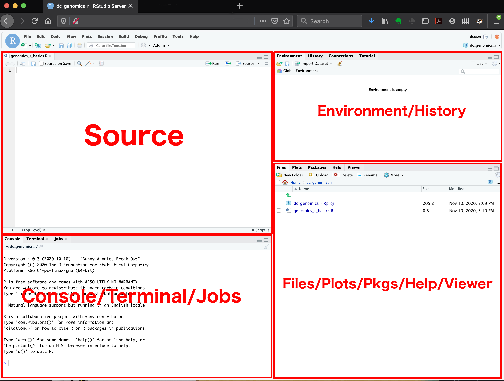
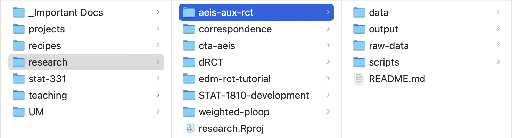
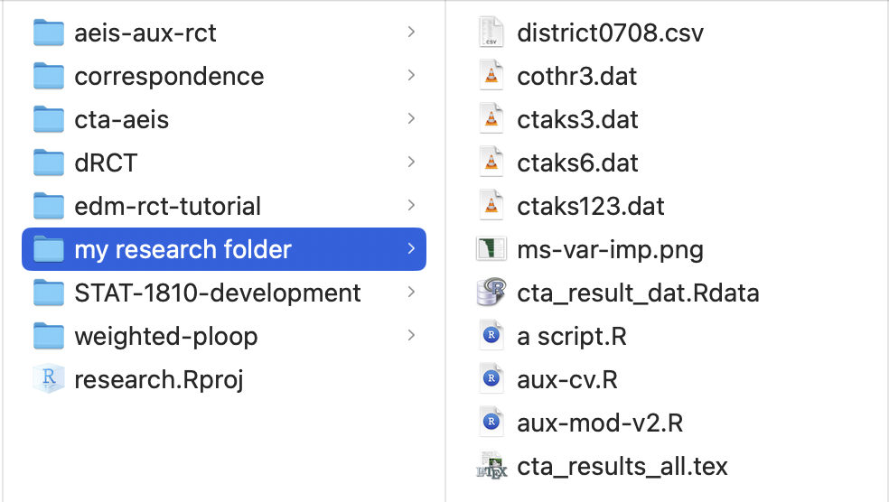
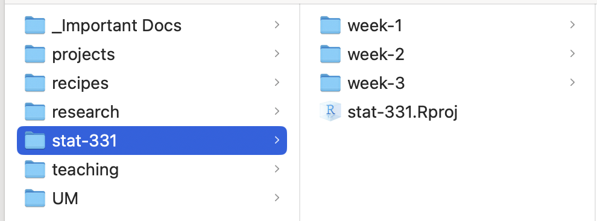
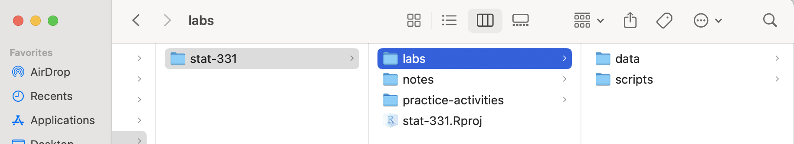
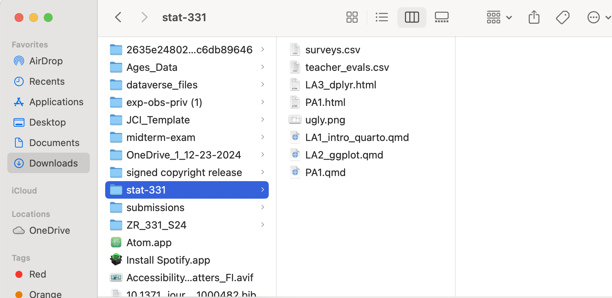

## Monday, March 30

Today we will...

-   Welcome to Stat 331/531: Statistical Computing in R
-   Intro to Me + You + the course
-   "Unplugged" Warm-up
-   Intro to `R` + RStudio
-   Organization
-   `R` Basics & Troubleshooting
-   PA 1: Find the Mistakes

# Introductions

## Me!

:::::: columns
:::: {.column width="60%"}
Hi, I'm Dr. C!

::: incremental
-   I am a transplant to the west coast.

-   My favorite things right now are cooking, knitting, and biking around SLO county.

-   I genuinely love `R`.
:::
::::

::: {.column width="40%"}
```{r, out.width = "90%", fig.align='center', echo = F}

```
:::
::::::

## You!

I am looking forward to reading your introductions on Discord!

-   Please read the intros of your classmates so you can discover who you will be learning with this quarter.

# Syllabus

## Communication

::: incremental
-   ✉️ email
    -   with your @calpoly.edu email address
    -   with questions that relate to you as an individual
-   💬 Discord
    -   any and all questions!!
    -   you will join and introduce yourself by Wednesday
-   🏢 office hours
    -   come and discuss anything during my scheduled hours!
    -   reach out to schedule other times
:::

## Course Materials

::: incremental
-   🏫 Canvas
    -   **everything** will be linked or posted on Canvas!
    -   refer to Canvas for current deadilnes & announcements
-   📕 [R for Data Science (2nd ed.)](https://r4ds.hadley.nz/)
    -   free online book by major R players
    -   supplemented with videos & tutorials
-   🖥️ [materials website](https://manncz.github.io/stat331-calpoly-s26/)
    -   slides, readings, notes, labs, and practice activities are organized
    -   this is for convenience, but everything will also be linked in Canvas
:::

## Assessments - Formative

::: incremental
-   Group Quizes (10%)
    -   "check" that you have a good understanding of previous week
    -   **in-class** on Mondays, on paper, with your group
    -   need to be present, but one excused quiz a quarter
-   Practice Activities (10%)
    -   first attempt at new skills
    -   get the hang of the week's `R` skills
-   Lab Activities (20%)
    -   "homework"
:::

```{=html}
<!--. . .

:::callout-tip
# Work with other's!

You should work with other's on all assignments! The final work you submit for a Lab should be your own.
:::
-->
```

## Assessments - Evaluative

-   Exams
    -   Midterm Exam (20%)
    -   Final Exam (25%)
-   Final project (15%)
    -   more info soon
    -   due end of week 10

::: callout-warning
# Exam Conflicts

If you have a known conflict with an exam, please discuss it with me at least three weeks prior to the exam date
:::

## Assessments - General Criteria

::: incremental
-   correct outputs are great, but you will also need to demonstrate that you are **intellectually engaging** with the material in assignments
-   in addition to getting a correct output from your code, you will be assessed for **efficiency and formatting**
-   technical **communication** will also be an important element of assessments
-   I hope you will be proud of your work in this class!
:::

## Weekly Overview



## Course Policies

::: incremental
**Late Policy**

-   4 "deadline extensions"
-   email me *before* the deadline for a 24 hour extention

**Attendance**

-   you will learn more if you work with your group!

**Accessibility and Accomodations**

-   let me know what I can do better
-   email me if you use the DRC
:::

## Academic Integrity

::: incremental
-   let’s be **proactive** to prevent situations where you are overwhelmed!
-   use generative AI as a tutor, not a substitute for your own work
-   **cite outside resources!** including AI
-   please review the [syllabus](../../course-info/syllabus-s26.qmd) carefully
:::

## My expectations for you

::: incremental
-   ask lots of questions
-   take advantage of resources to help you learn
    -   this includes working with others!
-   engage with what we are all doing together during class
-   work towards independent learning
    -   productive struggle
:::

## My expectations for me

::: incremental
-   creating an inclusive and accessible classroom
-   providing resources needed to learn the material
-   providing prompt and clear feedback
-   doing my best to make class worth your time
-   clearly communicating
:::

## What to expect from this course

::: incremental
-   everyone comes with different knowledge and skills -- figure out what helps you learn the best in this course
-   independent learning and learning from documentation is *part* of the course
-   coding involves unique challenges, frustrations, and satisfaction!
:::

{fig-align="center" width="70%"}

# "Unplugged" Warmup

## Statistical computing involves...

::: incremental
-   understanding data structures
    -   i.e. "what you have to work with"
-   developing an algorithm
    -   i.e. "what you want the computer to do"
-   knowing the syntax of a specific language
    -   i.e. "how to tell the computer what to do so it will understand"
-   improving efficiency of your code
:::

. . .

::: callout-tip
# Not *just* syntax

All of these skills improve as the others improve and we will work on *all* of them in this course!
:::

## Paper Planes

::: incremental
0.  Work with the person next to you & introduce yourself!
1.  Write a set of instructions to create the paper item I provided for you
2.  Swap the instructions with the pair next to you
3.  Follow their instructions as literally as possible to fold a plane
:::

{fig-align="center" width="40%"}

# Intro to R

## What is R?

-   `R` is a programming language designed originally for *statistical analyses*.
-   `R` is **open source**

{fig-align="center" width="30%"}

## What' going on with R?

::::: panel-tabset
## Strengths

`R`'s **strengths** are...

::: incremental
-   handling data with lots of **different types** of variables.

-   making nice and complex data **visualizations**.

-   having cutting-edge statistical **methods** available to users.
:::

## Weaknesses

`R`'s **weaknesses** are...

::: incremental
-   performing non-analysis programming tasks, like website creation (*python*, *ruby*, ...).

-   hyper-efficient numerical computation (*matlab*, *C*, ...).

-   being a simple tool for all audiences (*SPSS*, *STATA*, *JMP*, *minitab*, ...).
:::
:::::

## But wait!


## Packages

The heart and soul of `R` are **packages**.

. . .

-   These are "extra" sets of code that add **new functionality** to R when installed.
-   "base" `R` refers to functions that are in the `R` software, and do not require a package.

## Open-Source

Importantly, `R` is *open-source*.

::: incremental
-   There is no company that owns `R`, like there is for *SAS* or *Matlab*.
-   **This means packages are created by users like you and me!**
-   "Official" `R` packages live on the *Comprehensive R Archive Network*, or **CRAN**.
-   But anyone can write and share new code in "package form"
:::

## Open-Source

Being a good open-source citizen means...

::: incremental
-   **sharing** your code publicly when possible (later in this course, we'll learn about *GitHub*!).
-   **contributing** to public projects and packages, as you are able.
-   creating your own **packages**, if you can.
-   using `R` for **ethical and respectful** projects.
:::

# Intro to {width="30%"}

::: callout-tip
## Let's get into it!

-   If you have RStudio installed on your computer, open it now.

-   Otherwise, open the [Posit Cloud Project](https://posit.cloud/content/9084896)
:::

## What is RStudio?

**RStudio** is an IDE (*Integrated Developer Environment*).

-   This means it is an application that makes it easier for you to interact with `R`.

```{r, fig.align='center', out.width = "75%", echo = F}
knitr::include_graphics("https://d33wubrfki0l68.cloudfront.net/0b4d0569b2ddf6147da90b110fbb2a17653c8b08/f06f3/images/shutterstock/r_vs_rstudio_1.png")
```

## 

```{r, echo = FALSE, out.width="75%", fig.align='center'}

```

## RStudio is Your Friend!

-   You will always interact with `R` through RStudio

-   Helps with organization and some "point-and-click" options if desired

# Organization & Directories

## A lot of pieces go into a data analysis!

::::: columns
::: {.column width="30%"}
-   files with code
-   data files
-   documentation
-   images
-   reports
-   etc.
:::

::: {.column width="70%"}
{fig-alt="A frustrated looking little monster in front of a very disorganized cooking area, with smoke and fire coming from a pot surrounded by a mess of bowls, utensils, and scattered ingredients."}
:::
:::::

## Organization is key!

{fig-alt="An organized kitchen with sections labeled 'tools', 'report' and 'files', while a monster in a chef's hat stirs in a bowl labeled 'code.'"}

## What is a directory?

::: incremental
-   A **directory** is just a fancy name for a folder.

-   Directories are your **friends**!

-   Best practice:

    -   everything should have a place in a well-named directory
    -   do not include spaces in directory names
:::

## Project Directory Examples

::: panel-tabset
## GOOD 😃



## BAD ☠️

{width="70%"}
:::

## Class Directory Examples

::: panel-tabset
## GOOD 😃

{width="50%"} {width="70%"}

## BAD ☠️

{width="70%"}
:::

## Manage your Class Directory

Create a directory for this class!

::: incremental
-   Is it in a place you can easily find it?

    -   NOT IN YOUR DOWNLOADS FOLDER ☠️

-   Does it have an informative name?

    -   like "stat-331" or similar

-   Are the files inside it well-organized?
:::

. . .

::: callout-warning
I cannot stress how important this is!!
:::

# R Basics

::: callout-tip
# Open our handout

-   If on your computer: Download and save [w1.1-handout.qmd](../../student-versions/handouts/w1.1-handout.qmd) on your computer and open it in RStudio.

-   If on Posit Cloud: Open "w1-notes.qmd"

-   When you see 🧩 in the slides, there is something to practice in the handout
:::

## How do I run code in R? 🧩

::: incremental
-   You can run any lines of code directly in the *Console*
    -   But then your code isn't saved!
    -   This is best for exporatory and one-off tasks
-   We primarily write and run code in `R` scripts or notebooks in *Source*
    -   These are documents where you can organize and save code!
    -   More on scripts vs. notebooks tomorrow
:::

## Packages 🧩

To **install** a package use:

```{r}
#| echo: true
#| eval: false
#| code-line-numbers: false
install.packages("tibble")
```

-   You should have to install a package **only once**.

. . .

To **load** a package use:

```{r}
#| echo: true
#| code-line-numbers: false
#| eval: false
library(tibble)
```

-   You have to load a package **each time you restart R**.
-   You also should load packages at the beginning of any script.

. . .

::: callout-warning
Note that when you install packages you need to include quotation marks around the package name, but you don't need to when loading a package!
:::

## Variables

**Variables** are names that refer to values.

-   A variable is like a container that holds something - when you refer to the container, you get whatever is stored inside.

-   We assign values to variables using the syntax `object_name <- value`.

    -   You can read this as “object name gets value” in your head.

. . .

```{r}
#| echo: true
message <- "So long and thanks for all the fish"
year <- 2025
the_answer <- 42
earth_demolished <- FALSE
```

## Naming Conventions

-   `some_people_use_snake_case`
-   `somePeopleUseCamelCase`
-   `some.people.use.periods`
-   A few people mix conventions with `variables_thatLookLike.this` and they are almost universally hated.

::: callout-tip
Just pick one and stick with it!
:::

## Data Types 🧩

-   A **value** is a basic unit of stuff that a program works with.

-   Values have **types**:

. . .

1.  **logical / boolean**: FALSE/TRUE or 0/1 values.

. . .

2.  **integer**: whole numbers.

. . .

3.  **double / float / numeric**: decimal numbers.

. . .

4.  **character / string** - holds text, usually enclosed in quotes.

## Data Structures 🧩

*Homogeneous*: every element has the same data type.

-   **Vector**: a one-dimensional column of homogeneous data.

-   **Matrix**: the next step after a vector - it’s a set of homogenous data arranged in a two-dimensional, rectangular format.

. . .

*Heterogeneous*: the elements can be of different types.

-   **List**: a one-dimensional column of heterogeneous data.

-   **Dataframe**: a two-dimensional set of heterogeneous data arranged in a rectangular format.

## Indexing 🧩

We use **square brackets** (`[]`) to access elements within data structures.

-   In R, we start indexing from 1.

. . .

::::: columns
::: {.column width="25%"}
Vector:
:::

::: {.column width="75%"}
```{r}
#| eval: false
#| echo: true
#| code-line-numbers: false
vec[4]    # 4th element
vec[1:3]  # first 3 elements
```
:::
:::::

::::: columns
::: {.column width="25%"}
Matrix:
:::

::: {.column width="75%"}
```{r}
#| eval: false
#| echo: true
#| code-line-numbers: false
mat[2,6]  # element in row 2, col 6
mat[,3]   # all elements in col 3
```
:::
:::::

::::: columns
::: {.column width="25%"}
List:
:::

::: {.column width="75%"}
```{r}
#| eval: false
#| echo: true
#| code-line-numbers: false
li[[5]]    # 5th element
```
:::
:::::

::::: columns
::: {.column width="25%"}
Dataframe:
:::

::: {.column width="75%"}
```{r}
#| eval: false
#| echo: true
#| code-line-numbers: false
df[1,2]     # element in row 1, col 2
df[17,]     # all elements in row 17
df$calName  # all elements in the col named "colName"
df[["calName"]] # all elements in the col named "colName"
```
:::
:::::

## Logic 🧩

We can combine logical statements using and, or, and not.

-   (X AND Y) requires that both X and Y are true.

-   (X OR Y) requires that one of X or Y is true.

-   (NOT X) is true if X is false, and false if X is true.

. . .

```{r}
#| echo: true
x <- c(TRUE, FALSE, TRUE, FALSE)
y <- c(TRUE, TRUE, FALSE, FALSE)

x & y   # AND

x | y   # OR

!x & y  # NOT X AND Y
```

## Vectorization

::: incremental
-   `R` is designed to do vector and matrix math nicely

-   Many operations in `R` are **vectorized**.

    -   These functions operate on *vectors* of values rather than a *single* value.
    -   i.e. the function applies to every element of a vector individually.
:::

. . .

e.g.:

```{r}
#| echo: true
x <- seq(from = -2, to = 2)
x
```

**Say we want to add 1 to every element of `x`...**

## Vectorization

::::: columns
::: {.column width="50%"}
Loop:

```{r}
for(i in 1:length(x)){
  x[i] <- x[i] + 1
}
x
```
:::

::: {.column width="50%"}
Vectorized:

```{r}
#| echo: false
x <- seq(from = -2, to = 2)
```

```{r}
x <- x + 1
x
```
:::
:::::

. . .

-   See how leveraging vectorization in `R` is great?

::: callout-important
# Loops be gone!

Now forget about loops after this slide! We rarely need them in `R` and will avoid using them in this class
:::

## Logic, Indexing, and Vectorization 🧩

::: incremental
-   We can do some nifty things putting logic, indexing and vectorization together!

-   Booleans can be used for indexing, where `TRUE` elements are kept

```{r}
vec <- c(1, 2, 3)

vec > 2
```

```{r}
vec[vec > 2]
```

-   `TRUE` and `FALSE` booleans are treated as 1 and 0, respectively
    -   can be used to find counts or proportions that meet given criteria

```{r}
sum(vec > 2)
```
:::

# Troubleshooting Errors!

# Errors + Warnings + Messages

## Messages

Just because you see scary red text, this does **not** mean something went wrong! This is just `R` communicating with you.

. . .

-   For example, you will often see:

```{r}
#| echo: true
#| message: true
#| code-line-numbers: false
library(lme4)
```

## Warnings

Often, `R` will give you a **warning**.

-   This means that your code *did* run...

-   ...but you probably want to make sure it succeeded.

. . .

**Does this look right?**

```{r}
#| echo: true
#| warning: true
#| code-line-numbers: false
my_vec <- c("a", "b", "c")

my_new_vec <- as.numeric(my_vec)
```

. . .

```{r}
#| echo: true
#| code-line-numbers: false
my_new_vec
```

## Errors

If the word **Error** appears in your message from `R`, then you have a problem.

-   This means your code **could not run**!

. . .

```{r}
#| echo: true
#| error: true
#| code-line-numbers: false
my_vec <- c("a", "b", "c")

my_new_vec <- my_vec + 1
```

## Types of Errors

::: incremental
-   syntax errors (aka typos)
    -   did you forget a parenthesis?
    -   did you forget a comma?
    -   are you using the right argument names? function names?
-   object type errors
    -   are you using the right type of input?
    -   are you getting the type of output you expect?
:::

# Syntax Errors 🧩

## Did you leave off a parenthesis?

seq[(]{style="background-color:#ffff7f"}from = 1, to = 10, by = 1

```{r}
#| echo: true
#| error: true
#| code-line-numbers: false
seq(from = 1, to = 10, by = 1
```

. . .

```{r}
#| echo: true
#| code-line-numbers: false
seq(from = 1, to = 10, by = 1)
```

## Did you leave off a comma?

seq(from = 1, to = 10 [by]{style="background-color:#ffff7f"} = 1)

```{r}
#| echo: true
#| error: true
#| code-line-numbers: false
seq(from = 1, to = 10 by = 1)
```

. . .

```{r}
#| echo: true
#| code-line-numbers: false
seq(from = 1, to = 10, by = 1)
```

## Did you make a typo? Are you using the right names?

[sequence]{style="background-color:#ffff7f"}(from = 1, to = 10, by = 1)

```{r}
#| echo: true
#| error: true
#| code-line-numbers: false
sequence(from = 1, to = 10, by = 1)
```

. . .

```{r}
#| echo: true
#| code-line-numbers: false
seq(from = 1, to = 10, by = 1)
```

# Object Type Errors

## Are you using the right *input* that the function expects?

sqrt(['1']{style="background-color:#ffff7f"})

```{r}
#| echo: true
#| error: true
#| code-line-numbers: false
sqrt('1')
```

. . .

```{r}
#| echo: true
#| code-line-numbers: false
sqrt(1)
```

## Are you expecting the right *output* of the function?

```{r}
#| echo: true
#| error: true
#| code-line-numbers: false
my_obj <- seq(from = 1, to = 10, by = 1)

my_obj(5)
```

. . .

```{r}
#| echo: true
#| code-line-numbers: false
my_obj[5]
```

# `R` what are you trying to tell me?? 🧩

## `R` says...

> Error in ggplot() : could not find function "ggplot"

. . .

It *probably* means...

> You haven't installed/loaded the package that includes the ggplot() function OR you mispelled the function name

You should:

1.  check if the package is installed
2.  load the package (`library()`)

## `R` says...

> Error: Object `some_obj` not found.

. . .

It *probably* means...

> You haven't run the code to create `some_obj` OR you have a typo in the name!

```{r}
#| echo: true
#| error: true
#| code-line-numbers: false
some_ojb <- 1:10

mean(some_obj)
```

## `R` says...

> Error: Object of type 'closure' is not subsettable.

. . .

It *probably* means...

> Oops, you tried to use square brackets on a function

```{r}
#| echo: true
#| error: true
#| code-line-numbers: false
mean[1, 2]
```

## `R` says...

> Error: Non-numeric argument to binary operator.

. . .

It *probably* means...

> You tried to do math on data that isn't numeric.

```{r}
#| echo: true
#| error: true
#| code-line-numbers: false
"a" + 2
```

## What if none of these solved my error?

-   Look at the **help file** for the function! `?function`

-   Break what you are doing down into smaller pieces and look at whether or not each step gives you what you expect

-   When all else fails, **Google** your error message.

    -   Include the function you are using.

## Try it...

**What's wrong here?**

```{r}
#| echo: true
#| error: true
#| code-line-numbers: false
matrix(c("a", "b", "c", "d"), num_row = 2)
```

. . .

::: callout-tip
Look up the help file for the function `matrix` by running `?matrix` in the Console.
:::

## PA 1: Find the Mistakes

**Part One:**

This file has many mistakes in the code. Some are errors that will prevent the file from knitting; some are mistakes that do NOT result in an error.

Fix all the problems in the code chunks.

**Part Two:**

Follow the instructions in the file to uncover a secret message.

Submit the name of the poem as the answer to the Canvas Quiz question.

## To do...

-   **Reading & review**
-   **Course Setup Assignments**
    -   Due *Wednesday* at 11:59pm
-   **PA 1: Find the Mistakes**
    -   Due *Wednesday* at 11:59pm
