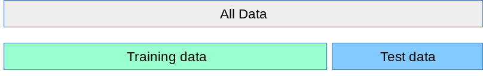
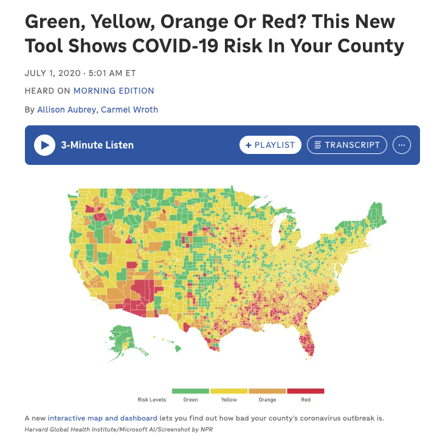
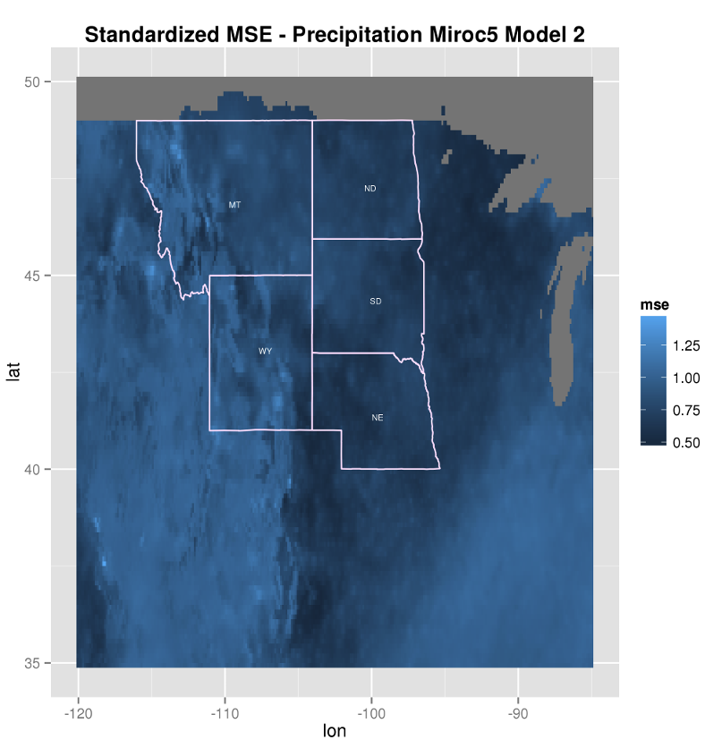

```{r setup}
#| include: false
#| message: false
library(tidyverse)
library(openintro)
data(ncbirths)
```

## Monday, June 1

Today we will...

-   Group Quiz 9
-   New Material:
    - Model Validation
    - Graphics with Geospacial Data (Maps)
-   Work Time
    -   PA 10: Map it!
    -   Final Project Submission


## Final Project Submission


# Model Validation


## How do we tell if a model is "good"?


- There are lots of different metrics to measure model performance!
  - Your choice depends on the type of model and what is "good" for the context
  - Do you only care about predictions? Or more about inference? 

::: panel-tabset

# Regression

  - See week 9 slides
  - RMSE
  - $R^2$

# Classification (binary outcomes)

  - overall prediction success or failure rate
  - sensitivity: true positive rate
  - specificity: true negative rater
  - many more...
  
:::


## Overfitting and Underfitting

](images/ch10-1-1.png)

## Big Question for Model Validation

Even if a model is "good" according to our metric with the data we have, how do we know if it will still work well with other data?

. . .


## Train / Test Split {.scrollable}


**Big idea:** Reserve part of your data for testing to get an idea of how the model would do on outside data

:::incremental
  1. Split your data into a training and a testing set (typically 80%/20%)
  2. Set the testing set aside 
  3. Do all the model development you want with the training data
  4. Fit a final model with the training data
  5. Generate predictions from that model with the testing data and calculate your performance metric
  6. Compare the testing and training metrics 
  
:::



## Comparing Train / Test Performance

::: incremental
- If the model is **over**fit... 

   + test performance < training performance
    
- If the model is **under**fit ...

  + test performance > training performance
    
- If the model is neither over nor underfit ... 
    
  + test performance $\approx$ training performance

:::

## $k$-fold Cross Validation

:::incremental

- Iterates over $k$ train / test splits
- Uses all of the data
- Especially useful for model development
   + covariate selection
   + specifying parameters for ML models

:::

## $k$-fold Cross Validation Process


0.  Choose a value for $k$
1.  Split data into $k$ folds
2.  For fold $i$ from 1 ... $k$:

    a.  Fit model on observations *not* in fold $i$
    b.  Generate predictions from this model for the observations **in** fold $i$
    c.  Calculate and save performance metric of interest
3.  Average the $k$ performance metrics across folds

## $k$-fold Cross Validation Process

](images/5-fold-cross-validation.png)


## $k$-fold Cross Validation Process - details

0.Choose a value for $k$


  + Typical values are 5 or 10
  
```{r}
k <- 5
```

## $k$-fold Cross Validation Process - details

1. Split data into $k$ folds
  - Should be approximately the same size
  - You *could* just split the data into $k$ groups based on their row number

```{r}
n <- nrow(ncbirths) 

ncbirths <- ncbirths |> 
  mutate(fold_cut = cut(1:n, breaks = k, labels = FALSE))
```

  - More typical to assign groups randomly
  
```{r}
set.seed(394)

ncbirths <- ncbirths |> 
  mutate(fold_random = sample(rep_len(1:k, length.out = n),
                       size = n))
```


## $k$-fold Cross Validation Process - details

```{r}
#| echo: false

# write a function to calculate the R2
r2_calc <- function(obs, pred){
  
  sse <- sum((obs - pred)^2, na.rm = T)
  sst <- sum((obs - mean(obs))^2, na.rm = T)
  
  r2 <- 1 - sse/sst
  
  return(r2)
}
```

```{r}
#| echo: false

cv_r2 <- rep(NA, k)

# for each fold 1-k...
for(x in 1:k){
  
  # separate fold (test) data
  fold_dat <- ncbirths |> 
    filter(fold_random == x)
  
  # and training data
  train_dat <- ncbirths |> 
    filter(fold_random != x)
  
  # fit model with training data
  it_lm <- lm(weight ~ weeks, 
               data = train_dat)
  
  # generate predictions for the held-out fold data
  fold_preds <- predict(it_lm, newdata = fold_dat)

  # calculate R2 for the held-out fold data and save it
  cv_r2[x] <- r2_calc(obs = fold_dat$weight,
                      pred = fold_preds)
  
}

```

We implemented 5-fold CV for the model of birth weight on gestation weeks with the NC births data...

```{r}
cv_r2
```

. . .

3.  Average the $k$ performance metrics across folds

```{r}
mean(cv_r2)
```

. . .

The $R^2$ from fitting the model on the full dataset was 0.449, so it appears the model is neither overfitting or underfitting (*maybe* slightly overfitting).

## Actually... should combine 

](images/grid_search_cross_validation.png){width="80%"}


## A first (not ideal) attempt at k-fold CV


```{r}
#| code-fold: true
#| eval: false

# write a function to calculate the R2
r2_calc <- function(obs, pred){
  
  sse <- sum((obs - pred)^2, na.rm = T)
  sst <- sum((obs - mean(obs))^2, na.rm = T)
  
  r2 <- 1 - sse/sst
  
  return(r2)
}
```

```{r}
#| code-fold: true
#| eval: false

cv_r2 <- rep(NA, k)

# for each fold 1-k...
for(x in 1:k){
  
  # separate fold (test) data
  fold_dat <- ncbirths |> 
    filter(fold_random == x)
  
  # and training data
  train_dat <- ncbirths |> 
    filter(fold_random != x)
  
  # fit model with training data
  it_lm <- lm(weight ~ weeks, 
               data = train_dat)
  
  # generate predictions for the held-out fold data
  fold_preds <- predict(it_lm, newdata = fold_dat)

  # calculate R2 for the held-out fold data and save it
  cv_r2[x] <- r2_calc(obs = fold_dat$weight,
                      pred = fold_preds)
  
}

```

- Not great!! This only works for the exact data and model that I was working with AND uses for-loops 🫣

## Let's write a general CV function to make this efficient!

- Inputs: 
  + a dataframe
  + formula for the desired model
  + number of folds ($k$)
  
- Output: 
  + vector of $k$ $R^2$ values
  

:::callout-important
You may need this function on the final exam...
:::

# Graphics with Geospacial Data (Maps)

## We see geospacial graphics all the time

{width="60%"}

## 

 Plotting geospacial data can uncover patterns that would be hard to determine through other analyses ...

{width="60%"}

## 

... It can also help make grouping of observations in your analysis clear!

{width="75%"}

## ArcGIS doesn't get to have all the fun  

- There are now many tools in `R` to plot geospacial data
- `maps` / `mapdata` + `geom_polygon()`
    + pros: simplest way to map the US counties / states and world countries
    + cons: doesn't include all geospacial boundaries you might want!
- [`sf`](https://r-spatial.github.io/sf/)
    + pros: work with any common spacial object (like those used in ArcGIS) plus well maintained and up to date! 
    + cons: a bit more of a learning curve to use

## PA 10: Map it!

The best way to learn how to make nice maps with `ggplot` is to just jump in yourself!

{width="75%"}

## To do...

-   **PA 10: Map it!**
    - Due **Tuesday, 6/2  at 11:59pm**.
-   **Lab 9**
    - Due **Tuesday, 6/2  at 11:59pm**.
-   **Final Project Report**
    -   Due **Friday, 6/5 at 11:59pm**.
-   **Course Evaluation**
    -   Closes **Friday, 6/5 at 11:59pm**.
