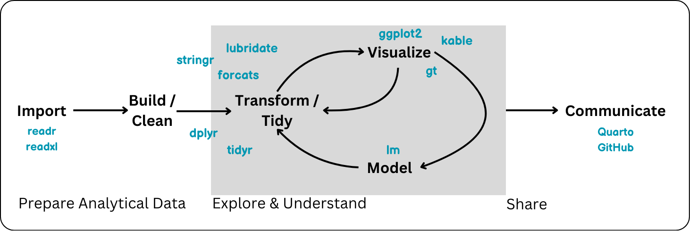

```{r setup}
#| include: false
#| message: false
library(tidyverse)
```


## Wednesday, June 3

Today we will...

+ Course Review
+ Final Exam: What to Expect
+ Remaining Q & A
+ Work Time
  + Final Project
  + Final Exam Practice


# Course Review


## Tools for the Data Science Workflow 



## Guiding Principles for Statistical Computing

- Reproducibility
- Efficiency
- Readability
- Communication
- Ethics

## Reproducibility


You can to send your code to someone else, and they can jump in and start working right away.

This means:

:::{.incremental}
1.  Files are organized and well-named.
2.  References to data and code work for everyone.
3.  Package dependency is clear.
4.  Code will run every time, even if data values change.
5.  Analysis process is well-explained and easy to read.
:::

## Tools for Reproducibility

- Quarto Notebooks

- Relative file paths

- `set.seed()` for simulations / random sampling

- Creating report-ready tables and plots using R code

- Generalizing code as much as possible 
    - e.g. not "hard-coding" column or row indices
    - e.g. regular expressions
    
- Git & GitHub

## Efficiency

We mean a number of things by efficiency including:

- Using as few steps / lines of code as possible
- Not unnecessarily saving variables or objects
- Computational efficiency

## Tools for Efficiency

- Piping and pipelines `|>`
- Recognizing when long vs. wide format will be better for a task (`pivot`)
- `across()` and `if_any()`
- NO FOR-LOOPS
  - taking advantage of vectorization
  - functional programming with `purrr`
- user-written functions

## Efficiency in Practice

- Programmers will always be searching for efficiency!
- Approach a problem the way that makes the most sense for you first, then consider if you can make your approach or code more efficient.


{width=70% fig-align="center"}

## Readability

- Hopefully your code can read line a sentence!
- Other's and your future self will thank you
- With big projects you will be writing 1,000's of lines of code -- messy code gets exponentially more difficult to read


## Tools for Readability

- Piping and pipelines `|>`
- Coding style (spacing, new lines, etc.)
- Using `tidyverse` packages / functions
- Quarto notebooks

{width=50% position="center"}

## Communication

- Communication may come in many forms:
  - emailing your boss / colleague about an analysis
  - presenting to clients
  - writing a memo for your company
  - writing a news article
  - writing an academic paper
  - creating an infographic instagram post
  - creating documentation on GitHub
  - etc....

## Communication

:::incremental
- How well you code doesn't really matter unless you can effectively communicate what you did and found!
- I CANNOT STRESS THIS ENOUGH
::::

{width=70%}

## Tools for Communication

- Quarto notebooks
- Thoughtful plots and tables (`ggplot` and `kable`/`gt`)
- GitHub
- I yelled at you about this a bunch
- Pay attention to how others communicate statistical findings


## Ethics

- Data has context
- How are variables defined?
- Where / who does the data come from?
- What is the potential impact of your analysis?
- What does a plot emphasize or potentially cover-up?

## My two-cents

:::incremental
1. Be curious about your data

2. Take a beat when you run into coding errors

3. Organize your &$!#% files

4. Find people whose work you admire and integrate what they do into your workflow

5. Take pride in your work!
:::

. . .

{width=40% position="center"}

## Course Feedback Discussion

In groups of 4 discuss...

1. Which activities did you find most interesting?

2. What was the most challenging topic in the course?

3. Is there anything you wish you learned that we didn't cover?

4. What helped you when you felt stuck on a problem and/or were debugging code?

5. What are 1 or 2 of your biggest take-aways from the course?


## Take Intermediate R!

- STAT 3820
- Topics can include:
  - some review of the end of STAT 331...
  - websites & graphical user interfaces
  - data from API's & webscraping
  - writing packages
  - more advanced statistical algorithms
  
  
# Final Exam

## Final Exam: What to Expect

+ The exam is worth a total of 100 points and has 2 parts: General Questions, and Short Answer
+ You will have 2 hours and 50 minutes for the entire exam.
+ You will complete Part 1: General Questions first. 
  + This part is closed note and closed computer.
+ Part 2: Short Answer.
  + A .qmd starter file will be opened at the start of each final.
  + Any non-human online resources other than ChatGPT allowed
  + I will pass out paper copies of the questions.


## Final Exam: What to Expect

The exam is **cumulative** so you can expect:

+ Data manipulations with `dplyr` and `tidyr`.
+ Data visualizations with `ggplot`.
+ Working with special variable types: strings, factors, and/or dates.

## Final Exam: What to Expect

There is an emphasis on the material since the midterm:

+ Function writing.
+ Iteration with `map`
+ Statistical modeling with `lm`
  + Cross-validation
+ Simulation
+ Nicely formatted tables


## Final Exam: What to Expect

- Monday 6/8 7:10-10pm in **180-102**
  - Alternative times as scheduled and confirmed.
- Check that your short answer assignment on Canvas is for the right time!
- Plan for taking the full ~3 hours
  - bring food, water, drinks 🧋🧉 ☕️, etc.
  - bring a fully charged computer and a computer charger

## Office Hours

- Friday (tomorrow) 12:30 - 2:00pm
- Monday (6/8) 3 - 5pm
- All in-person (25-201)
- Available to meet by appointment (schedule via email)

## Project Group Evaluations

- A form is now available on Canvas to discuss how group work went
- Submit this form by 6/12 

# Final Exam + Final Project Q & A


## To do...

+ **Course Evaluation**
  + Closes **Friday, 6/5 at 11:59pm**.
  
+ **Final Project Submission**
  + Due **Friday, 6/5 at 11:59pm**.
  + May use up to 4 deadline extensions on project

+ **Final Exam**
  + Monday 6/8 7:10-10pm in 180-102
  + Alternative times as scheduled and confirmed.
  
+ **Final Project Group Evaluation**
  + Due by **Friday, 6/12 at 11:59pm**.

  