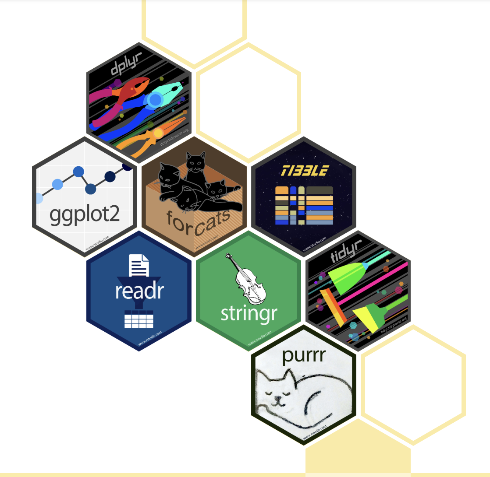
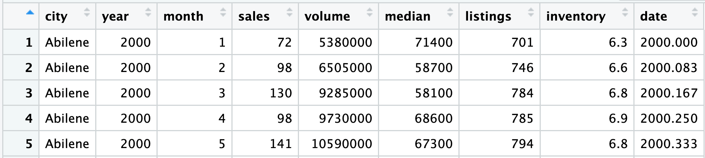
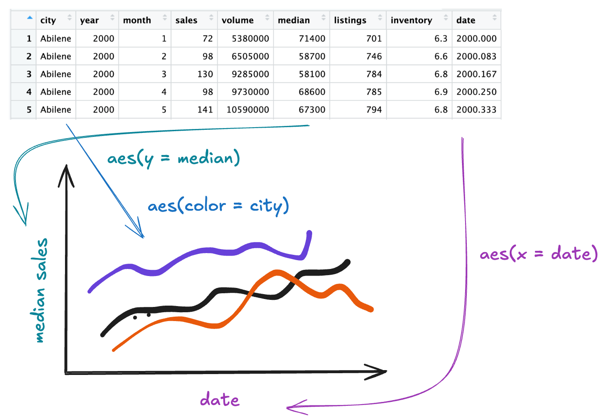
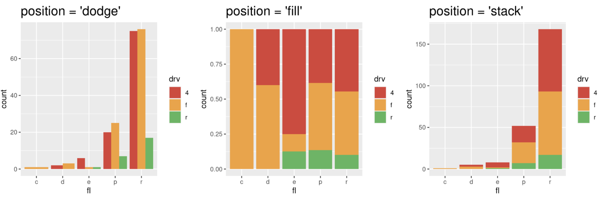

```{r setup}
#| include: false
#| message: false
library(tidyverse)
```

## Monday, April 6

Today we will...

-   Group Quiz (15 min)
-   Style Note of the Day
-   New Material
    -   Welcome to the Tidyverse
    -   Graphics with `ggplot2`
    -   Game Planning
-   PA 2: Using Data Visualization to Find the Penguins


## Style Note of the Day - [Function Calls](https://style.tidyverse.org/syntax.html#argument-names)

:::callout-tip
**Name** arguments in function calls

Only include **necessary** arguments! (If you are using any default values, no need to repeat them in your function call.)
:::

**Good**
```{r}
#| echo: true
#| eval: false
mean(1:10, na.rm = TRUE)
seq(from = 1, to = 100, by = 5)
```

. . .

**Bad**
```{r}
#| echo: true
#| eval: false
mean(1:10, , TRUE)
mean(1:10, trim = 0, na.rm = TRUE)

seq(1, 100, 5)
```

# Welcome to the Tidyverse

## Tidywho?

::: columns
::: {.column width="70%"}
>The tidyverse is an opinionated collection of R packages designed for data science. All packages share an underlying design philosophy, grammar, and data structures.[^1]
:::

::: {.column width="30%"}

:::
:::


. . .


- Most of the functionality you will need for an entire data analysis workflow with **cohesive grammar**

[^1]: https://www.tidyverse.org/


## Core Packages

**The tidyverse includes functions to:**

|                                 |           |
|---------------------------------|-----------|
| Read in data                    |`readr`    |
| Visualize data                  |`ggplot2` |
| Manipulate rectangular data     |`tidyr`, `dplyr`, `tibble` |
| Handle special variable types   |`stringr`, `forcats` , `lubridate` |
| Support functional programming  |`purrr` |

## Tidyverse and STAT 331

::: {.incremental}
- This version of the course will primarily use tidyverse packages and grammar

- Reasoning:
    + the tidyverse is as reputable and ubiquitous as base `R` at this point (in my opinion)
    + the tidyverse is specifically designed to help programmers produce easy-to-read and reproducible analyses and to reduce errors
    + there is excellent [documentation](https://www.tidyverse.org/packages/)!
    + I like it!
    
:::


## Using the `tidyverse` package

- Installing/loading the `tidyverse` package installs/loads **all** of the "tidyverse" packages

- Avoid redundantly installing or loading packages!

. . .

Do this:

```{r}
#| echo: true
#| eval: false
library(tidyverse)
```
or 
```{r}
#| echo: true
#| eval: false
library(readr)
```

. . .

Not this:

```{r}
#| echo: true
#| eval: false
library(tidyverse)
library(readr)
```


# Graphics with `ggplot2`

## Why Do We Create Graphics?

## Grammar of Graphics

The Grammar of Graphics (GoG) is a principled way of specifying **exactly** how to create a particular graph from a given data set. It helps us to systematically design new graphs.

. . .

<br>

Think of a graph or a data visualization as a mapping...

- **FROM variables** in the data set (or statistics computed from the data)...

- **TO visual attributes** (or "aesthetics") **of marks** (or "geometric elements") on the page/screen.


## Components of Grammar of Graphics

-   `data`: dataframe containing variables
-   `aes` : aesthetic mappings (position, color, symbol, ...)
-   `geom` : geometric element (point, line, bar, box, ...)

. . .

-   `stat` : statistical variable transformation (identity, count, linear model, quantile, ...)
-   `scale` : scale transformation (log scale, color mapping, axes tick breaks, ...)
-   `coord` : Cartesian, polar, map projection, ...
-   `facet` : divide into subplots using a categorical variable

## Aesthetics

We map **variables** (columns) from the data to **aesthetics** on the graphic useing the `aes()` function.

. . .

What aesthetics can we set?


-   x, y
-   color, fill
-   linetype
-   size
-   shape

(*see [ggplot2 cheat sheet](https://github.com/rstudio/cheatsheets/blob/main/data-visualization-2.1.pdf) for more*)

## Geometric Objects

We use a `geom_xxx()` function to represent data points.

. . .

::: columns

::: {.column width="50%"}
**one variable**

-   `geom_bar()`
-   `geom_density()`
-   `geom_histogram()`
-   `geom_boxplot()`
:::

::: {.column width="50%"}
**two variable**

-   `geom_boxplot()`
-   `geom_point()`
-   `geom_line()`

:::

:::

:::callout-tip

See [ggplot2 cheat sheet](https://github.com/rstudio/cheatsheets/blob/main/data-visualization-2.1.pdf) for more!
:::


## How to Build a Graphic

To create a specific type of graphic, we will **combine** aesthetics and geometric objects.

. . .

Complete this template to build a basic graphic:


```{r}
#| eval: false
#| echo: true
#| code-line-numbers: false

ggplot(
  data = <DATA>, 
  mapping = aes(<MAPPINGS>)
  ) +
  <GEOM FUNCTION>() + 
  any other arguments...
```

. . .

-  Every `+` to adds another **layer** to a graphic.

## 

::: panel-tabset
### Add data

This begins a plot that you can add layers to:

```{r}
#| echo: true
#| code-line-numbers: "1"
#| fig-align: center
#| fig-height: 4.5
#| fig-width: 4.5
ggplot(data = mpg)
```

### Add aesthetics 🧩

```{r}
#| echo: true
#| code-line-numbers: "2"
#| fig-align: center
#| fig-height: 4.5
#| fig-width: 4.5
ggplot(data = mpg, 
       aes(x = class, y = hwy))
```

### Add one `geom` per layer

::: columns
::: {.column width="50%"}
```{r}
#| echo: true
#| code-line-numbers: "4"
#| fig-height: 6
ggplot(data = mpg, 
       aes(x = class, y = hwy)) +
  geom_jitter()
```
:::

::: {.column width="50%"}
```{r}
#| echo: true
#| code-line-numbers: "5"
#| fig-height: 6
ggplot(data = mpg, 
       aes(x = class, y = hwy)) +
  geom_jitter() +
  geom_boxplot()
```
:::

How would you make the points be **on top** of the boxplots?
:::
:::


## Practice 🧩

::: panel-tabset
### Goal

Start with TX housing data.



Make a plot of [ median house price ]{style="color:teal"} over [ time ]{style="color:purple"}, distinguishing between [ different cities ]{style="color:blue"}.

### Plan

{width=60%}

### ggplot

```{r}
#| echo: false
sm_tx <- txhousing |>
  filter(city %in% c("Dallas","Fort Worth", "Austin",
                     "Houston", "El Paso"))
```

```{r}
#| echo: true
#| code-fold: true
#| fig-height: 4


ggplot(data = sm_tx,
       aes(x = date, 
           y = median, 
           color = city)) + 
  geom_line() + 
  labs(x = "Date",
       y = "Median Home Price",
       title = "Texas Housing Prices",
       color = "City")
```
:::

## Global v. Local Aesthetics 🧩


**Global Aesthetics**

```{r}
#| eval: false
#| echo: true
#| code-line-numbers: "2-3"
ggplot(data = mpg, 
       mapping = aes(x = class, 
                     y = hwy)) +
  geom_boxplot()
```

. . .

**Local Aesthetics**

```{r}
#| eval: false
#| echo: true
#| code-line-numbers: "2-3"
ggplot(data = mpg) +
  geom_boxplot(mapping = aes(x = class, 
                             y = hwy))
```

## Mapping v. Setting Aesthetics 🧩

**Mapping Aesthetics**

```{r}
#| eval: false
#| echo: true
#| code-line-numbers: "4"
ggplot(data = mpg) +
  geom_jitter(mapping = aes(x = class, 
                             y = hwy,
                             color = class))
```

. . .

**Setting Aesthetics**

```{r}
#| eval: false
#| echo: true
#| code-line-numbers: "4"
ggplot(data = mpg) +
  geom_jitter(mapping = aes(x = class, 
                             y = hwy),
               color = "steelblue")
```


## Faceting

Extracts subsets of data and places them in side-by-side plots.

::: panel-tabset
### `facet_grid()`

```{r}
#| echo: true
#| fig-height: 3
#| fig-width: 12
#| code-line-numbers: "4"
#| code-fold: true
ggplot(data = sm_tx,
       aes(x = date, y = median)) + 
  geom_line() + 
  facet_grid(cols = vars(city)) +
  labs(x = "Date",
       y = "Median Home Price",
       title = "Texas Housing Prices")
```

### `facet_wrap()`

```{r}
#| echo: true
#| fig-height: 3.5
#| fig-width: 8
#| code-line-numbers: "4"
#| code-fold: true
#| fig-align: center
ggplot(data = sm_tx,
       aes(x = date, y = median)) + 
  geom_line() + 
  facet_wrap(vars(city)) +
  labs(x = "Date",
       y = "Median Home Price",
       title = "Texas Housing Prices")

```
:::

## Faceting - details

Extracts subsets of data and places them in side-by-side plots.

::: panel-tabset
### Options

<font size = "6">

-   `facet_grid(cols = vars(b))`: facet into columns based on b
-   `facet_grid(rows = vars(a))`: facet into rows based on a
-   `facet_grid(rows = vars(a), cols = vars(b))`: facet into both rows and columns
-   `facet_wrap(vars(b))`: wrap facets into a rectangular layout

</font>

### Scales

You can set scales to let axis limits vary across facets:

```{r}
#| eval: false
#| echo: true
#| code-line-numbers: false

facet_grid(rows = vars(a),
           cols = vars(b),
           scales = ______)
```

<font size = "6">

-   `"fixed"` -- default, x- and y-axis limits are the same for each facet
-   `"free"` -- both x- and y-axis limits adjust to individual facets
-   `"free_x"` -- only x-axis limits adjust
-   `"free_y"` -- only y-axis limits adjust

</font>


### Labels

You can set a labeller to adjust facet labels.

<font size = "6">

Include both the variable name and factor name in the labels:

-   `facet_grid(cols = vars(b), labeller = label_both)`

</font>
:::


<!--
## Statistical Transformation: `stat`

A `stat` transforms an existing variable into a new variable to plot.

-   `identity` leaves the data as is.
-   `count` counts the number of observations.
-   `summary` allows you to specify a desired transformation function.

. . .

Sometimes these statistical transformations happen under the hood when we call a `geom`.-->
<!--
## Statistical Transformation: `stat`

::: panel-tabset
### `stat_count()`

::: columns
::: {.column width="50%"}
```{r}
#| echo: true
#| code-line-numbers: "3"
ggplot(data = mpg,
       mapping = aes(x = class)) +
  geom_bar()
```
:::

::: {.column width="50%"}
```{r}
#| echo: true
#| code-line-numbers: "3"
ggplot(data = mpg,
       mapping = aes(x = class)) +
  stat_count(geom = "bar")
```
:::
:::

### `stat_summary()`

::: columns
::: {.column width="50%"}
```{r}
#| echo: true
#| code-line-numbers: "4-5"
ggplot(data = mpg,
       mapping = aes(x = class,
                     y = hwy)) +
  stat_summary(geom = "bar",
               fun = "mean") +
  scale_y_continuous(limits = c(0,45))
```
:::

::: {.column width="50%"}
```{r}
#| echo: true
#| code-line-numbers: "4-5"
ggplot(data = mpg,
       mapping = aes(x = class,
                     y = hwy)) +
  stat_summary(geom = "bar",
               fun = "max") +
  scale_y_continuous(limits = c(0,45))
```
:::
:::
:::
-->
## Position Adjustements

Position adjustments determine how to arrange `geom`'s that would otherwise occupy the same space.

<font size = "6">

-   `position = 'dodge'`: Arrange elements side by side.
-   `position = 'fill'`: Stack elements on top of one another + normalize height.
-   `position = 'stack'`: Stack elements on top of one another.
-   `position = 'jitter"`: Add random noise to X & Y position of each element to avoid overplotting (see `geom_jitter()`). </font>

## Position Adjustments

```{r}
#| eval: false
#| echo: true
#| code-line-numbers: "2"
ggplot(mpg, aes(x = fl, fill = drv)) + 
  geom_bar(position = "_____")
```



## Plot Customizations

::: panel-tabset
### Labels

```{r}
#| echo: true
#| code-line-numbers: "3-6"
#| fig-height: 4
#| fig-width: 6
#| fig-align: center
#| code-fold: true
ggplot(data = mpg) + 
  geom_jitter(mapping = aes(x = displ, y = hwy, color = cyl)) + 
  labs(x = "Engine Displacement (liters)", 
       y = "Highway MPG", 
       color = "Number of \nCylinders",
       title = "Car Efficiency")
```

### Themes

```{r}
#| echo: true
#| code-line-numbers: "7-8"
#| fig-height: 4
#| fig-width: 6
#| fig-align: center
#| code-fold: true
ggplot(data = mpg) + 
  geom_jitter(mapping = aes(x = displ, y = hwy, color = cyl)) + 
  labs(xlab = "Engine Displacement (liters)", 
       ylab = "Highway MPG", 
       color = "Number of \nCylinders",
       title = "Car Efficiency") +
  theme_bw() +
  theme(legend.position = "bottom")
```

### Scales: Axes Ticks

```{r}
#| echo: true
#| code-line-numbers: "6-9"
#| fig-height: 4
#| fig-width: 6
#| fig-align: center
#| code-fold: true
ggplot(data = mpg) + 
  geom_jitter(mapping = aes(x = displ, y = hwy, color = cyl)) + 
  labs(x     = "Engine Displacement (liters)",
       color = "Number of \nCylinders",
       title = "Car Efficiency") +
  scale_y_continuous("Highway MPG", 
                     limits = c(0,50),
                     breaks = seq(0,50,5))
```

### Scales: Color

```{r}
#| echo: true
#| code-line-numbers: "7"
#| fig-height: 4
#| fig-width: 6
#| fig-align: center
#| code-fold: true
ggplot(data = mpg) + 
  geom_jitter(mapping = aes(x = displ, y = hwy, color = cyl)) + 
  labs(x    = "Engine Displacement (liters)",
       y    = "Highway MPG",
       color = "Number of \nCylinders",
       title = "Car Efficiency") +
  scale_color_gradient(low = "white", high = "green4")
```
:::

## Formatting your Plot Code

It is good practice to put each `geom` and `aes` on a new line.

-   This makes code easier to read!
-   Generally: no line of code should be over 80 characters long.

::: panel-tabset
### Bad Practice

```{r}
#| echo: true
#| eval: false
ggplot(data = mpg, mapping = aes(x = cty, y = hwy, color = class)) + geom_point() + theme_bw() + labs(x = "City (mpg)", y = "Highway (mpg)")
```

### Good Practice

```{r}
#| echo: true
#| eval: false
ggplot(data = mpg, 
       mapping = aes(x = cty, 
                     y = hwy, 
                     color = class)) + 
  geom_point() + 
  theme_bw() + 
  labs(x = "City (mpg)", 
       y = "Highway (mpg)")
```

### Somewhere In Between

```{r}
#| echo: true
#| eval: false
ggplot(data = mpg, 
       mapping = aes(x = cty, y = hwy, color = class)) + 
  geom_point() + 
  theme_bw() + 
  labs(x = "City (mpg)", y = "Highway (mpg)")
```
:::
<!--
## Let's Practice!

How would you make this plot from the `diamonds` dataset in `ggplot2`?

::: columns
::: {.column width="90%"}
```{r}
#| echo: false
tmp <- diamonds
tmp$category <- cut(tmp$price, breaks = c(0, 999, 4999, Inf))
price_labs <- c("<$1k", "$1k-$5k", ">$5k")
names(price_labs) <- c("(0,999]","(999,5e+03]","(5e+03,Inf]")

ggplot(data = tmp,
       mapping = aes(x = cut,
                     fill = cut)) +
  geom_bar() +
  facet_wrap(.~category,
             labeller = labeller(category = price_labs)) +
  theme(axis.text.x = element_blank(),
        axis.title = element_text(size = 18),
        legend.title = element_text(size = 18),
        legend.text = element_text(size = 14),
        strip.text = element_text(size = 18))
```
:::

::: {.column width="10%"}
<br>

-   `data`
-   `aes`
-   `geom`
-   `facet`
:::
:::

## Creating a Game Plan

There are a lot of pieces to put together when creating a good graphic.

-   So, when sitting down to create a plot, you should first create a **game plan**!

. . .

This game plan should include:

1.  What data are you starting from?
2.  What are your x- and y-axes?
3.  What type(s) of `geom` do you need?
4.  What other `aes`'s do you need?

## 

::: panel-tabset
### Make a Game Plan!

Use the `mpg` dataset to create two side-by-side scatterplots of city MPG vs. highway MPG where the points are colored by the drive type (drv). The two plots should be separated by year.


### Example


### R Code - Baseline Plot

```{r}
#| code-fold: true
#| echo: true
#| fig-height: 4.5
ggplot(data = mpg,
       mapping = aes(x = cty,
                     y = hwy,
                     color = drv)) +
  geom_point() +
  facet_grid(cols = vars(year))
```
### R Code - Formatted Plot

```{r}
#| code-fold: true
#| echo: true
#| fig-height: 4.5
ggplot(data = mpg,
       mapping = aes(x = cty,
                     y = hwy,
                     color = drv)) +
  geom_point() +
  facet_grid(cols = vars(year)) +
  labs(x = "city MPG",
       y = "highway MPG") +
  scale_color_discrete(name = "drive type",
                      labels = c("4-wheel","front","rear"))
```
:::-->

## ggplot2 can basically do anything!

- imagine the graphic you want to make, and the support exists for you to make it!

Some general resources:

- [ggplot2 cheatsheet](https://github.com/rstudio/cheatsheets/blob/main/data-visualization-2.1.pdf)
- [index of all functions](https://ggplot2.tidyverse.org/reference/index.html)

Making your exact graphic:

- [all theme elements](https://ggplot2.tidyverse.org/reference/theme.html)
- [already created themes](https://ggplot2.tidyverse.org/reference/ggtheme.html)


## PA 2: Using Data Visualization to Find the Penguins


## Collaborative Protocol

::: {.small}
During your collaboration, your group will alternate between three roles: 
:::


::: panel-tabset

### Project Manager
-   Reads out the prompt and ensures the group understands what is being asked. 
-   Manages resources (e.g., cheatsheets, textbook). 
-   Answers Coder's questions about syntax based on the resources.
-   Works with the group to debug the code.


### Computer

-   Encourages the Coder to vocalize and explain their thinking.
-   Types the code specified by the Coder into the Quarto document.
-   Runs the code provided by the Coder. 
-   Works with group to debug the code.
-   Evaluates the output against the question prompt. 


### Coder

-   Confirms they understand what the prompt is asking.
-   Talks with the group about their ideas. 
-   Explains their thinking.
-   Directs the Computer what to type. 
-   Works with the group to debug the code. 

:::


## Submission

- When you have completed the puzzle, you will submit the name of the poem on Canvas.
  - You can ask me if it is correct before you submit
- You do not need to submit your code, but you should check your code against the solutions when they are posted!
. . .

::: callout-tip

## Starting Roles Today

The person whose family name starts first alphabetically starts as the project manager, second as the computer.

:::

## To do...

-   **[PA 2](../../practice-activities/pa2.qmd): Using Data Visualization to Find the Penguins**
    -   Due Tuesday (4/7) at 11:59pm 
-   [Reading](../../reading/week-2.1.qmd) and review
-   **Lab 2: Exploring Rodents with `ggplot2`**
    -   Due Sunday (4/12) at 11:59 pm
