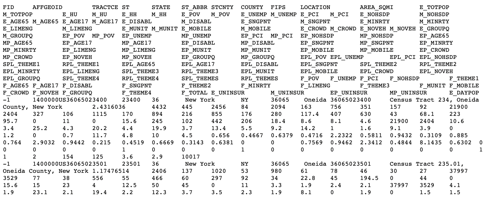
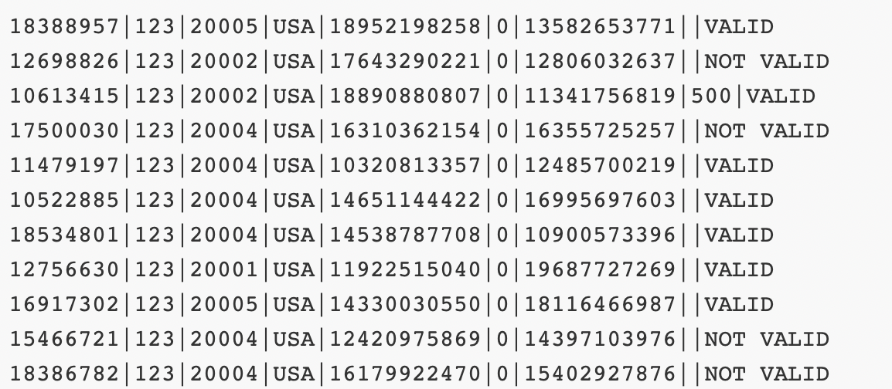
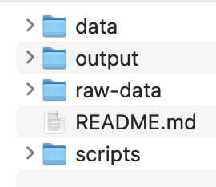
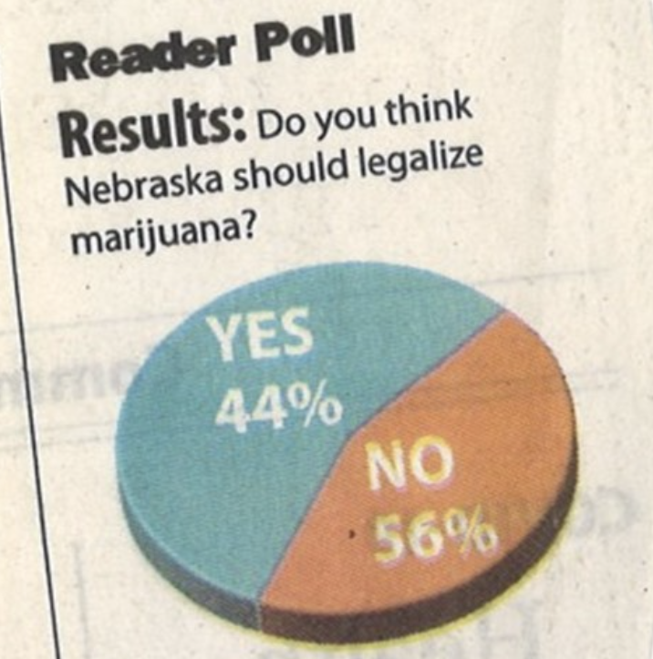
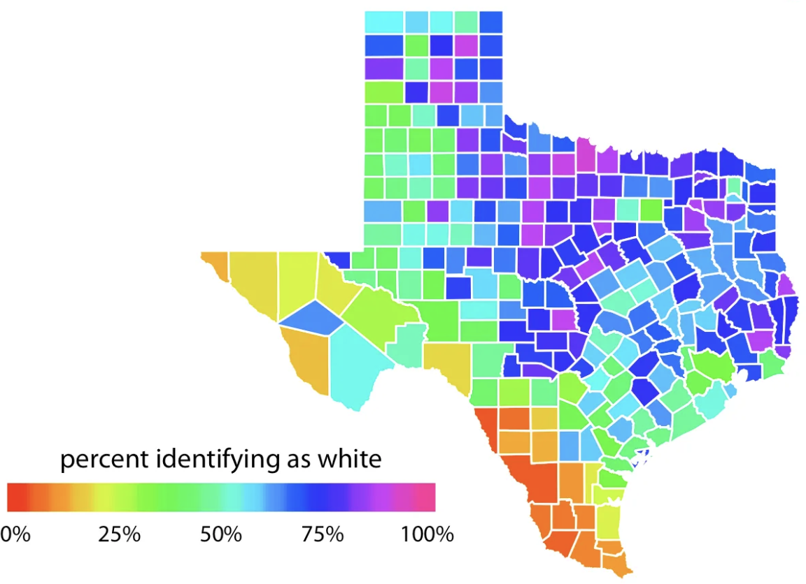
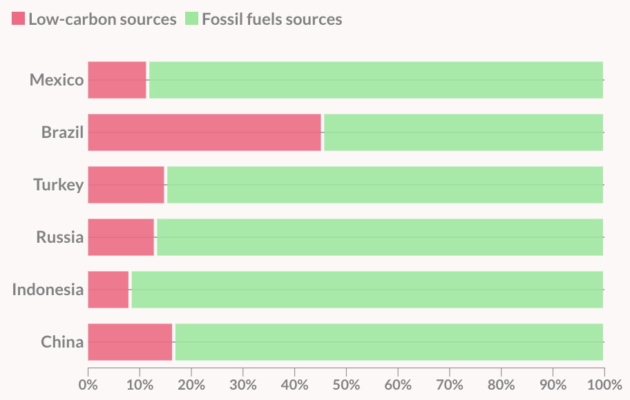
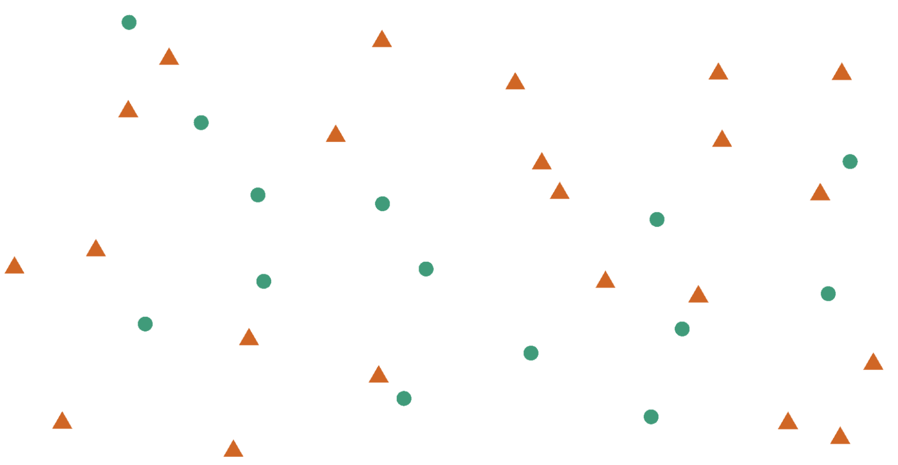
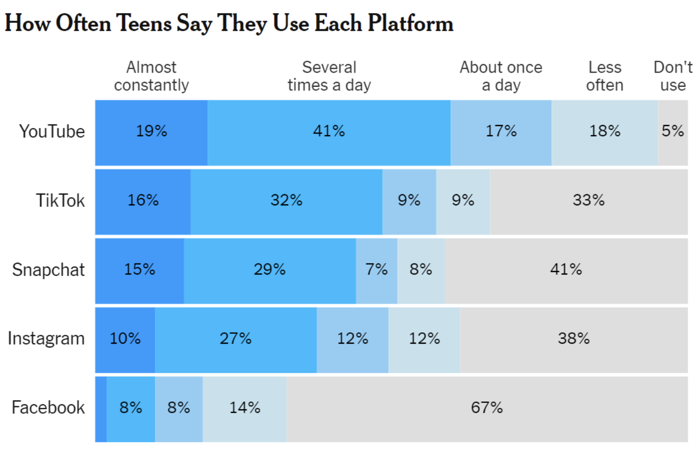
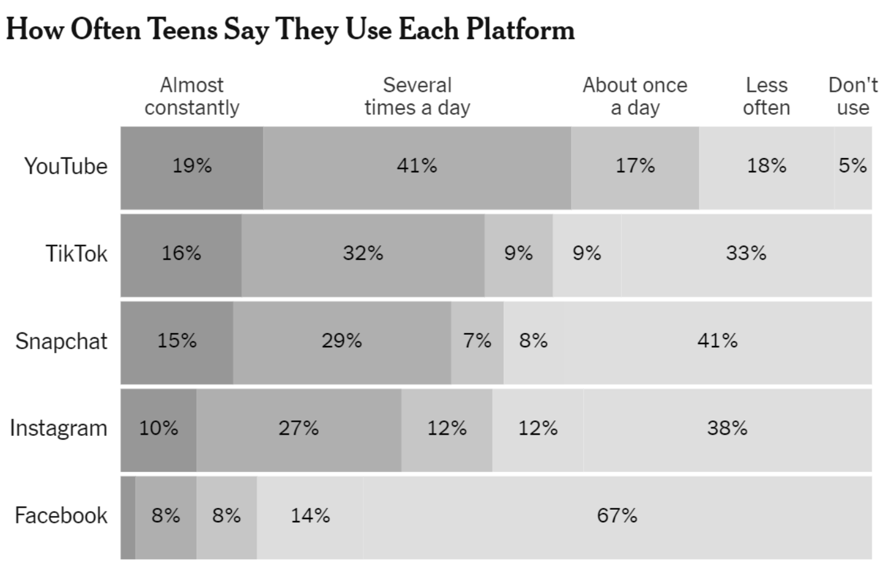

```{r setup}
#| include: false
#| message: false
library(tidyverse)
library(palmerpenguins)
```

## Wednesday, April 8

Today we will...

-   Importing Data
-   What makes a good graphic?
-   Lab 2: Exploring Rodents with ggplot2

<!--
## Lab 1 Notes

- Overall looking nice!
- make sure your code is visible: `echo: true`
- see what your rendered document looks like *before* you submit it
- if you have questions about statistical interpretations, just ask!

-->

# Working with External Data

## Data Science Workflow


## Common Types of Data Files

Look at the **file extension** for the type of data file.

. . .

::: columns
::: {.column width="70%"}
`.csv` : "comma-separated values"

- most typical type used in R
:::

::: {.column width="30%"}
```         
Name, Age
Bob, 49
Joe, 40
```
:::
:::

. . .

`.xls, .xlsx`: Microsoft Excel spreadsheet

- use `readxl` package
. . .

`.txt`: plain text

-   Could have any sort of delimiter...
-   Need to let R know what to look for!

## Common Types of Data Files

::: panel-tabset
### File A


### File B



### File C



### Sources

-   [File A](https://people.sc.fsu.edu/~jburkardt/data/csv/csv.html)
-   [File B](https://github.com/ccusa/Disaster_Vulnerability_Map/blob/master/sample-data.tsv)
-   [File C](https://chadbaldwin.net/2021/03/24/quick-parse-csv-file.html)
:::


## Loading External Data 

The **tidyverse** has nice functions for **reading** in data in the `readr` and `readxl` packages:

-   `read_csv()` is for comma-separated data.

-   `read_tsv()` is for tab-separated data.

-   `read_table()` is for white-space-separated data.

-   `read_delim()` is any data with "columns" (you specify the separator). The above are special cases.

-   `read_excel()` is specifically for dealing with Excel files.

Remember to load the `readr` and `readxl` packages first!


## Reminder: Notebooks and File Paths

- You have to tell `R` where to "find" the data you want to read in using a file path.

- Quarto automatically sets the working directory to the be directory where the Quarto document is for any code **within** the Quarto document

- This overrides the directory set by an .Rproj

. . .

::: columns
::: {.column width="70%"}
- Pay attention to this when setting relative filepaths

    + To "backout" of one directory, use `"../"`
    + e.g.: `"../data/dat.csv"`
:::
::: {.column width="30%"}  

:::
:::

## Data Import Options 🧩

- Depending on how messy your original data file is, you may need to add no extra arguments to these import functions
- But there are plenty of options!
    - how to handle column names
    - what data types columns should be
    - what rows to import ...
    - etc.
- See `readr` and `readxl` cheatsheets


# What Makes a Good Visualization?


## Graphics

Graphics consist of:

-   **Structure:** boxplot, scatterplot, etc.

-   **Aesthetics:** features such as color, shape, and size that map other variables to structural features.

**Both** the structure and aesthetics should help viewers interpret the information.

## What makes bad graphics bad?

-   BAD DATA.
-   Too much "chartjunk" -- superfluous details (Tufte).
-   Design choices that are difficult for the human brain to process, including:

::: columns
::: {.column width="10%"}
:::

::: {.column width="50%"}
-   Colors
-   Orientation
-   Organization
:::

::: {.column width="40%"}
{.absolute width="300"}
:::
:::

## What makes good graphics good?

Edward R. Tufte is a well-known critic of visualizations, and his definition of **graphical excellence** consists of:

::: {.incremental}
-   communicating complex ideas with **clarity, precision, and efficiency**.
-   maximizing the **data-to-ink** ratio.
-   telling the truth about the data.
:::


## Color Guidelines

-   Do not use rainbow color gradients!

-   Be conscious of what certain colors “mean”.

    -   Good idea to use red for "good" and green for "bad"???

```{r}
#| fig-align: center
#| layout-ncol: 2
#| out-width: 70%


```

## Color Guidelines

-   For **categorical** data, try not to use more than 7 colors.

. . .

-   For **quantitative** data, use mappings from data to color that are **numerically and perceptually uniform**.


## Color Guidelines

**To colorblind-proof a graphic...**

-   use **double encoding** - when you use color, **also** use another aesthetic (line type, shape, etc.).

```{r}
#| fig-align: center
#| out-width: 50%

```

## Color Guidelines

**To colorblind-proof a graphic...**

-   with a unidirectional scale (e.g., all + values), use a **monochromatic** color gradient.

```{r}
#| fig-align: center
#| out-width: 50%

```

-   with a bidirectional scale (e.g., + and - values), use a **purple-white-orange** color gradient. Transition through white!

```{r}
#| fig-align: center
#| out-width: 70%

```

## Color Guidelines

**To colorblind-proof a graphic...**

-   print your chart out in black and white -- if you can still read it, it will be safe for all users.

```{r}
#| fig-align: center
#| layout-ncol: 2


```

## Color in ggplot2

There are several packages with color scheme options:

-   Rcolorbrewer
-   ggsci
-   viridis
-   wesanderson

These packages have color palettes that are aesthetically pleasing and, in many cases, colorblind friendly.

You can also take a look at other [ways to find nice color palettes](https://lisacharlottemuth.com/2016/04/22/Colors-for-DataVis/). [ColorBrewer](https://colorbrewer2.org/#type=sequential&scheme=BuGn&n=3) is my personal favorite.

# Let's Practice

## Penguins -  Flipper Length by Species


::: panel-tabset

## Species X-Axis

```{r}
#| code-fold: true
#| echo: true
#| fig-height: 4.5
#| fig-width: 8
#| fig-align: "center"


ggplot(data = penguins,
       mapping = aes(y = flipper_length_mm, 
                              x = species)) +
    geom_boxplot() + 
    labs(title = "Distribution of Flipper Lengths for Penguin Species", 
         x = "Species" , 
         y = "Flipper Length (mm)")
```

## Species Facets

```{r}
#| code-fold: true
#| echo: true
#| fig-height: 4.5
#| fig-width: 8
#| fig-align: "center"


ggplot(data = penguins,
       mapping = aes(y = flipper_length_mm)) +
    geom_boxplot() + 
    facet_grid(cols = vars(species)) +
    labs(title = "Distribution of Flipper Lengths for Penguin Species", 
         y = "Flipper Length (mm)")
```

:::

## Penguins - Flipper Length by Species & Sex


::: panel-tabset

## Option 1

```{r}
#| code-fold: true
#| echo: true
#| fig-height: 4.5
#| fig-width: 8
#| fig-align: "center"


ggplot(data = penguins) +
    geom_boxplot(mapping = aes(y = flipper_length_mm, 
                             x = species,
                             color = sex)) + 
    labs(title = "Distribution of Flipper Lengths for Penguin Species", 
         x = "Species" , 
         y = "Flipper Length (mm)")
```

## Option 2

```{r}
#| code-fold: true
#| echo: true
#| fig-height: 4.5
#| fig-width: 8
#| fig-align: "center"


ggplot(data = penguins) +
    geom_boxplot(mapping = aes(y = flipper_length_mm,
                               x = sex)) + 
    facet_grid(cols = vars(species)) +
    labs(title = "Distribution of Flipper Lengths for Penguin Species", 
         y = "Flipper Length (mm)")
```
## Option 3

```{r}
#| code-fold: true
#| echo: true
#| fig-height: 4.5
#| fig-width: 8
#| fig-align: "center"


ggplot(data = penguins) +
    geom_boxplot(mapping = aes(y = flipper_length_mm,
                               x = species)) + 
    facet_grid(cols = vars(sex)) +
    labs(title = "Distribution of Flipper Lengths for Penguin Species", 
         y = "Flipper Length (mm)")
```

:::

## PA 2 Example - Two Categorical Variables

```{r}
data(penguins)
```

:::panel-tabset

## Colors & Shapes

```{r}
#| code-fold: true
#| echo: true
#| fig-height: 4.5
#| fig-width: 8
#| fig-align: "center"

ggplot(data = penguins) +
    geom_point(mapping = aes(x = bill_length_mm, 
                             y = bill_depth_mm, 
                             color = species, 
                             shape = island )) + 
    labs(title = "Relationship Between Bill Length and Bill Depth", 
         x = "Bill Length (mm)" , 
         y = "Bill Depth (mm)")
```

## Colors & Facets

```{r}
#| code-fold: true
#| echo: true
#| fig-height: 4.5
#| fig-width: 8
#| fig-align: "center"

ggplot(data = penguins,
       mapping = aes(x = bill_length_mm, 
                     y = bill_depth_mm, 
                     color = species)) +
  geom_point() + 
  facet_wrap(~island) +
  labs(x = "Bill Length (mm)",
       y = "Bill Depth (mm)", 
       title = "Relationship Between Bill Length and Bill Depth")
```
:::

## Lecture Example - Texas Housing Data
```{r}
data(txhousing)
sm_tx <- txhousing |>
  filter(city %in% c("Dallas","Fort Worth", "Austin",
                     "Houston", "El Paso"))
```

:::panel-tabset

## Color


```{r}
#| code-fold: true
#| echo: true
#| fig-height: 4.5
#| fig-width: 8
#| fig-align: "center"

ggplot(data = sm_tx,
       aes(x = date, y = median, color = city)) + 
  geom_line() + 
  labs(x = "Date",
       y = "Median Home Price",
       title = "Texas Housing Prices over Time for Select Cities")
```
## Facet

```{r}
#| code-fold: true
#| echo: true
#| fig-height: 4.5
#| fig-width: 8
#| fig-align: "center"

ggplot(data = sm_tx,
       aes(x = date, y = median)) + 
  geom_line() + 
  facet_wrap(vars(city)) +
  labs(x = "Date",
       y = "Median Home Price",
       title = "Texas Housing Prices over Time for Select Cities")
```

:::


# What Do You Think About This Graphic?

## Example 1


## Example 2


## Example 3


## Lab 2: Exploring Rodents with ggplot2


## Lab Formatting

- Starting with Lab 2, your labs **will** be graded more strictly on appearance and code format. 

- Review the lab formatting guidelines on Canvas
*before* you submit your lab!

- Big points:
  - use relative file paths
  - make sure all markdown renders as expected 
  - NEVER PRINT OUT FULL DATASETS
  - no long code lines - use line breaks liberally
  - "clean up" the lab before submitting
  

## ggplot2 cheatsheet


](https://rstudio.github.io/cheatsheets/pngs/data-visualization.png)

## To do...

-   **Lab 2: Exploring Rodents with ggplot2**
    -   due Sunday 4/12 at 11:59pm
-   **Required [Reading](../../reading/week-2.2.qmd)**
-   Review all material from this week for the **group quiz on Monday**!
    - Make sure that you can answer all of the questions in this week's notes!
    - Group quiz at the **beginning** of class
    
  
    