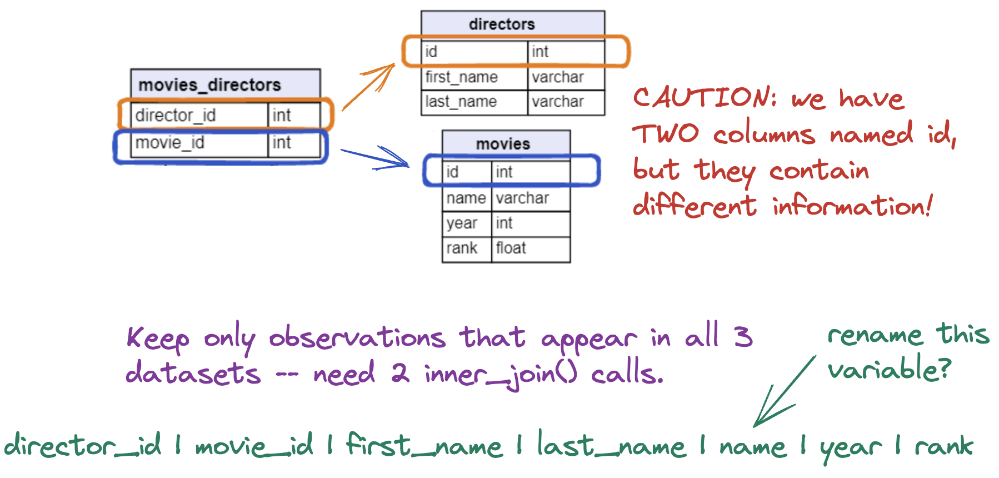

```{r setup}
#| include: false
#| message: false
library(tidyverse)
library(readxl)
library(ggridges)
library(RColorBrewer)

load("data/imdb_data.Rdata")
```


## Wednesday, April 20

Today we will...

<!---   Notes on Lab 3-->
-   Project Info
-   New Material
    -   Clean Variable Names
    -   Extensions to Data Joins
    -   Factors with `forcats`
-   Lab 4: Childcare Costs in California

<!--## Notes on Lab 3

::: {.incremental}
- Only include output that (exactly) answers a specific question
    + If you find yourself outputting a datatable with more than 20 rows, think again!
- Be mindful of "environment junk"
- If we have cleaned up a dataset, you can assume that will be used for the remainder of the lab, unless otherwise specified
- Please **look at the solutions** for efficient code and statistical interpretations
:::


## Where is my file?

- Remember: I will smash 💥 your computer if you:
    1. Set a working directory in a Quarto file `setwd()` OR
    2. Use an aboslute file path that would **only work on your computer**

. . .    

- USE RELATIVE FILE PATHS I BEG OF YOU


## Lab 3 Question 11

<font size = 6>
**Which instructor(s) with either a doctorate or professor degree had the highest and lowest average percent of students responding to the evaluation across all their courses? Include how many years the professor had worked (seniority) and their sex in your output**
</font>

. . .

The trick: `group_by()` `instructor_id`, `seniority`, and `sex`


```{r}
#| eval: false
#| echo: true

teacher_evals_clean |> 
  filter(academic_degree %in% c("dr", "prof")) |> 
  group_by(teacher_id, seniority, sex) |> 
  summarize(avg_response = mean(resp_share)) |> 
  ungroup() |> 
  slice_max(order_by = avg_response) |> 
  kable()
```

- If you find yourself using `mutate()` and then `distinct()`, you should probably be using `summarize()`

-->

## Project 

:::{.incremental}

- Detailed information about the project is posted on Canvas
- You will complete the project in groups of 2-3
- The project is scaffolded into "Checkpoints"
  - The bulk of the work will be in Weeks 8-10
- **First Checkpoint due 6th Monday (5/4) at 11:59pm**
  + Fill out a survey to form groups 
  + You can specify if there are people you want to work with or have me place you in a group

:::

# `janitor` Package

## Variable Names in R

```{r}
#| include: false
library(readxl)
library(tidyverse)
military <- read_xlsx("../../practice-activities/_data/SIPRI-Milex-data-1949-2024.xlsx", 
                sheet = "Share of Govt. spending", 
                skip  = 7)

military_clean <- military |> 
  select(-Notes, -`Reporting year`) |> 
  filter(!is.na(Country)) |> 
   mutate(across(.cols = !Country, 
                .fns  = ~na_if(.x, "...")),
         across(.cols = !Country,
                .fns  = ~na_if(.x, "xxx")))
```

Data from external sources likely has variable names not ideally formatted for R.

Names may...

-   contain spaces.
-   start with numbers.
-   start with a mix of capital and lower case letters.

. . .

```{r}
#| eval: true
#| echo: true
names(military)[1:12]
```

## Messy Variable Names are a Pain

- You should have noticed this in Practice Activity 4 working with the SIPRI data

- You have to use back tick marks around variables that start with numbers or have spaces:

```{r}
#| eval: false
#| echo: true
military |> 
  select(`Reporting year`,
          `1988.0`)
```

- I personally find capitilization in variable names is *very* annoying and slows me down

##  [`janitor`](https://sfirke.github.io/janitor/) to the rescue!


## Clean Variable Names with [`janitor`](https://sfirke.github.io/janitor/)

The `janitor` package converts all variable names in a dataset to *snake_case*.

:::{.incremental}
Names will...

-   start with a lower case letter.
-   have spaces and special characters filled in with `_`.

```{r}
#| eval: true
#| echo: true
#| code-line-numbers: "3-5"
library(janitor)
military_clean_names <- military |> 
  clean_names()

names(military_clean_names)[1:12]
```
:::


# Extensions to Relational Data

## Relational Data Reminder - Keys

When we work with relational data, we rely on **keys**.

-   A key uniquely identifies an observation in a dataset.
-   A key allows us to relate datasets to each other

## IMDb Movies Data


**What were the active years of each director?**

::: callout-note
# Discussion

Which datasets do we need to use to answer this question?
:::

## Joining Multiple Data Sets

::: panel-tabset
### Data

::: columns
::: {.column width="50%"}
```{r}
#| echo: true
#| eval: false
movies_directors |> 
  slice_head(n = 4)
```

```{r}
#| echo: false
#| eval: true
movies_directors |> 
  slice_head(n = 4) |> 
  knitr::kable() |> 
  kableExtra::scroll_box(height = "200px") |> 
  kableExtra::kable_styling(font_size = 20)
```

:::

::: {.column width="50%"}
```{r}
#| echo: true
#| eval: false
directors |> 
  slice_head(n = 4)
```

```{r}
#| echo: false
#| eval: true
directors |> 
  slice_head(n = 4) |> 
  knitr::kable() |> 
  kableExtra::scroll_box(height = "200px") |> 
  kableExtra::kable_styling(font_size = 20)
```
:::
:::

::: columns
::: {.column width="25%"}
:::

::: {.column width="50%"}
```{r}
#| echo: true
#| eval: false
movies |> 
  slice_head(n = 4)
```

```{r}
#| echo: false
#| eval: true
movies |> 
  slice_head(n = 4) |> 
  knitr::kable() |> 
  kableExtra::scroll_box(height = "200px") |> 
  kableExtra::kable_styling(font_size = 20)
```
:::
:::

### Sketch

```{r}
#| out-width: "90%"
#| fig-align: center

```

### 1st + 2nd

```{r}
#| echo: true
#| eval: false
movies_directors |> 
  inner_join(directors, 
             join_by(director_id == id))
```

```{r}
#| eval: true
#| echo: false
movies_directors |> 
  inner_join(directors, 
             join_by(director_id == id)) |> 
  knitr::kable() |> 
  kableExtra::scroll_box(height = "400px") |> 
  kableExtra::kable_styling(font_size = 30)
```

### + 3rd

```{r}
#| echo: true
#| eval: false
movies_directors |> 
  inner_join(directors, 
             join_by(director_id == id)) |> 
  inner_join(movies,
             join_by(movie_id == id))
```

```{r}
#| eval: true
#| echo: false
movies_directors |> 
  inner_join(directors, 
             join_by(director_id == id)) |> 
  inner_join(movies,
             join_by(movie_id == id)) |> 
  knitr::kable() |> 
  kableExtra::scroll_box(height = "300px") |> 
  kableExtra::kable_styling(font_size = 30)
```

### Analysis

```{r}
#| echo: true
#| eval: false
#| code-line-numbers: "6-10"

movies_directors |> 
  inner_join(directors, 
             join_by(director_id == id)) |> 
  inner_join(movies,
             join_by(movie_id == id)) |> 
  group_by(first_name, last_name) |>
  summarize(start_year = min(year),
            end_year = max(year)) |> 
  mutate(n_years_active = end_year - start_year) |> 
  arrange(desc(n_years_active))
```

```{r}
#| echo: false
#| eval: true

movies_directors |> 
  inner_join(directors, 
             join_by(director_id == id)) |> 
  inner_join(movies,
             join_by(movie_id == id)) |> 
  group_by(first_name, last_name) |>
  summarize(start_year = min(year),
            end_year = max(year)) |> 
  mutate(n_years_active = end_year - start_year) |> 
  arrange(desc(n_years_active)) |> 
  knitr::kable() |> 
  kableExtra::scroll_box(height = "200px") |> 
  kableExtra::kable_styling(font_size = 30)
```

:::

## Know Your Unique Observations!

::: callout-note
# Discussion

What is the observational unit after joining the `directors` and `movies_directors` by the `director_id` key? What happens for directors that have multiple movies in the `movies_directors` data?
:::

. . .

```{r}
#| echo: true
#| eval: false
directors |> 
  inner_join(movies_directors, 
             join_by(id == director_id))
```

```{r}
#| eval: true
#| echo: false
directors |> 
  inner_join(movies_directors, 
             join_by(id == director_id)) |> 
  knitr::kable() |> 
  kableExtra::scroll_box(height = "300px") |> 
  kableExtra::kable_styling(font_size = 30)
```

## Know Your Unique Observations!

Remember the `rodent` data from Lab 2. Say we had separate datsets for measurements and species information:


```{r}
rodent <- read_csv("../../labs/lab2/surveys.csv")
species <- rodent |> 
  select(genus:taxa, species_id) |> 
  distinct()

measurements <- rodent |> 
  select(genus, species, sex:weight) |> 
  rename(genus_name = genus)
```

::: panel-tabset
## Species

```{r}
#| echo: true
#| eval: false
species
```

```{r}
#| eval: true
#| echo: false
species |> 
  knitr::kable() |> 
  kableExtra::scroll_box(height = "300px") |> 
  kableExtra::kable_styling(font_size = 30)
```

## Measurements

```{r}
#| echo: true
#| eval: false
measurements
```

```{r}
#| eval: true
#| echo: false
measurements[1:100,] |> 
  knitr::kable() |> 
  kableExtra::scroll_box(height = "300px") |> 
  kableExtra::kable_styling(font_size = 30)
```

:::

## Know Your Unique Observations!

::: callout-note 
# Discussion

What happens if we join `species` and `measurements` by the genus only?
:::


```{r}
#| echo: true
#| eval: false
measurements |> 
  inner_join(species, 
             by = join_by(genus_name == genus))
```


```{r}
#| eval: true
#| echo: false
measurements |> 
  inner_join(species, 
             by = join_by(genus_name == genus)) |> 
  slice_head(n = 100) |> 
  knitr::kable() |> 
  kableExtra::scroll_box(height = "150px") |> 
  kableExtra::kable_styling(font_size = 20)
```

. . .

::: callout-important
# DANGER : MANY-TO-MANY JOIN!

Our observations exploded and the `species_id` isn't even right for some observations! We also now have a `species.x` and `species.y` variable since the variable was present in both the left and right data.
::: 


## Joining on Multiple Variables

To fix this, we need to join on multiple variables (a compound key):

```{r}
#| echo: true
#| eval: false
species |> 
  full_join(measurements,
            join_by(species == species, 
                    genus == genus_name))
```

```{r}
#| eval: true
#| echo: false
species |> 
  full_join(measurements,
            join_by(species == species, 
                    genus == genus_name)) |> 
  slice_head(n = 100) |> 
  knitr::kable() |> 
  kableExtra::scroll_box(height = "250px") |> 
  kableExtra::kable_styling(font_size = 30)
```


# Categorical Data

## Categorical variables in R

- As you have seen, categorical variables can be stored as

  - character OR
  - factor

- So what's the difference??

## What is a factor variable?

Factors are used for

1.  categorical variables with a fixed and known set of possible values.

-   E.g., `day_born` = Sunday, Monday, Tuesday, ..., Saturday

2.  displaying character vectors in non-alphabetical order.

- useful for nice tables and plots!

## Eras Tour

Let's consider songs that Taylor Swift played on her Eras Tour.

I have randomly selected 25 songs (and their albums) to demonstrate.

```{r}
#| echo: false
set.seed(2)
full_eras <- read_excel("data/TS_data.xlsx", sheet = 1)
eras_data <- full_eras |> 
  slice_sample(n = 25) |> 
  select(Song, Album)
```

```{r}
#| echo: true
#| eval: false
eras_data |> 
  slice_head(n = 10)
```

```{r}
#| echo: false
#| eval: true
eras_data |> 
  slice_head(n = 10) |> 
  knitr::kable() |> 
  kableExtra::scroll_box(height = "450px") |> 
  kableExtra::kable_styling(font_size = 25)
```

## Creating a Factor -- Base `R`

A **character** vector:

```{r}
#| echo: true
eras_data |> 
  pull(Album)
```

. . .

A **factor** vector:

```{r}
#| echo: true
eras_data |> 
  pull(Album) |> 
  factor()
```

## Creating a Factor -- Base `R`

When you create a factor variable from a vector...

-   Every unique element in the vector becomes a **level**.
-   The levels are ordered alphabetically.
-   The elements are no longer displayed in quotes.

## Creating a Factor -- Base `R`

You can **specify the order of the levels** with the `level` argument.

```{r}
#| echo: true
eras_data |> 
  pull(Album) |> 
  factor(levels = c("Fearless","Speak Now","Red","1989",
                    "Reputation","Lover","Folklore",
                    "Evermore","Midnights"))
```

## `forcats`

::: columns
::: {.column width="80%"}
We use this package to...

-   turn character variables into factors.

-   make factors by discretizing numeric variables.

-   rename or reorder the levels of an existing factor.
:::

::: {.column width="20%"}
```{r}
#| fig-align: center
knitr::include_graphics("https://github.com/rstudio/hex-stickers/blob/main/thumbs/forcats.png?raw=true")
```
:::
:::

::: callout-note
The packages `forcats` ("for categoricals") helps wrangle categorical variables.

-   `forcats` loads with `tidyverse`!
:::

## Creating a Factor -- `fct`

With `fct()`, the levels are automatically ordered in the **order of first appearance**.

```{r}
#| echo: true
eras_data |> 
  mutate(Album = fct(Album)) |> 
  pull(Album)
```


## Creating a Factor -- `fct`

You can still **specify the order of the levels** with `level`.

```{r}
#| echo: true
eras_data |> 
  mutate(Album = fct(Album,
                     levels = c("Fearless","Speak Now","Red",
                                "1989", "Reputation","Lover",
                                "Folklore", "Evermore","Midnights"))) |> 
  pull(Album) 
```

## Creating a Factor -- `fct`

You can also **specify non-present levels**.

```{r}
#| echo: true
#| code-line-numbers: "3,7"
eras_data |> 
  mutate(Album = fct(Album, 
                     levels = c("Taylor Swift",
                                "Fearless","Speak Now","Red",
                                "1989", "Reputation","Lover",
                                "Folklore", "Evermore","Midnights",
                                "The Tortured Poets Department"))) |> 
  pull(Album) 
```

```{r}
#| echo: false
eras_data <- eras_data |> 
  mutate(Album = fct(Album,
                     levels = c("Taylor Swift",
                                "Fearless","Speak Now","Red",
                                "1989","Reputation","Lover",
                                "Folklore","Evermore","Midnights",
                                "The Tortured Poets Department")))
```

## Re-coding a Factor -- `fct_recode`

Oops, we have a typo in some of our levels! We change existing levels with the syntax `<new level> = <old level>`.

. . .

```{r}
#| echo: true
eras_data |>
  mutate(Album = fct_recode(.f = Album,
                            "folklore" = "Folklore",
                            "evermore" = "Evermore",
                            "reputation" = "Reputation")) |>
  pull(Album) 
```

```{r}
#| echo: false
eras_data <- eras_data |>
  mutate(Album = fct_recode(.f = Album,
                            "folklore" = "Folklore",
                            "evermore" = "Evermore",
                            "reputation" = "Reputation"))
```

. . .

**Non-specified levels are not re-coded.**

## Re-coding a Factor -- `case_when`

We have similar functionality with the `case_when()` function...

. . .

```{r}
#| echo: true
eras_data |>
  mutate(Album = case_when(Album == "Folklore" ~ "folklore",
                           Album == "Evermore" ~ "evermore",
                           Album == "Reputation" ~ "reputation",
                           .default = Album),
         Album = fct(Album)) |> 
  pull(Album)
```

## Collapsing a Factor --`fct_collapse`

Collapse multiple existing levels of a factor with the syntax `<new level> = c(<old levels>)`.

. . .

```{r}
#| echo: true
#| eval: false
eras_data |> 
  mutate(Genre = fct_collapse(.f= Album,
                       "country pop" = c("Taylor Swift", "Fearless"),
                       "pop rock" = c("Speak Now","Red"),
                       "electropop" = c("1989","reputation","Lover"),
                       "folk pop" = c("folklore","evermore"),
                       "alt-pop" = "Midnights")) |> 
  slice_sample(n = 6)
```

```{r}
#| echo: false
#| eval: true

eras_data |> 
  mutate(Genre = fct_collapse(.f= Album,
                       "country pop" = c("Taylor Swift", "Fearless"),
                       "pop rock" = c("Speak Now","Red"),
                       "electropop" = c("1989","reputation","Lover"),
                       "folk pop" = c("folklore","evermore"),
                       "alt-pop" = "Midnights")) |> 
  slice_sample(n = 6) |> 
  knitr::kable() |> 
  kableExtra::scroll_box(height = "350px") |> 
  kableExtra::kable_styling(font_size = 25)
```


## Re-leveling a Factor --`fct_relevel`

Change the **order** of the levels of an existing factor.

::: panel-tabset
### Original

```{r}
#| echo: true
eras_data |>
  pull(Album) |> 
  levels()
```

### Ordered by Copies Sold

```{r}
#| echo: true
eras_data |> 
  mutate(Album = fct_relevel(.f = Album, 
                             c("Fearless","1989","Taylor Swift",
                               "Speak Now","Red","Midnights","reputation",
                               "folklore","Lover","evermore"))) |>
  pull(Album) |>
  levels()
```

Unspecified levels remain in the same order at the **end**.
:::

## Re-ordering Factors in `ggplot2`

::: panel-tabset
### Original

The bars follow the default factor levels.

```{r}
#| echo: true
#| eval: false
#| code-line-numbers: "2"
full_eras |> 
  mutate(Album = fct(Album)) |> 
  ggplot() +
  geom_bar(aes(y = Album), fill = "#A5C9A5") +
  theme_minimal() +
  labs(x = "Number of Songs",
       y = "",
       subtitle = "Album",
       title = "Songs Played on the Eras Tour")
```

### Plot

```{r}
#| echo: false
full_eras |> 
  mutate(Album = fct(Album)) |> 
  ggplot() +
  geom_bar(aes(y = Album), fill = "#A5C9A5") +
  theme_minimal() +
  labs(x = "Number of Songs",
       y = "",
       subtitle = "Album",
       title = "Songs Played on the Eras Tour")
```

### Specify Levels

We can order factor levels to order the bar plot.

```{r}
#| echo: true
#| eval: false
#| code-line-numbers: "2-6"
full_eras |> 
  mutate(Album = fct(Album,
                     levels = c("Fearless","Speak Now","Red",
                                "1989","Reputation","Lover",
                                "Folklore","Evermore",
                                "Midnights"))) |> 
  ggplot() +
  geom_bar(aes(y = Album), fill = "#A5C9A5") +
  theme_minimal() +
  labs(x = "Number of Songs",
       y = "",
       subtitle = "Album",
       title = "Songs Played on the Eras Tour")
```

### Plot

```{r}
#| echo: false
full_eras |> 
  mutate(Album = fct(Album,
                     levels = c("Fearless","Speak Now","Red",
                                "1989","Reputation","Lover",
                                "Folklore","Evermore",
                                "Midnights"))) |> 
  ggplot() +
  geom_bar(aes(y = Album), fill = "#A5C9A5") +
  theme_minimal() +
  labs(x = "Number of Songs",
       y = "",
       subtitle = "Album",
       title = "Songs Played on the Eras Tour")
```

:::


## Re-ordering Factors in `ggplot2`

::: panel-tabset
### Original

The bars follow the default factor levels.

```{r}
#| echo: true
#| eval: false
#| code-line-numbers: "2"
full_eras |> 
  mutate(Album = fct(Album)) |> 
  ggplot() +
  geom_bar(aes(y = Album), fill = "#A5C9A5") +
  theme_minimal() +
  labs(x = "Number of Songs",
       y = "",
       subtitle = "Album",
       title = "Songs Played on the Eras Tour")
```

### Plot

```{r}
#| echo: false
full_eras |> 
  mutate(Album = fct(Album)) |> 
  ggplot() +
  geom_bar(aes(y = Album), fill = "#A5C9A5") +
  theme_minimal() +
  labs(x = "Number of Songs",
       y = "",
       subtitle = "Album",
       title = "Songs Played on the Eras Tour")
```

### Reorder by Value

We can order factor levels to order the bar plot by the count using `fct_infreq()`

```{r}
#| echo: true
#| eval: false
#| code-line-numbers: "3"
full_eras |> 
  ggplot() +
  geom_bar(aes(y = fct_infreq(Album)), 
           fill = "#A5C9A5") +
  theme_minimal() +
  labs(x = "Number of Songs",
       y = "",
       subtitle = "Album",
       title = "Songs Played on the Eras Tour")
```

### Plot

```{r}
#| echo: false
full_eras |> 
  ggplot() +
  geom_bar(aes(y = fct_infreq(Album)), 
           fill = "#A5C9A5") +
  theme_minimal() +
  labs(x = "Number of Songs",
       y = "",
       subtitle = "Album",
       title = "Songs Played on the Eras Tour")
```
:::


## Re-ordering Factors in `ggplot2`

```{r}
full_eras <- full_eras |> 
  mutate(Album = fct(Album,
                     levels = c("Fearless","Speak Now","Red",
                                "1989","Reputation","Lover",
                                "Folklore","Evermore",
                                "Midnights")))
```

::: panel-tabset
### Original

The ridge plots follow the order of the factor levels.

```{r}
#| echo: true
#| eval: false
#| code-line-numbers: "3"
full_eras |> 
  ggplot(aes(x = Length, 
             y = Album, 
             fill = Album)) +
  geom_density_ridges() +
  theme_minimal() +
  theme(legend.position = "none")+
  labs(x = "Song Length (mins)",
       y = "",
       subtitle = "Album",
       title = "Songs Played on the Eras Tour")
```

### Plot

```{r}
#| echo: false
library(ggridges)
full_eras |> 
  ggplot(aes(x = Length, 
             y = Album, 
             fill = Album)) +
  geom_density_ridges() +
  theme_minimal() +
  theme(legend.position = "none")+
  labs(x = "Song Length (mins)",
       y = "",
       subtitle = "Album",
       title = "Songs Played on the Eras Tour")
```

### `fct_reorder()`

Inside `ggplot()`, we can order factor levels by a summary value.

```{r}
#| echo: true
#| eval: false
#| code-line-numbers: "3-5"
full_eras |> 
  ggplot(aes(x = Length, 
             y = fct_reorder(.f = Album,
                             .x = Length,
                             .fun = mean), 
             fill = Album)) +
  geom_density_ridges() +
  theme_minimal() +
  theme(legend.position = "none")+
  labs(x = "Song Length (mins)",
       y = "",
       subtitle = "Album",
       title = "Songs Played on the Eras Tour")
```

### Plot

```{r}
#| echo: false
full_eras |> 
  ggplot(aes(x = Length, 
             y = fct_reorder(.f = Album,
                             .x = Length,
                             .fun = mean), 
             fill = Album)) +
  geom_density_ridges() +
  theme_minimal() +
  theme(legend.position = "none")+
  labs(x = "Song Length (mins)",
       y = "",
       subtitle = "Album",
       title = "Songs Played on the Eras Tour")
```
:::

## Re-ordering Factors in `ggplot2`


```{r}
# this data is saved from the pa4 solution

load("data/military_long.Rdata")
```


::: panel-tabset
### Original
Remember the miliary data from the practice activity?

The legend follows the order of the factor levels.

```{r}
central.asia <- c("Kazakhstan","Kyrgyz Republic", 
                        "Tajikistan")
```

```{r}
#| echo: true
#| eval: false
#| code-line-numbers: "6"
military_long |> 
  filter(Country %in% central.asia,
         !is.na(spending)) |> 
  ggplot(aes(x = year,
             y = spending,
             color = Country)) +
  geom_line() +
  labs(x = "Year",
       y = "",
       subtitle = "Spending (as % of Government Spending)",
       title = "Military Expenditures in Central Asia") +
  scale_color_manual(values = brewer.pal(3, "Dark2")) +
  scale_y_continuous(labels = scales::percent) +
  scale_x_continuous(breaks = seq(1990, 2023, 5)) +
  theme_bw() +
  theme(panel.grid.minor.x = element_blank())
```

### Plot

```{r}
#| echo: false
military_long |> 
  filter(Country %in% central.asia,
         !is.na(spending)) |> 
  ggplot(aes(x = year,
             y = spending,
             color = Country)) +
  geom_line() +
  labs(x = "Year",
       y = "",
       subtitle = "Spending (as % of Government Spending)",
       title = "Military Expenditures in Central Asia") +
  scale_color_manual(values = brewer.pal(3, "Dark2")) +
  scale_y_continuous(labels = scales::percent) +
  scale_x_continuous(breaks = seq(1990, 2023, 5)) +
  theme_bw() +
  theme(panel.grid.minor.x = element_blank())
```

### `fct_reorder2()`

Inside `ggplot()`, we can order factor levels by the $y$ values associated with the largest $x$ values.

```{r}
#| echo: true
#| eval: false
#| code-line-numbers: 6-8
military_long |> 
  filter(Country %in% central.asia,
         !is.na(spending)) |> 
  ggplot(aes(x = year,
             y = spending,
             color = fct_reorder2(.x = year,
                                  .y = spending,
                                  .f = Country))) +
  geom_line() +
  labs(x = "Year",
       y = "",
       color = "Country",
       subtitle = "Spending (as % of Government Spending)",
       title = "Military Expenditures in Central Asia") +
  scale_color_manual(values = brewer.pal(3, "Dark2")) +
  scale_y_continuous(labels = scales::percent) +
  scale_x_continuous(breaks = seq(1990, 2023, 5)) +
  theme_bw() +
  theme(panel.grid.minor.x = element_blank())
```

### Plot

```{r}
#| echo: false
military_long |> 
  filter(Country %in% central.asia,
         !is.na(spending)) |> 
  ggplot(aes(x = year,
             y = spending,
             color = fct_reorder2(.x = year,
                                  .y = spending,
                                  .f = Country))) +
  geom_line() +
  labs(x = "Year",
       y = "",
       subtitle = "Spending (as % of Government Spending)",
       title = "Military Expenditures in Central Asia") +
  scale_color_manual(values = brewer.pal(3, "Dark2"),
                     name = "Country") +
  scale_y_continuous(labels = scales::percent) +
  scale_x_continuous(breaks = seq(1990, 2023, 5)) +
  theme_bw() +
  theme(panel.grid.minor.x = element_blank())
```
:::


## Lab 4: Childcare Costs in California


## To do...

-   **Lab 4: Childcare Costs in California**
    -   Due Sunday, 4/26 at 11:59pm
-   **Required [Reading](../../reading/week-4.2.qmd)**
-   Review all material from this week for the **group quiz on Monday**!
    - Make sure that you can answer all of the questions in this week's notes!
    - Group quiz at the **beginning** of class
