```{r setup}
#| include: false
#| message: false
library(tidyverse)
```


## Monday, April 20

Today we will...

-   Big Picture
-   New Material
    -   Joining data with `dplyr`
    -   Pivoting data with `tidyr`
-   PA 4: Military Spending

:::callout-tip
## Follow along

Remember to download, save, and open up the [handout](../../student-versions/handouts/w4.1-handout.qmd) for this week! This week you need to download and save some data as well.
:::


## Comments from Week 3

- Very nice work overall!!
- Work on the lab early!
    + Get an idea of how long it may take and what any big challenges are

- Be thoughtful about use of color in plots
- Only save variables / intermediate objects when needed
- Avoid long lines of code

# Big Picture - Data Science Workflow

## Data Science Process

```{r}
#| out-width: "90%"
#| fig-align: center
knitr::include_graphics("images/data-science-workflow.png")
```

Adapted from [r4ds](https://r4ds.hadley.nz/intro#fig-ds-diagram)

## We have covered...

```{r}
#| out-width: "90%"
#| fig-align: center
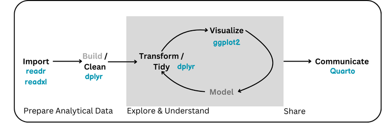
```

## Today

```{r}
#| out-width: "90%"
#| fig-align: center
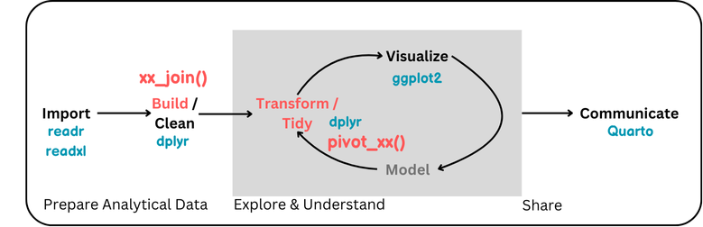
```

# Building an Analytical Dataset

## Getting Data

-   So far, we have simply needed to import *one* nice *rectangular* data set in a *typical* file type
-   Real life often gets a bit more complicated!!


## Motivating (Real) Example[^1]

:::{.incremental}
-   Texas Education Data (AEIS): K-12 student performance data provided by the Texas Education Agency
-   Provides A LOT of information ... in [many separate files](https://rptsvr1.tea.texas.gov/perfreport/aeis/2005/xplore/DownloadSelData.html):
    -   by year
    -   for State, Regions, Districts, or Schools
    -   for different sets of variables
:::

. . .

🧐 need to get this #%$ together before we can analyze it

[^1]: I worked with this data for a project. See the [paper](https://educationaldatamining.org/edm2024/proceedings/2024.EDM-short-papers.52/2024.EDM-short-papers.52.pdf) and [Github repo](https://github.com/manncz/aeis-aux-rct/) if you are interested!

## Relational Data
:::{.incremental}
-   Multiple, interconnected tables of data are called **relational**.
-   Individual datsets may not provide exactly what we need - but we can use the *relation* between datasets to get the information we want.
:::
. . .

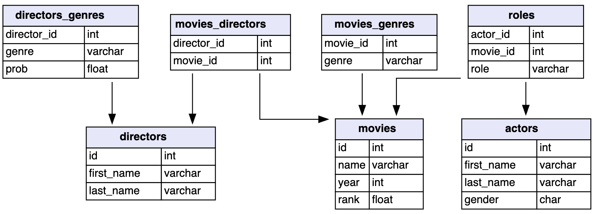

```{r imdb-data}
#| eval: false
#| include: false
#| message: false
#| warning: false
library(RMariaDB)
library(dm)
`
# IMDb
con <- dbConnect(
  drv = RMariaDB::MariaDB(), 
  username = "guest",
  password = "relational", 
  host = "relational.fit.cvut.cz", 
  port = 3306,
  dbname = "imdb_small")
dbListTables(con)

my_dm <- dm_from_src(con)

actors <- my_dm$actors |> 
  as.data.frame()
write_csv(actors, "data/actors.csv", na = "")

directors <- my_dm$directors |> 
  as.data.frame()
write_csv(directors, "data/directors.csv", na = "")

directors_genres <- my_dm$directors_genres |> 
  as.data.frame()
write_csv(directors_genres, "data/directors_genres.csv", na = "")

movies <- my_dm$movies |> 
  as.data.frame()
write_csv(movies, "data/movies.csv", na = "")

movies_directors <- my_dm$movies_directors |> 
  as.data.frame()
write_csv(movies_directors, "data/movies_directors.csv", na = "")

movies_genres <- my_dm$movies_genres |> 
  as.data.frame()
write_csv(movies_genres, "data/movies_genres.csv", na = "")

roles <- my_dm$roles |> 
  as.data.frame()
write_csv(roles, "data/roles.csv", na = "")

dbDisconnect(con)
rm(con, my_dm)
```

```{r imdb-data2}
#| eval: false
#| include: false
#| message: false
#| warning: false

save(actors, roles, 
     directors, directors_genres,
     movies, movies_directors,
     movies_genres, 
     file = "data/imdb_data.Rdata")
```

```{r imdb-data3}
#| eval: true
#| include: false
#| message: false
#| warning: false

# actors <- read_csv("data/actors.csv")
# directors <- read_csv("data/directors.csv")
# directors_genres <- read_csv("data/directors_genres.csv")
# movies <- read_csv("data/movies.csv")
# movies_directors <- read_csv("data/movies_directors.csv")
# movies_genres <- read_csv("data/movies_genres.csv")
# roles <- read_csv("data/roles.csv")

load("data/imdb_data.Rdata")
```


## Example - IMDb Movie Data

::: callout-note
# Discussion

What if we want to know which actor has worked with the most directors in the dataset?

What **analytical dataset** would we need to answer this question? What are the rows, and variables needed?
:::

. . .

-  💡 In order to answer our question, we need to **combine** some of the individual datasets into one big dataset
-   **Joins!**

# Data Joins

## Data Joins

We can **combine** (join) data tables based on their relations.

::: columns
::: column
**Mutating joins**

Add *variables* from a new dataframe to observations in an existing dataframe.

`full_join()`, `left_join()`, `right_join()`, `inner_join()`
:::

::: column
**Filtering Joins**

Filter *observations* based on values in new dataframe.

`semi_join()`, `anti_join()`
:::
:::

## Keys

Some combination of variables (should) uniquely identify an observation in a data set.

-   To combine (join) two datasets, a **key** needs to be present in both.

. . .

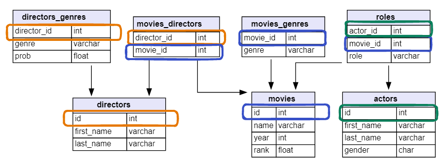

## General Structure of a Join

::: columns
::: {.column width="60%"}
::: incremental
-   Choose a **left** and a **right** dataset
-   Add or remove **rows** based on the type of join and the structure of the left vs. right data
-   Add **columns** (or not) based on the type of join and the and the structure of the left vs. right data
:::
:::

::: {.column width="40%"}
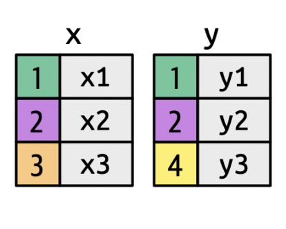
:::
:::

## `inner_join()`

Keeps observations when their keys are present in **both** datasets.

::: columns
::: {.column width="50%"}

:::

::: {.column width="50%"}
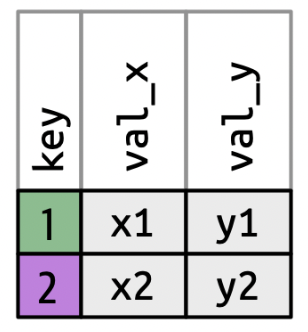
:::
:::

. . .

::: callout-note
# Discussion

When would you want to use `inner_join()`?
:::

## `inner_join()`: IMDb Example

```{r}
directors_genres_subset <- directors_genres |>
  filter(director_id %in% c(429, 2931, 11652, 14927, 15092)) |> 
  group_by(director_id) |> 
  slice_max(order_by = prob, n = 2, with_ties = F)

movies_directors_subset <- movies_directors |> 
  filter(director_id %in% c(429, 9247, 11652, 14927, 15092))

directors_subset <- directors |> 
  filter(id %in% c(429, 9247, 11652, 14927, 15092))
```

::: columns
::: {.column width="50%"}
```{r}
#| eval: false
#| echo: true
#| code-line-numbers: false
directors_genres
```

```{r}
#| eval: true
#| echo: false
directors_genres_subset |> 
  knitr::kable() |> 
  kableExtra::scroll_box(height = "160px") |> 
  kableExtra::kable_styling(font_size = 30)
```
:::

::: {.column width="50%"}
```{r}
#| eval: false
#| echo: true
#| code-line-numbers: false
movies_directors
```

```{r}
#| eval: true
#| echo: false
movies_directors_subset |> 
  knitr::kable() |> 
  kableExtra::scroll_box(height = "160px") |> 
  kableExtra::kable_styling(font_size = 30)
```
:::
:::

<font size = 6>

ID: 429, **2931**, 11652, 14927, 15092       ID: 429, **9247**, 11652, 14927, 15092

</font>

. . .

```{r}
#| eval: false
#| echo: true
#| code-line-numbers: false
inner_join(directors_genres, movies_directors, 
           by = "director_id")
```

```{r}
#| eval: true
#| echo: false
inner_join(directors_genres_subset, movies_directors_subset) |> 
  knitr::kable() |> 
  kableExtra::scroll_box(height = "160px") |> 
  kableExtra::kable_styling(font_size = 30)
```

<font size = 6>

ID: 429, ~~**2931**~~, ~~**9247**~~, 11652, 14927, 15092

</font>

## `inner_join()`: IMDb Example

What if our **key** does not have the same name?

::: columns
::: {.column width="50%"}
```{r}
#| eval: false
#| echo: true
#| code-line-numbers: false
directors_genres
```

```{r}
#| eval: true
#| echo: false
directors_genres_subset |> 
  knitr::kable() |> 
  kableExtra::scroll_box(height = "130px") |> 
  kableExtra::kable_styling(font_size = 30)
```
:::

::: {.column width="50%"}
```{r}
#| eval: false
#| echo: true
#| code-line-numbers: false
directors
```

```{r}
#| eval: true
#| echo: false
directors_subset |> 
  knitr::kable() |> 
  kableExtra::scroll_box(height = "130px") |> 
  kableExtra::kable_styling(font_size = 30)
```
:::
:::

. . .

```{r}
#| eval: false
#| echo: true
#| code-line-numbers: "3"
inner_join(directors_genres, 
           directors, 
           by = join_by(director_id == id))
```

```{r}
#| eval: true
#| echo: false
inner_join(directors_subset,
           directors_genres_subset,
           join_by(id == director_id)) |> 
  knitr::kable() |> 
  kableExtra::scroll_box(height = "170px") |> 
  kableExtra::kable_styling(font_size = 30)
```

<font size = 6> Join by different variables on `dataX` and `dataY`: `join_by(a == b)` will match `dataX$a` to `dataY$b`. </font>

## Piping Joins

Remember: the dataset you pipe in becomes the **first argument** of the function you are piping into!

-   If you are using a pipe,
    -   the piped in data is the **left** dataset
    -   specify the **right** dataset inside the `join` function.

. . .

```{r}
#| eval: false
#| echo: true
#| code-line-numbers: false
inner_join(directors_genres, movies_directors)
```

...is equivalent to...

```{r}
#| eval: false
#| echo: true
#| code-line-numbers: false
directors_genres |> 
  inner_join(movies_directors, by = "director_id")
```

## More Mutating Joins

-   `left_join()` -- keep only (and all) observations present in the left data set

-   `right_join()` -- keep only (and all) observations present in the right data set

-   `full_join()` -- keep only (and all) observations present in **both** data sets

<center>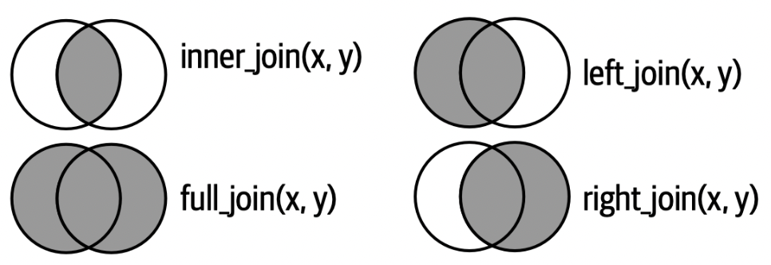{width="70%"}</center>

## Why Use a Certain Mutating Join?

::: incremental
<font size = 6>

-   `inner_join()`
    -   You want all of the columns from both left and right data and only to include the observations that have information in both
-   `left_join()`
    -   The left dataset is your "main" data and you just want to add information (columns) from the right dataset
-   `right_join()`
    -   The right data is your "main data" and you just want to add columns from the left dataset
-   `full_join()`
    -   You want all of the columns from both left and right data for all of the observations possible

</font>
:::
<!--
## Which Join?

::: callout-note
# Discussion

How many movies are there in the data for each director (by name), including if any directors don't have any movies in the data? **Which join should I use??**
:::

```         
directors |> 
  ??_join(movies_directors, 
          by = join_by("id" == "director_id"))
```

<br>

::: columns
::: column
```{r}
#| eval: false
#| echo: true
directors |> 
  slice_head(n = 5)
```

```{r}
#| eval: true
#| echo: false
directors |> 
  slice_head(n = 5) |> 
  knitr::kable() |> 
  kableExtra::scroll_box(height = "200px") |> 
  kableExtra::kable_styling(font_size = 25)
```
:::

::: column
```{r}
#| eval: false
#| echo: true
movies_directors |> 
  slice_head(n = 5)
```

```{r}
#| eval: true
#| echo: false
movies_directors |> 
  slice_head(n = 5) |> 
  knitr::kable() |> 
  kableExtra::scroll_box(height = "200px") |> 
  kableExtra::kable_styling(font_size = 25)
```
:::
:::


## Which Join?

::: callout-note
# Discussion

What is the complete set movies and actors included in the data? **Which join should I use??**
:::

```         
roles |> 
  ??_join(actors, 
          by = join_by("actor_id" == "id"))
```

<br>

::: columns
::: column
```{r}
#| eval: false
#| echo: true
roles |> 
  slice_head(n = 5)
```

```{r}
#| eval: true
#| echo: false
roles |> 
  slice_head(n = 5) |> 
  knitr::kable() |> 
  kableExtra::scroll_box(height = "200px") |> 
  kableExtra::kable_styling(font_size = 25)
```
:::

::: column
```{r}
#| eval: false
#| echo: true
actors |> 
  slice_head(n = 5)
```

```{r}
#| eval: true
#| echo: false
actors |> 
  slice_head(n = 5) |> 
  knitr::kable() |> 
  kableExtra::scroll_box(height = "200px") |> 
  kableExtra::kable_styling(font_size = 25)
```
:::
:::
-->
## Filtering Joins: `semi_join()`

Keeps observations when their keys are present in **both** datasets, **but only keeps variables from the *left* dataset**.

::: columns
::: {.column width="60%"}
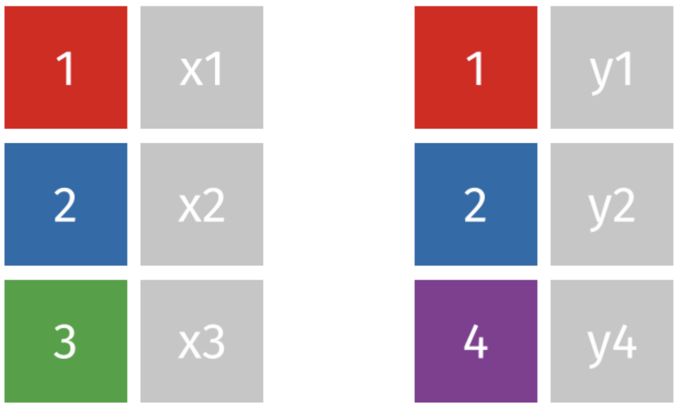
:::

::: {.column width="15%"}
<br>

::: r-fit-text
→  
:::
:::

::: {.column width="25%"}
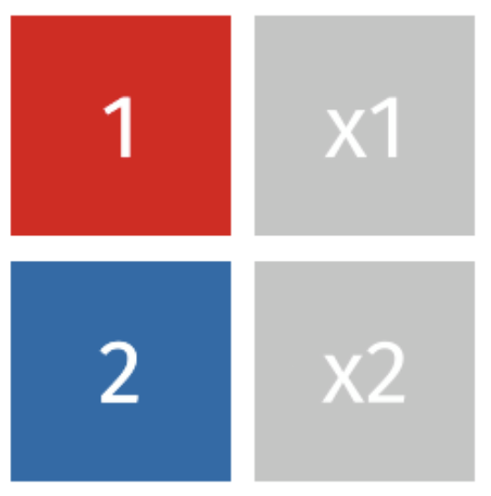
:::
:::

## IMDb Data Example

::: columns
::: column
```{r}
#| eval: false
#| echo: true
directors_genres |> 
  distinct(director_id)
```

```{r}
#| eval: true
#| echo: false
directors_genres_subset |> 
  distinct(director_id) |> 
  knitr::kable() |> 
  kableExtra::row_spec(2, bold = T, color = "red") |>
  kableExtra::scroll_box(height = "320px") |> 
  kableExtra::kable_styling(font_size = 30)
```
:::

::: column
```{r}
#| eval: false
#| echo: true
movies_directors |> 
  distinct(director_id)
```

```{r}
#| eval: true
#| echo: false
movies_directors_subset |> 
  distinct(director_id) |> 
  knitr::kable() |> 
  kableExtra::row_spec(2, bold = T, color = "red") |>
  kableExtra::scroll_box(height = "320px") |> 
  kableExtra::kable_styling(font_size = 30)
```
:::
:::

## Filtering Joins: `semi_join()`

::: panel-tabset
### `semi_join()`

```{r}
#| echo: true
#| eval: false
directors_genres |> 
  semi_join(movies_directors)
```

```{r}
#| eval: true
#| echo: false
semi_join(directors_genres_subset, movies_directors_subset) |> 
  knitr::kable() |> 
  kableExtra::scroll_box(height = "320px") |> 
  kableExtra::kable_styling(font_size = 30)
```

Movie Directors: 429, ~~**2931**~~, 11652, 14927, 15092

### Connection to `filter()`

```{r}
#| echo: true
#| eval: false
directors_genres |>
  filter(director_id %in% movies_directors$director_id)
```

```{r}
#| eval: true
#| echo: false
directors_genres_subset |>
  filter(director_id %in% movies_directors_subset$director_id) |> 
  knitr::kable() |> 
  kableExtra::scroll_box(height = "320px") |> 
  kableExtra::kable_styling(font_size = 30)
```
:::

## Filtering Joins: `anti_join()`

**Removes** observations when their keys are present in **both** datasets, and **only keeps variables from the *left* dataset**.

::: columns
::: {.column width="60%"}

:::

::: {.column width="15%"}
<br>

::: r-fit-text
→  
:::
:::

::: {.column width="25%"}
<br>


:::
:::

## Filtering Joins: `anti_join()`

::: panel-tabset
### `anti_join()`

```{r}
#| echo: true
#| eval: false
directors_genres |> 
  anti_join(movies_directors)
```

```{r}
#| eval: true
#| echo: false
anti_join(directors_genres_subset, movies_directors_subset) |> 
  knitr::kable() |> 
  kableExtra::scroll_box(height = "200px") |> 
  kableExtra::kable_styling(font_size = 30)
```

Movie Directors: ~~429~~, **2931**, ~~11652~~, ~~14927~~, ~~15092~~

### Connection to `filter()`

```{r}
#| echo: true
#| eval: false
directors_genres |>
  filter(!director_id %in% movies_directors$director_id)
```

```{r}
#| eval: true
#| echo: false
directors_genres_subset |>
  filter(!director_id %in% movies_directors_subset$director_id) |> 
  knitr::kable() |> 
  kableExtra::scroll_box(height = "200px") |> 
  kableExtra::kable_styling(font_size = 30)
```
:::

## Building an Analytical Dataset

Now we have tools to:

-   Combine multiple data sets (`xx_join()`)
-   Subset to certain observations (`filter()` and `xx_join()`)
-   Create new variables (`mutate()`)
-   Select columns of interest (`select()`)

. . .

We are well on our way to building and cleaning up a nice dataset! 🥳

## Transform and Tidy

What's next?

```{r}
#| out-width: "90%"
#| fig-align: center
knitr::include_graphics("images/data-science-workflow.png")
```

## Transform and Tidy

What's next?

We may need to **transform** our data to turn it into the **version of tidy** that is best for a task at hand.


# Reshaping Data Layouts with Pivots

## Creating Tidy Data

Let's say we want to look at `mean` **cereal nutrients** based on `shelf`.

. . .

-   The data are in a **wide** format -- a separate column for each nutrient.

```{r}
#| echo: true
#| eval: false
library(liver)
data(cereal)
head(cereal)
```

```{r}
#| eval: true
#| echo: false
library(liver)
data(cereal)
head(cereal) |> 
  knitr::kable() |> 
  kableExtra::scroll_box(height = "210px") |> 
  kableExtra::kable_styling(font_size = 30)
```

## Creating Tidy Data

::: callout-note
# Discussion

How would we plot the mean cereal nutrients by shelf (as shown below) with the wide data using `ggplot2`?
:::

```{r}
#| echo: false
#| fig-align: "center"

cereal |> 
  pivot_longer(cols = calories:vitamins,
               names_to = "Nutrient",
               values_to = "Amount") |> 
  group_by(shelf, Nutrient) |> 
  summarise(mean_amount = mean(Amount)) |> 
  ggplot(aes(x = shelf, 
             y = mean_amount, 
             color = Nutrient)) +
  geom_point() +
  geom_line() +
  labs(x = "Shelf", y = "", subtitle = "Mean Amount")
```

. . .

**Transforming** the data will make plotting **much** easier

## Creating Tidy Data

::: panel-tabset
## Wide

```{r}
#| echo: true
#| code-line-numbers: "2-3"
#| code-fold: true
cereal_wide <- cereal |> 
  group_by(shelf) |> 
  summarise(across(calories:vitamins, mean))
```

```{r}
#| eval: true
#| echo: false
cereal_wide|> 
  knitr::kable() |> 
  kableExtra::scroll_box(height = "210px") |> 
  kableExtra::kable_styling(font_size = 30)
```

## Wide Plot

```{r}
#| echo: true
#| code-line-numbers: "5-8"
#| fig-height: 4
#| fig-width: 6
#| fig-align: center
#| code-fold: true
my_colors <- c("calories_col" = "steelblue", "sugars_col" = "orange3")

cereal_wide |> 
  ggplot() +
  geom_point(aes(x = shelf, y = calories, color = "calories_col")) +
  geom_line(aes(x = shelf, y = calories, color = "calories_col")) + 
  geom_point(aes(x = shelf, y = sugars, color = "sugars_col")) +
  geom_line(aes(x = shelf, y = sugars, color = "sugars_col")) +
  scale_color_manual(values = my_colors, labels = names(my_colors)) +
  labs(x = "Shelf", y = "", subtitle = "Mean Amount", color = "Nutrient")
```

## Long

```{r}
#| echo: true
#| code-line-numbers: "5-6"
#| code-fold: true
cereal_long<- cereal |> 
  pivot_longer(cols = calories:vitamins,
               names_to = "Nutrient",
               values_to = "Amount") |> 
  group_by(shelf, Nutrient) |> 
  summarise(mean_amount = mean(Amount))
```

```{r}
#| eval: true
#| echo: false
cereal_long |> 
  knitr::kable() |> 
  kableExtra::scroll_box(height = "400px") |> 
  kableExtra::kable_styling(font_size = 30)
```

## Long Plot

```{r}
#| echo: true
#| code-line-numbers: "2-4"
#| fig-height: 4
#| fig-width: 6
#| fig-align: center
#| code-fold: true
cereal_long |> 
  ggplot(aes(x = shelf, 
             y = mean_amount, 
             color = Nutrient)) +
  geom_point() +
  geom_line() +
  labs(x = "Shelf", y = "", subtitle = "Mean Amount")
```
:::

## Data Layouts


{width="60%"} 


## Manual Method

Consider daily rainfall observed in SLO in January 2023.

-   The data is in a human-friendly form (like a calendar).
-   Each week has a row, and each day has a column.

](images/slo-rainfall.jpg)

::: callout-note
# Discussion

How would you **manually** convert this to **long format**?
:::

## Manual Method: Steps

0.  Keep the column `Week`.
1.  Create a new column `Day_of_Week`.
2.  Create a new column `Rainfall` (hold daily rainfall values).
3.  Now we have three columns -- move Sunday values over.
4.  Duplicate `Week` 1-5 and copy Monday values over.

<center>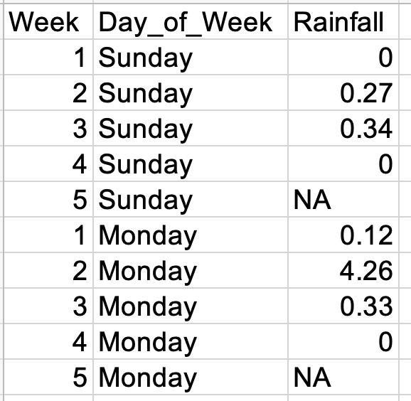{width="25%"}</center>

5.  Repeat ...

## Computational Approach

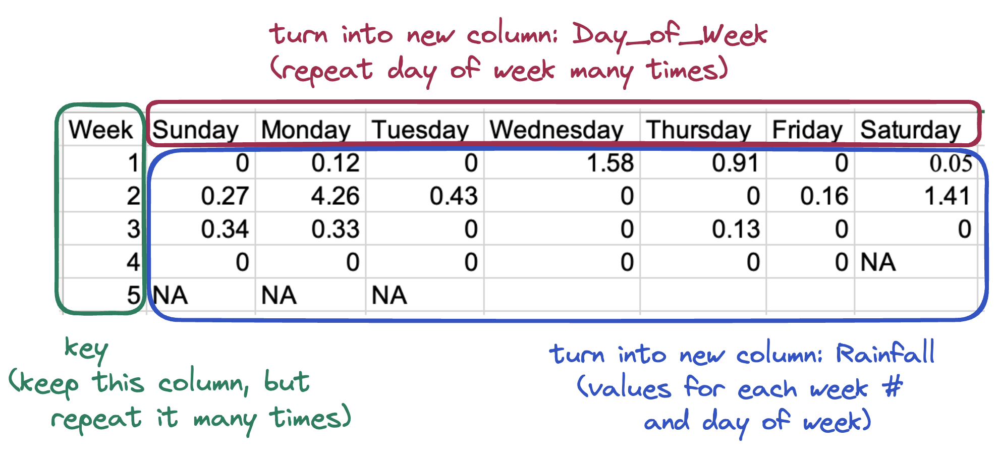

We can use `pivot_longer()` to turn a **wide** dataset into a **long(er)** dataset.

## `pivot_longer()`

Take a **wide** dataset and turn it into a **long** dataset.

-   `cols` -- specify the columns that should be pivoted.
    -   Do **not** include the names of ID columns (columns to not be pivoted).
-   `names_to` -- the name of the new column containing the old column names.
-   `values_to` -- the name of the new column containing the old column values.

## `pivot_longer()`

```{r}
#| echo: true
#| eval: false
slo_rainfall |> 
  pivot_longer(cols      = Sunday:Saturday,
               names_to  = "day_of_week",
               values_to = "rainfall")
```

```{r}
#| eval: true
#| echo: false
library(readxl)
slo_rainfall <- read_xlsx("data/2023-rainfall-slo.xlsx")

slo_rainfall |> 
  mutate(across(Sunday:Saturday, as.numeric)) |> 
  pivot_longer(cols      = Sunday:Saturday,
               names_to  = "day_of_week",
               values_to = "rainfall")|> 
  knitr::kable() |> 
  kableExtra::scroll_box(height = "500px") |> 
  kableExtra::kable_styling(font_size = 30)
```

## Long to Wide

What are the `mean` amount of `protein` for cereals on each `shelf` and for each `manuf`?

```{r}
#| echo: true
#| eval: false
mean_protein <- cereal |> 
  group_by(manuf, shelf) |> 
  summarize(mean_protein = mean(protein))
```

```{r}
#| eval: true
#| echo: false
mean_protein <- cereal |> 
  group_by(manuf, shelf) |> 
  summarize(mean_protein = mean(protein))

mean_protein |> 
  knitr::kable() |> 
  kableExtra::scroll_box(height = "200px") |> 
  kableExtra::kable_styling(font_size = 30)
```

::: callout-note
# Discussion

What could we do to make this table easier to understand?
:::

## `pivot_wider()`

Take a **long** dataset and turn it into a **wide** dataset.

-   `id_cols` -- specify the column(s) that contain the ID for unique rows in the wide dataset.
-   `names_from` -- the name of the column containing the new column names.
-   `values_from` -- the name of the column containing the new column values.

## `pivot_wider()`

Much easier to read!

```{r}
#| eval: false
#| echo: true
mean_protein |> 
  arrange(shelf) |> 
  pivot_wider(id_cols = manuf,
              names_from = shelf,
              values_from = mean_protein)
```

```{r}
#| eval: true
#| echo: false
mean_protein |> 
  arrange(shelf) |> 
  pivot_wider(id_cols = manuf,
              names_from = shelf,
              values_from = mean_protein) |> 
  knitr::kable() |> 
  kableExtra::scroll_box(height = "420px") |> 
  kableExtra::kable_styling(font_size = 30)
```

## Better names in `pivot_wider()`

Even better!

```{r}
#| eval: false
#| echo: true
#| code-line-numbers: "6"
mean_protein |> 
  arrange(shelf) |> 
  pivot_wider(id_cols = manuf,
              names_from = shelf,
              values_from = mean_protein,
              names_prefix = "shelf_")
```

```{r}
#| eval: true
#| echo: false
mean_protein |> 
  arrange(shelf) |> 
  pivot_wider(id_cols = manuf,
              names_from = shelf,
              values_from = mean_protein,
              names_prefix = "shelf_") |> 
  knitr::kable() |> 
  kableExtra::scroll_box(height = "400px") |> 
  kableExtra::kable_styling(font_size = 30)
```

## PA 4: Military Spending

Today you will be tidying messy data to explore the relationship between countries of the world and military spending.

## Resources - use them all!

::: columns
::: {.column width="50%"}
- `dplyr` and `tidyr` [cheatsheets](https://posit.co/resources/cheatsheets/)
- slides and textbook
- help files
:::
::: {.column width="50%"}
- ⭐️️ **each other**⭐️ 
- and me 😎
:::
:::

. . .

[**Don't struggle individually for too long!**]{style="color:green;"}


## To do...

-   **PA 4: Military Spending**
    -   Due Tuesday 4/21 by 11:59pm
- + [Reading](../../reading/week-4.1.qmd) and Review
+ **Lab 4: California Childcare Costs**
  + Due Sunday 4/26 at 11:59 pm


