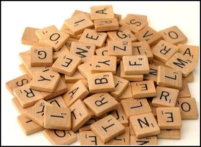

```{r}
#| include: false
#| message: false
#| label: setup

library(tidyverse)
library(liver)

data(cereal)

colleges <- read_csv("https://www.dropbox.com/s/bt5hvctdevhbq6j/colleges.csv?dl=1") 
```

## Monday, April 27

Today we will...

+ Group Quiz 4
+ Different schedule this week & next
+ New material
  + String variables
  + Regular expressions
  + Functions for working with strings
+ PA 5.1: Scrambled Message


:::callout-tip
## Follow along

Remember to download, save, and open up the [handout](../../student-versions/handouts/w5.1-handout.qmd) for today!
:::

## Week 5 Layout 

- Today: Strings with `stringr`
  + Practice Activity: Decoding a Message

. . .

- Wednesday: Dates with `lubridate`
  + Practice Activity: Jewel Heist
  + Discuss midterm exam

. . .

- Lab Assignment Solving a Murder Mystery
  + Using `dplyr` + `stringr` + `ludridate`
  + Due Sunday
  + **May only use 1 late day so that I can post solutions before the exam**

## Week 6 Layout

- Monday: Version control with `git` and GitHub
  + There are two "Course Setup" assignments to complete before class
  + Practice Activity - done in groups **in class**
  + Last day to submit Lab 5
  
. . .

- Wednesday: Midterm Exam

<!-- ## Comments from Week 4 -->

<!-- :::: {.columns}  -->
<!-- ::: {.column width="40%"}  -->

<!--  **Read**  -->

<!-- Average  -->

<!--  Total  -->

<!--  Which or For Each  -->

<!--  Minimum  -->

<!--  Maximum  -->

<!-- :::  -->
<!-- ::: {.column width="60%"}  -->

<!--  **Think**  -->

<!--  `summarize(avg = mean())`  -->

<!--  `summarize(total = sum())`  -->

<!--  `group_by()`  -->

<!--  `slice_min()`  -->

<!--  `slice_max()`  -->

<!-- :::  -->
<!-- :::: -->


# String Variables

## What is a string?

A **string** is a bunch of **characters**.

. . .

There is a difference between...

<center>

...a **string** (many characters, one object)...

and

...a **character vector** (vector of strings).

</center>

. . .

```{r}
#| echo: true
#| code-line-numbers: false
#| label: strings-example

my_string <- "Hi, my name is Bond!"
my_string
```

. . .

```{r}
#| echo: true
#| code-line-numbers: false
my_vector <- c("Hi", "my", "name", "is", "Bond")
my_vector
```

## Strings in a Data Frame

For the `colleges` dataset from PA 3:

a string is:

```{r}
#| echo: true
#| eval: false
#| label: character-cp-code
#| code-line-numbers: false

colleges$INSTNM[214]
```

a character vector is:

```{r}
#| label: character-vector-inst-name-code
#| echo: true
#| eval: false
#| code-line-numbers: false

colleges$INSTNM 
```


## `stringr`

:::: {.columns}
::: {.column width="80%"}
**Common tasks**

+ Identify strings containing a particular pattern.
+ Remove or replace a pattern.
+ Edit a string (e.g., make it lowercase).

:::
::: {.column width="20%"}

```{r}
#| fig-align: center
#| fig-alt: ""
knitr::include_graphics("https://github.com/rstudio/hex-stickers/blob/main/PNG/stringr.png?raw=true")
```
:::
::::

::: callout-note 
+ The `stringr` package loads with `tidyverse`.
+ All functions are  of the form `str_xxx()`.
:::

## `string = `

- None of the `stringr` functions have a `.data = ` argument!
- These functions only accept a **character vector** `string = ` as an input

```{r}
#| eval: false
#| echo: true

str_detect(string = colleges$INSTNM, 
           pattern = "Polytechnic")
```

- Thus, functions will need to be combined with functions from `dplyr` to work with a dataset!

## `pattern = `

The `pattern` **argument** appears in many `stringr` functions.

+ The pattern **must** be supplied inside quotes.

```{r}
#| eval: false
#| echo: true
#| code-line-numbers: false

str_detect(string = colleges$INSTNM, 
           pattern = "Polytechnic")

str_remove(string = colleges$INSTNM, 
           pattern = "(University|College)")

str_replace(string = colleges$INSTNM, 
            pattern = "$u", 
            replacement = "U")

```


<br>

. . .

Let's talk more about what some of these symbols mean.


# Regular Expressions

## Regular Expressions

**...are tricky!**

+ There are lots of new symbols to keep straight.
+ There are a lot of cases to think through.

</br>

We're going to focus on:

::: columns
::: {.column width="40%"}
- special characters
- anchors
- quantifiers 
:::

::: {.column width="5%"}
:::

::: {.column width="55%"}
- character classes
- groups
:::
:::


## Note: `str_subset()`

Returns a **character vector** containing a subset of the original **character vector** consisting of the elements where the pattern was found *anywhere in the element*.

::: {.small}
```{r}
#| echo: true
#| code-line-numbers: false

my_vector <- c("Hello,", 
               "my name is", 
               "Bond", 
               "James Bond")

str_subset(my_vector, pattern = "Bond")
```
:::

## Special Characters

There is a set of characters that have a specific meaning when using regex.

+ The `stringr` package **does not** read these as normal characters.
+ These characters are:

<center>

`.` `^`  `$` `\`  `|` `*` `+` `?` `{` `}` `[` `]` `(` `)`

</center>

## Wild Card Character: `.`

This character can match **any** character.

```{r}
#| echo: true
#| code-line-numbers: false

x <- c("She", 
       "sells", 
       "seashells", 
       "by", 
       "the", 
       "seashore!")

str_subset(x, pattern = ".ells")
```

## Escape: `\\`

To match literally one of those special characters on the previous slide you need to "escape" it with `\\`

. . .

Use `\\` to escape the `.` -- it is now read as a normal character.

```{r}
#| echo: true
#| eval: false
#| code-line-numbers: false

str_subset(colleges$INSTNM, pattern = "\\.")
```

```{r}
#| echo: false
#| eval: true
#| code-line-numbers: false

str_subset(colleges$INSTNM, pattern = "\\.") |> 
  head()
```


## Anchor Characters: `^ $`

::: columns
::: {.column width="48%"}
::: {.small}
`^` -- looks at the beginning of a string.

```{r}
#| echo: true
#| eval: false
#| code-line-numbers: false

str_subset(colleges$INSTNM, 
           pattern = "^California State")
```

:::

:::

::: {.column width="2%"}
:::

::: {.column width="50%"}
::: {.fragment}
::: {.small}
`$` -- looks at the end of a string.

```{r}
#| echo: true
#| eval: false
#| code-line-numbers: false

str_subset(colleges$INSTNM, 
           pattern = "State University$")
```

:::

:::
:::
:::

## Character Classes: `[]`


- Character classes let you specify multiple possible characters to match on.
- Anything inside `[]` is treated like "or"

```{r}
#| echo: true
#| eval: false
#| code-line-numbers: false

str_subset(colleges$INSTNM, 
           pattern = "^[AC]")
```


## Excluding Characters

::: {.midi}
`[^ ]`  -- specifies characters **not** to match on
:::

::: {.small}
::: columns
::: {.column width="50%"}
```{r}
#| echo: true
#| eval: false
#| code-line-numbers: false

str_subset(colleges$INSTNM, 
           pattern = "[^y]$")
```

:::

::: {.column width="5%"}
:::

::: {.column width="45%"}

::: {.fragment}

[Beware / Reminder: a `^` doesn't always mean "not"]{.large}

</br>

**Starts with "University"**

```{r}
#| echo: true
#| eval: false
#| code-line-numbers: false

str_subset(colleges$INSTNM, 
           pattern = "^U")
```


**[Does not]{.underline} starts with "University"**

```{r}
#| echo: true
#| eval: false
#| code-line-numbers: false

str_subset(colleges$INSTNM, 
           pattern = "^[^U]")
```
:::
:::
:::
:::


## Special Character Classes: `[]`

::: {.midi}
`[ - ]`  -- specifies a range of characters.
:::

::: {.small}
::: columns
::: {.column width="55%"}
+ [A-Z] or [:upper:] matches any capital letter.
+ [a-z] or [:lower:] matches any lowercase letter.
+ [A-z] or [:alpha:] matches any letter
+ [0-9] or [:digit:] matches any number
+ [:punct:] matches any punctuation character
:::

::: {.column width="2%"}
:::

::: {.column width="43%"}
::: {.fragment}
```{r}
#| echo: true
#| code-line-numbers: false
#| eval: false

str_subset(colleges$INSTNM, 
           pattern = "[0-9]")

str_subset(colleges$INSTNM, 
           pattern = "[:punct:]$")
```
:::
:::
:::
:::


## Quantifier Characters: `+ *`

::: {.small}
::: columns
::: {.column width="40%"}

`+` -- occurs 1 or more times

```{r}
#| echo: true
#| code-line-numbers: false
#| eval: false

str_subset(colleges$INSTNM, 
           pattern = "St\\.+")
```


:::

::: {.column width="5%"}
:::

::: {.column width="55%"}
::: {.fragment}
`*` -- occurs 0 or more times

```{r}
#| echo: true
#| code-line-numbers: false
#| eval: false

str_subset(colleges$INSTNM, 
           pattern = "\\s*-\\s*")

```

:::callout-tip
`"\\s"` is a commonly used shortcut which matches any whitespace (space, tab, etc.)
:::

:::
:::
:::
:::

## Quantifier Characters: `{}`

::: {.small}
::: columns
::: {.column width="40%"}

`{n}` -- occurs exactly n times

```{r}
#| echo: true
#| code-line-numbers: false
#| eval: false

str_subset(colleges$INSTNM, 
           pattern = "[A-Z]{4}")
```


:::

::: {.column width="5%"}
:::

::: {.column width="55%"}
::: {.fragment}

`{n,m}` -- occurs between n and m times


```{r}
#| echo: true
#| eval: false
#| code-line-numbers: false

str_subset(colleges$INSTNM, 
           pattern = "[A-Z]{4,6}")
```


::: {.callout-tip}
## Want **at least 4**? `{4,}`
:::
:::
:::
:::
:::


## Character Groups: `()`


+ `()` creates a group of characters to be matched exactly


```{r}
#| echo: true
#| eval: false
#| code-line-numbers: false

str_subset(colleges$INSTNM, 
           pattern = "(iss){2}")
```


. . .

+ We can specify "either" / "or" within a group using `|`.

```{r}
#| echo: true
#| eval: false
#| code-line-numbers: false

str_subset(colleges$INSTNM, 
           pattern = "(T|t)ech")
```

. . .

+ We can refer to created groups with escaped numbers

```{r}
#| echo: true
#| eval: false
#| code-line-numbers: false

str_subset(colleges$INSTNM, 
           pattern = "([aeiou])\\1")
```


# let's put these to use!

# Detecting Patterns

## `str_detect()`

Returns a **logical vector** indicating whether the pattern was found in each element of the supplied vector.

::: {.small}
```{r}
#| echo: true
#| code-line-numbers: false
#| results: hold

my_vector <- c("Hello,", 
               "my name is", 
               "Bond", 
               "James Bond")
str_detect(my_vector, pattern = "Bond")
```
:::

. . .

::: {.small}
+ Pairs well with `filter()`.
+ Works with `summarise()` + `sum` (to get total matches) or `mean` (to get proportion of matches).
:::

. . .


## `str_detect()` with `filter()`

> Which colleges in the dataset have "Polytechnic" in their name?

```{r}
#| echo: true
#| label: str-detect-filter
#| eval: false
#| code-line-numbers: false

colleges |> 
  filter(str_detect(INSTNM, pattern = "Polytechnic"))
```

. . .

> How many colleges in the dataset have "Polytechnic" in their name?

```{r}
#| echo: true
#| label: str-detect-sum
#| eval: false
#| code-line-numbers: false

colleges |> 
  summarize(n = sum(
    str_detect(INSTNM, pattern = "Polytechnic")
    )
    )
```

# Replace / Remove Patterns

## `str_replace()`

::: {.small}
Replace the **first** matched pattern in each string.

```{r}
#| echo: true
#| code-line-numbers: false

str_replace(my_vector, 
            pattern = "Bond", 
            replace = "Franco")
```
:::

</br> 

::: {.small}
::: {.callout-note collapse="true"}
## Related Function

`str_replace_all()` replaces **all** matched patterns in each string.
:::
:::


## `str_replace()` with `mutate()`

- Change "University" to "Uni" to pretend we live in Australia

```{r}
#| echo: true
#| eval: false
#| code-line-numbers: false

colleges |> 
  mutate(INSTNM = str_replace(INSTNM, 
                              pattern = "University", 
                              replacement = "Uni")
         )
```

## `str_remove()`

::: {.small}
Remove the **first** matched pattern in each string.

```{r}
#| echo: true
#| code-line-numbers: false
#| eval: false

colleges |> 
  mutate(INSTNM = str_remove(INSTNM, 
                             pattern = "(College|University)"
                             )
         )
```
:::

</br>

::: {.small}
::: {.callout-note collapse="true"}
## Related Functions

This is a special case of  `str_replace(x, pattern, replacement = "")`.

`str_remove_all()` removes **all** matched patterns in each string.
:::
:::


# String Lengths

## `str_length()`

> returns number of elements (characters) of a string

```{r}
#| echo: true
colleges |> 
  mutate(
    name_length = str_length(INSTNM)
         ) |> 
  select(INSTNM, name_length) |> 
  head()
```

## Change the Length
> shorten or lengthen a string to a specified length

::: panel-tabset

### `str_sub()`

::: {.midi}
Extract values of a string based on a starting and ending location.
:::

```{r}
#| echo: true
#| eval: false
#| code-line-numbers: false

colleges |> 
  mutate(short_name = str_sub(INSTNM, 
                                  start = 1,
                                  end = 8)
         )
```

### `str_pad()`

::: {.midi}
Make every string have a fixed length (width)
:::

```{r}
#| echo: true
#| eval: false
#| code-line-numbers: false

colleges |> 
  mutate(long_name = str_pad(INSTNM, 
                             width = 20, 
                             pad = "_", 
                             side = "both")
         )
```

:::

# Create new character variable

## `str_extract()` 

Returns a **character vector** with either `NA` or the pattern, depending on if the pattern was found.

::: {.small}
```{r}
#| echo: true
#| eval: false
#| code-line-numbers: false

colleges |> 
  mutate(first_word = str_extract(INSTNM,
                                  pattern = "[A-z]*\\s"))
```
:::

. . .

::: callout-warning

`str_extract()` only returns the **first** pattern match.
:::


# Modify Characters

## Edit Capitalization of Strings

::: {.small}
Convert letters in a string to a specific capitalization format.
:::

::: panel-tabset

### [`str_to_lower()`]{.midi}

::: {.small}
> converts all letters in a string to lowercase.

```{r}
#| echo: true
#| eval: false
#| code-line-numbers: false

colleges |> 
  mutate(INSTNM = str_to_lower(INSTNM))
```

```{r}
#| echo: false
#| eval: false

colleges |> 
  mutate(INSTNM = str_to_lower(INSTNM)) |> 
  knitr::kable() |> 
  kableExtra::kable_styling(font_size = 25)
```
:::

### [`str_to_upper()`]{.midi}

::: {.small}
> converts all letters in a string to uppercase.

```{r}
#| echo: true
#| eval: false
#| code-line-numbers: false

colleges |> 
  mutate(INSTNM = str_to_upper(INSTNM))
```

```{r}
#| echo: false
#| eval: false

colleges |> 
  mutate(INSTNM = str_to_upper(INSTNM)) |> 
  knitr::kable() |> 
  kableExtra::kable_styling(font_size = 25)
```
:::

### [`str_to_title()`]{.midi}

::: {.small}
> converts the first letter of each word to uppercase.

```{r}
#| echo: true
#| eval: false
#| code-line-numbers: false

colleges |> 
  mutate(INSTNM = str_to_title(INSTNM))
```

```{r}
#| echo: false
#| eval: false

colleges |> 
  mutate(INSTNM = str_to_title(INSTNM)) |> 
  knitr::kable() |> 
  kableExtra::kable_styling(font_size = 25)
```

:::

:::

# Handling Whitespace

## Removing Whitespace


:::columns

:::column
`str_trim()`

> removes whitespace from start and end of string

```{r}
#| echo: true
#| eval: true
#| code-line-numbers: false

str_trim("  Hi.     there  ", 
         side = "both")
```
:::
:::column
`str_squish()`

> trims whitespace from each end and collapses multiple spaces into single spaces

```{r}
#| echo: true
#| eval: true
#| code-line-numbers: false

str_squish("  Hi.     there  ")
```
:::
:::
# Combining Strings

## `str_c()`

> join multiple strings into a single character vector

```{r}
#| echo: true
#| eval: false
#| code-line-numbers: false

colleges |> 
  mutate(
    address = str_c(CITY, STABBR, ZIP, sep = ", ")
         )
```

::: callout-note
Similar to `paste()` and `paste0()` but with more precision.
:::

## Tips for working with strings and regex

::: incremental

- Use the `stringr` [cheatsheet](https://rstudio.github.io/cheatsheets/strings.pdf)!!!
- Remember that `str_xxx` functions need the first argument to be a **vector of strings**, not a **dataset**!
- Read the regular expressions out loud like a request.
- Test out your expressions on small examples first.
- Be patient with yourself!

:::

# PA 5.1: Scrambled Message

::: columns
::: {.column width="40%"}
In this activity, you will use functions from the `stringr` package and regex to decode a message.
:::

::: {.column width="5%"}
:::

::: {.column width="55%"}
{fig-alt="A pile of tiles from the game of Scrabble."}
:::
:::


## To do...

+ **PA 5.1: Scrambled Message**
  + Due Thursday before class
+ **LA 5: Murder in SQL City**
  + Due Monday at 11:59 pm
  + You can use maximum 1 late day on this lab!
+ Look out for exam information posted on Canvas - we will discuss on Thursday


# Appendix -- More stringr verbs and practice with regex


## `str_match()` 

Returns a **character matrix** containing either `NA` or the pattern, depending on if the pattern was found.

::: {.small}
```{r}
#| echo: true
#| code-line-numbers: false
my_vector <- c("Hello,", 
               "my name is", 
               "Bond", 
               "James Bond")

str_match(my_vector, pattern = "Bond")
```
:::


## `str_locate()` 

Returns a **dateframe** with two **numeric variables** -- the starting and ending location of the pattern. The values are `NA` if the pattern is not found.

::: {.small}
```{r}
#| echo: true
#| code-line-numbers: false

my_vector <- c("Hello,", 
               "my name is", 
               "Bond", 
               "James Bond")

str_locate(my_vector, pattern = "Bond")
```
:::

. . .

::: {.small}
::: callout-note
## Related Function

`str_sub()` extracts values based on a starting and ending location.
:::
:::

## `str_glue()`

Use variables in the environment to create a string based on {expressions}.

```{r}
#| echo: true
#| code-line-numbers: false

first <- "James"
last <- "Bond"
str_glue("My name is {last}, {first} {last}")
```

::: callout-tip
For more details, I would recommend looking up the [`glue` R package](https://glue.tidyverse.org/)!
:::


## What do you mean by the *first* match for `str_extract`?

Suppose we had a slightly different vector...

```{r}
#| echo: true
#| code-line-numbers: false

alt_vector <- c("Hello,", 
               "my name is", 
               "Bond, James Bond")
```

. . .

If we were to extract ***every*** instance of `"Bond"` from the vector...

::: columns
::: {.column width="45%"}
::: {.small}
```{r}
#| echo: true
#| code-line-numbers: false

str_extract(alt_vector, 
            pattern = "Bond")
```
:::
:::

::: {.column width="3%"}
:::

::: {.column width="52%"}
::: {.fragment}
::: {.small}
```{r}
#| echo: true
#| code-line-numbers: false

str_extract_all(alt_vector, 
                pattern = "Bond")
```
:::
:::
:::
:::


## Try it out!

::: {.small}
```{r}
#| eval: false
#| echo: true
#| code-line-numbers: false

my_vector <- c("I scream,", 
               "you scream", 
               "we all",
               "scream",
               "for",
               "ice cream")

str_detect(my_vector, pattern = "cream")
str_locate(my_vector, pattern = "cream")
str_match(my_vector, pattern = "cream")
str_extract(my_vector, pattern = "cream")
str_subset(my_vector, pattern = "cream")
```

::: callout-note
For each of these functions, write down:

+ the **object structure** of the output.
+ the **data type** of the output.
+ a brief explanation of what they do.
::::
:::

## Try it out!

What regular expressions would match words that...

::: columns
::: {.column width="40%"}
+ end with a vowel?
+ start with x, y, or z?
+ contains at least one digit?
+ contains two of the same letters in a row?
:::

::: {.column width="5%"}
:::

::: {.column width="55%"}
```{r}
#| echo: true
#| code-line-numbers: false

x <- c("zebra", 
       "xray", 
       "apple", 
       "yellow",
       "color", 
       "patt3rn",
       "g2g",
       "summarise")
```
:::
:::

## Some Possible Solutions...

+ end with a vowel?

```{r}
#| echo: true
#| eval: false
#| code-line-numbers: false

str_subset(x, "[aeiouy]$")
```

+ start with x, y, or z?

```{r}
#| echo: true
#| eval: false
#| code-line-numbers: false

str_subset(x, "^[xyz]")
```

+ contain at least one digit?

```{r}
#| echo: true
#| eval: false
#| code-line-numbers: false

str_subset(x, "[:digit:]")
```

+ contains two of the same letters in a row

```{r}
#| echo: true
#| eval: false
#| code-line-numbers: false

str_subset(x, "([:alpha:])\\1")
```


## More practice!

```{r}
county_pop <- data.frame(county = c("STORY", "BOONE", "MARSHALL", "POLK"),
                         pop = c(100000, 40000, 120000, 500000))

county_loc <- data.frame(county = c("Story", "Boone", "Marshall", "Polk"),
                         region = c("Central", "Central", "East", "Central"))
```


I want to join two datasets that have a `county` variable:

::: columns
::: {.column width="50%"}


```{r}
#| echo: true
#| eval: false
county_pop
```

```{r}
#| echo: false
county_pop |> 
  knitr::kable()
```

:::

::: {.column width="50%"}


```{r}
#| echo: true
#| eval: false
county_loc
```

```{r}
#| echo: false
county_loc |> 
  knitr::kable()
```

:::
:::

. . .

:::callout-note
# Practice

What `stringr` function will help me join the `county_pop` and `county_loc` by `county`?
:::

## More practice!


What if I want to pull out only the area code in a phone number?

```{r}
#| echo: true
phone_numbers <- c("(515)242-1958", "(507)598-1395", "(805)938-7639")
```

:::callout-note
# Practice

You will need a `stringr` function and to use regular expressions!
:::

. . .

```{r}
#| echo: true
str_extract(phone_numbers, "\\(\\d{3}\\)")
```

. . .

What if I want *just* the numbers in the area code?

. . .
```{r}
#| echo: true
str_extract(phone_numbers, "\\((\\d{3})\\)", group = 1)
```

```{r}
#| echo: true
phone_numbers |> 
  str_extract(pattern = "\\(\\d{3}\\)") |> 
  str_remove_all(pattern = "[:punct:]")
```

## More practice! (last one)

```{r}
#| echo: false
awards_dat <- data.frame(awards = c("Beyonce: 35G,  0A, 0E",
                                    "Kendrick Lamar: 22G, 0A, 1E",
                                    "Charli XCX: 2G, 0A, 0E",
                                    "Cynthia Erivo: 1G, 0A, 1E",
                                    "Viola Davis: 1G, 1A, 1E",
                                    "Elton John: 6G, 2A, 1E"))
```
::: columns
::: {.column width="50%"}


```{r}
#| echo: true
#| eval: false
awards_dat
```

```{r}
#| echo: false
awards_dat |> 
  knitr::kable() |> 
  kableExtra::scroll_box() |> 
  kableExtra::kable_styling(font_size = 30)
```

::: callout-note
# That's annoying...

Create a variable with just the artist name and a variable with the number of Grammys won.
:::

:::
::: {.column width="50%"}


:::
:::

## More practice! (last one)

::: columns
::: {.column width="50%"}


```{r}
#| echo: true
#| eval: false
awards_dat
```

```{r}
#| echo: false
awards_dat |> 
  knitr::kable() |> 
  kableExtra::scroll_box() |> 
  kableExtra::kable_styling(font_size = 30)
```

::: callout-note
# That's annoying...

Create a variable with just the artist name and a variable with the number of Grammys won.
:::

:::
::: {.column width="50%"}

```{r}
#| echo: true
#| eval: false

awards_dat |> 
  mutate(artist = str_extract(awards, "[A-z\\s]+"),
         grammies = str_extract(awards, "([1-9]+)G", 
                                group = 1)) |> 
  select(artist, grammies)
```

```{r}
#| echo: false
#| eval: true

awards_dat |> 
  mutate(artist = str_extract(awards, "([[:alpha:]\\s]+)\\:", 
                              group = 1),
         grammies = str_extract(awards, "([1-9]+)G", 
                                group = 1)) |> 
  select(artist, grammies) |> 
  knitr::kable() |> 
  kableExtra::scroll_box(height = "400px") |> 
  kableExtra::kable_styling(font_size = 30)
```

:::
:::

