```{r setup}
#| include: false
#| message: false
library(tidyverse)
library(knitr)
```

## Monday, May 4

Today we will...

+ Questions about Midterm?
+ New Material
  + git/GitHub
  + Connect GitHub to RStudio
+ PA 6: Merge Conflicts -- Collaborating within a GitHub Repo

<!--
## Open-Ended Analysis from Lab 4

**Research Question**

:::{.incremental}
+ Keep it general
+ We are doing an exploratory analysis - not statistical testing
:::

**Written Description**

:::{.incremental}
+ **Do not use variable names or R function names in your written text.**
+ Breaking up sections with headers can help with organization and flow.
+ Do not print out the data!!!
:::

## Open-Ended Analysis from Lab 4

**Discussing Data**

:::{.incremental}
+ What would you need to tell something if they knew **nothing** about the data already?? Probably should include:
  - Data source
  - Observational unit / level (e.g. county and year)
  - Overview of what is included (e.g. demographic information and weekly median childcare costs for each county and year)
  - Years or geographies included (e.g. 2008-2018, CA only)
:::


## Open-Ended Analysis from Lab 4
:::{.incremental}

**Table Design**

+ Think about the number of rows/columns -- is it readable?
+ How many decimal points are needed?
+ Change row/column names to be understandable.

**Plot Design**

+ What can I investigate with a plot that is difficult with a table?
+ What type of plot will best display the data?
+ What order of elements will best display the comparison you want to make?
+ Think about: colors, order of categories, if a legend is needed, etc.
:::

## Example: Answering a Research Question

```{r}
#| echo: false

childcare_costs <- read_csv('https://raw.githubusercontent.com/rfordatascience/tidytuesday/master/data/2023/2023-05-09/childcare_costs.csv')
counties <- read_csv('https://raw.githubusercontent.com/rfordatascience/tidytuesday/master/data/2023/2023-05-09/counties.csv')
tax_rev <- read_csv('https://raw.githubusercontent.com/manncz/stat-331-s25/main/labs/lab4/data/ca_tax_revenue.csv')

ca_childcare <- counties |> 
  filter(state_abbreviation == "CA") |> 
  select(county_fips_code, county_name) |> 
  left_join(childcare_costs, 
            by = join_by(county_fips_code)) |> 
  left_join(tax_rev,
            by = join_by(county_name == entity_name,
                         study_year == year))

ca_childcare <- ca_childcare |> 
  mutate(county_name = str_remove(county_name, " County"),
         region = fct_collapse(.f = county_name,
                               "Superior California"         = c("Butte","Colusa","El Dorado",
                                                                 "Glenn","Lassen","Modoc",
                                                                 "Nevada","Placer","Plumas",
                                                                 "Sacramento","Shasta","Sierra","Siskiyou",
                                                                 "Sutter","Tehama","Yolo","Yuba"),
                               "North Coast"                 = c("Del Norte","Humboldt","Lake",
                                                                 "Mendocino","Napa","Sonoma","Trinity"),
                               "San Francisco Bay Area"      = c("Alameda","Contra Costa","Marin",
                                                                 "San Francisco","San Mateo","Santa Clara",
                                                                 "Solano"),
                               "Northern San Joaquin Valley" = c("Alpine","Amador","Calaveras","Madera",
                                                                 "Mariposa","Merced","Mono","San Joaquin",
                                                                 "Stanislaus","Tuolumne"),
                               "Central Coast"               = c("Monterey","San Benito","San Luis Obispo",
                                                                 "Santa Barbara","Santa Cruz","Ventura"),
                               "Southern San Joaquin Valley" = c("Fresno","Inyo","Kern","Kings","Tulare"),
                               "Inland Empire"               = c("Riverside","San Bernardino"),
                               "Los Angeles County"          = "Los Angeles",
                               "Orange County"               = "Orange",
                               "San Diego-Imperial"          = c("Imperial","San Diego")),
         .after = county_name)
```


```{r}
#| out-width: "100%"

ca_childcare |> 
  ggplot(aes(x = mfcc_infant, y = mc_infant)) +
  geom_point(size = .5, alpha = .6) +
  labs(x = "Family-Based Cost",
       y = "Center-Based Cost",
       subtitle = "Median Weekly Infant Childcare Cost ($)") 
```


## Example: Answering a Research Question

```{r}
#| out-width: "100%"

ca_childcare |> 
  ggplot(aes(x = mfcc_infant, y = mc_infant)) +
  geom_point(size = .5, alpha = .6) +
  geom_abline(intercept = 0, slope = 1,
              size = .2, linetype = 2,
              color = "red") +
  xlim(100, 500) +
  ylim(100, 500) +
  labs(x = "Family-Based Cost",
       y = "Center-Based Cost",
       subtitle = "Median Weekly Infant Childcare Cost ($)") +
  theme(aspect.ratio = 1)
```


## Describing Tables


```{r}
#| code-fold: true
#| echo: true

ca_childcare_long <- ca_childcare |> 
  select(county_name, study_year, mc_infant:mfcc_preschool,
         total_property_taxes, total_pop, me_2018) |>
  pivot_longer(cols = starts_with("mc") | starts_with("mfcc"),
               names_to = c("type", "age_group"),
               names_sep = "_",
               values_to = "med_cost") |> 
  filter(!is.na(total_property_taxes)) |> 
  mutate(tax_per_cap = total_property_taxes / total_pop,
         wealth_level = case_when(tax_per_cap <= quantile(tax_per_cap, .25) ~ "Lower 1/4",
                                  tax_per_cap <= quantile(tax_per_cap, .75) ~ "Middle Half",
                                                                       TRUE ~ "Upper 1/4"))

ca_childcare_long |> 
  group_by(wealth_level, type, age_group) |> 
  summarize(mean_cost = mean(med_cost)) |> 
  pivot_wider(values_from = mean_cost,
              names_from = type) |> 
  filter(age_group != "preschool") |> 
  mutate(age_group = str_to_title(age_group),
         perc_dif = mc /mfcc) |> 
  rename(price_center = mc,
         price_family = mfcc) |> 
  kable(digits = 2)
```

:::callout-tip
# Can you tell??
Without looking at the code, what does each cell in this table represent?
:::

## Describing Plots

```{r}
#| echo: true
#| code-fold: true

ca_childcare_long |> 
  filter(age_group != "preschool") |> 
  mutate(age_group = str_to_title(age_group),
         type = fct_recode(type,
                           "Center-Based" = "mc",
                           "Family-Based" = "mfcc")) |> 
  group_by(wealth_level, age_group, type, study_year) |> 
  summarize(upper_q = quantile(med_cost, .75),
            lower_q = quantile(med_cost, .25),
            med_cost = median(med_cost),
            ) |> 
  ggplot(aes(x = study_year, y = med_cost,
             group = interaction(type, wealth_level))) +
  geom_ribbon(aes(ymin = lower_q, ymax = upper_q, fill = type),
                alpha = .15,
                linetype = 0) +
  geom_line(aes(color = type)) +
  geom_point(aes(shape = fct_reorder2(wealth_level, 
                                      .x = study_year,
                                      .y = med_cost),
                color = type)) +
  facet_wrap(vars(age_group)) +
  scale_color_manual(name = "Childcare Type",
                     values = c("#045a8d","#fd8d3c")) +
  scale_fill_manual(name = "Childcare Type",
                     values = c("#045a8d","#fd8d3c")) +
  labs(subtitle = "Median Weekly Cost ($)",
       y = "",
       x = "Year",
       shape = "County Wealth") +
  scale_x_continuous(breaks = c(2008, 2010, 2012, 2014, 2016, 2018))
 

```

## Describing Plots

```{r}
#| echo: true
#| code-fold: true

ca_childcare_long |> 
  filter(age_group != "preschool") |> 
  mutate(age_group = str_to_title(age_group),
         type = fct_recode(type,
                           "Center-Based" = "mc",
                           "Family-Based" = "mfcc")) |> 
  mutate(week_income = me_2018 / 52,
         cost_income_rat = med_cost / week_income) |> 
  filter(study_year == 2018) |> 
  ggplot(aes(x = type,
             y = cost_income_rat,
             fill = wealth_level)) +
  geom_boxplot() +
  facet_wrap(vars(age_group)) +
  labs(x = "Childcare Type",
       subtitle = "Ratio of Median Weekly Childcare Cost to\nMedian Weekly Income",
       y = "",
       fill = "County Tax Income")
```


## Open-Ended Analysis from Lab 4

:::{.incremental}

**Discussing Figures**

+ **Describe / explain** what your table / plot is showing before **analyzing** it
+ If you are taking a statistical summary you should be clear what the summary is taken *over*
+ Make it clear what *one point* on your plot represents
:::
-->
# Questions about Midterm Exam?

# Version Control

## What is version control?

:::{.columns}
::: column
A process of **tracking changes** to a file or set of files over time so that you can **recall specific versions later**.
:::

::: column
{width="60%"}
:::
:::

# git/GitHub Basics


## Git vs GitHub

:::: columns
::: column

```{r}
#| fig-align: center
#| out-width: 50%
knitr::include_graphics("https://bornsql.ca/wp-content/uploads/2022/03/Git-Logo-2Color.png") 
```

+ A system for version control that manages a collection of files in a structured way.
+ Uses the command line or a GUI.
+ Git is **local**.

:::
::: column


:::
::::


## Git vs GitHub

:::: columns
::: column

```{r}
#| fig-align: center
#| out-width: 50%
knitr::include_graphics("https://bornsql.ca/wp-content/uploads/2022/03/Git-Logo-2Color.png") 
```

+ A system for version control that manages a collection of files in a structured way.
+ Uses the command line or a GUI.
+ Git is **local**.

:::
::: column

```{r}
#| fig-align: center
#| out-width: 60%
knitr::include_graphics("https://brand.github.com/_next/static/media/logo-03.cc5e5332.png") 
```

+ A cloud-based service that lets you use git across many computers.
+ Basic services are free, advanced services are paid. 
+ GitHub is **remote**.

:::
::::


## Why Learn Git/GitHub?

:::{.incremental}
1. GitHub provides a structured way for tracking changes to files over the course of a project.
  + *Think Google Docs or Dropbox history, but more structured and powerful!*
2. Share your work transparently!
3. Designed for programming collaboration and project management.
4. You can host a URL of fun things (like the class text, these slides, a personal website, etc.) with [GitHub pages](https://pages.github.com/).

:::

## In this class...

- We just want to introduce you to the **basics** of Git and GitHub
- There is a lot more cool functionality in both!
- Come chat with me if you want to learn more

## Git Repositories

Git is based on **repositories**.

:::: {.columns}
::: {.column width="80%"}

+ Think of a repository (**repo**) as a directory (folder) for a single project.
  + This directory will likely contain code, documentation, data, to do lists, etc. associated with the project.
  + You can link a local repo with a remote copy on GitHub.

:::
::: {.column width="20%"}

```{r}
#| fig-align: center
knitr::include_graphics("https://miro.medium.com/max/512/1*w07Er4gPg8H2Ew-P0HhxNA.png")
```

:::
::::

+ To create a repository, you can start with your local computer **or** you can start with the remote copy.

## Git Repositories

::: panel-tabset
# Local repo

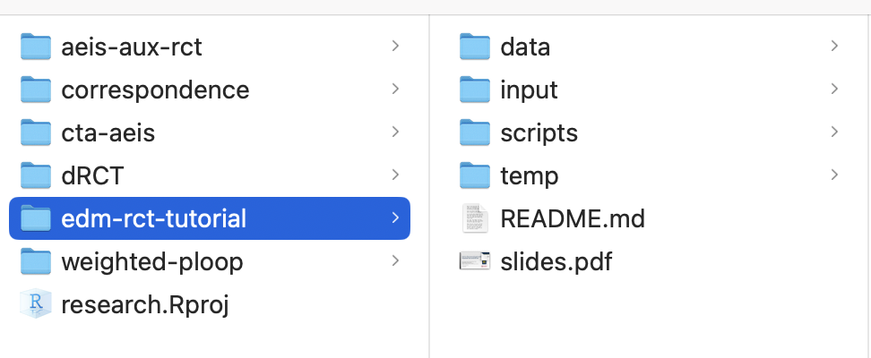{width="60%"}

# Remote copy on GitHub

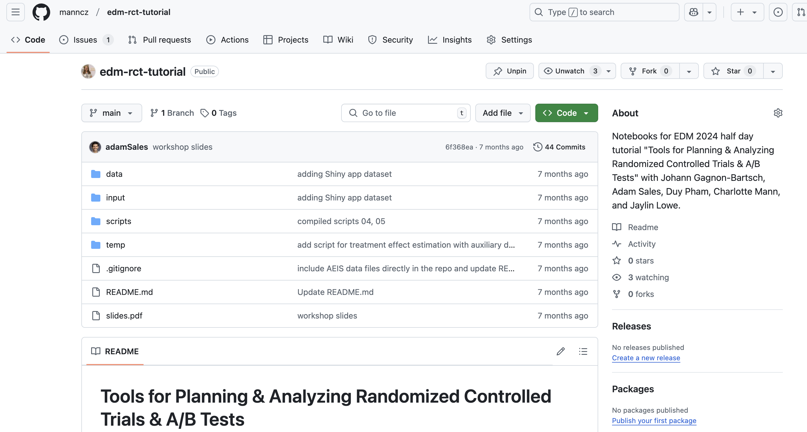{width="80%"}

:::

## What does Git do?? (very basics)

By default:

- Git tracks changes in any documents in a given repo
- Git records **any** changes to **lines** in the document since the last version of the document was saved (committed)

You need to:

- Tell Git if there are files you don't want it to track (`.gitignore`)
- Tell Git when to save changes to the repo (commit)
  - Once you do that, you can always look back on your previous versions and changes!


## `.gitignore`

Sometimes there are files that you **do not** want to track.

+ A `.gitignore` file specifies the files that git should intentionally ignore.
  + Note that annoyingly a `.gitignore` is an "invisible file" in many file browsers
+ Often you want to ignore machine generated files (e.g., `/bin`, `.DS_Store`) or files/directories that you do not want to be shared (e.g., `solutions/`).
+ **We want to ignore `.Rproj` files!**


## `.gitignore` example

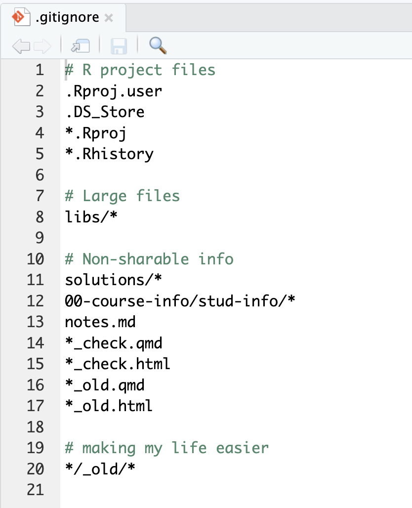

# Actions in Git


## Cloning a Repo

:::: columns
::: column

<bR>

Create an exact copy of a remote repo on your local machine.

(typically only done once at the beginning of a project.)

:::
::: column
```{r}
#| fig-align: center
#| out-width: 50%
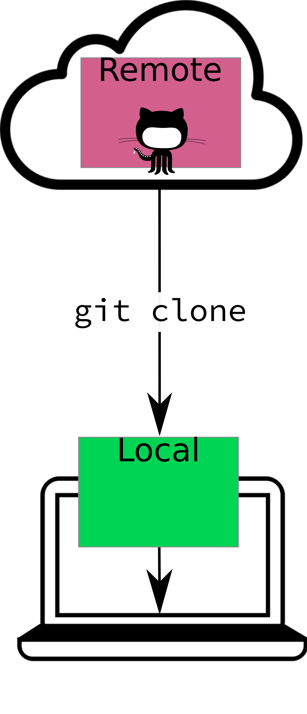
```
:::
::::


## Committing Changes 

Tell git you have made changes you want to add (**save** ✅) to the repo.

+ **local** action

+ Also provide a *commit message* -- a short label describing what the changes are and why they exist.

:::: {.columns}
::: {.column width="60%"}

The red line is a change we commit (add) to the repo.

:::
::: {.column width="40%"}

```{r}
#| fig-align: center
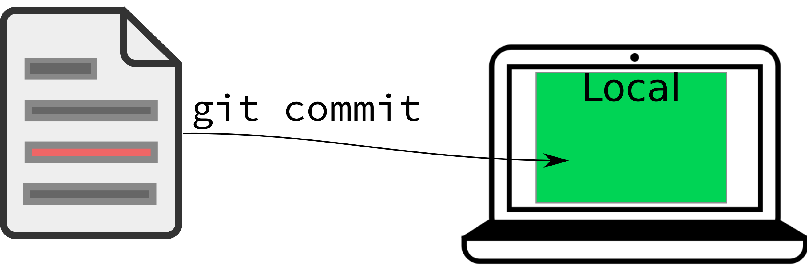
```

:::
::::

. . .

The log of these changes (and the file history) is called your *git commit history*.

+ You can always go back to old copies!


## Commit Tips

+ Use **short, but informative** commit messages.
+ Commit **small** blocks of changes -- commit every time you accomplish a small task. 
  + You’ll have a set of bite-sized changes (with description) to serve as a record of what you’ve done.
+ With **frequent** commits its easier to...
  + find the issue when you mess up!
  + read back through what you changed!


## Pushing Changes

:::: columns
::: column

<br>

**Update** the copy of your repo on GitHub so it has the most recent changes you’ve made on your machine.

- **local** to **remote** ⬆ action

:::
::: column
```{r}
#| fig-align: center
#| out-width: 75%
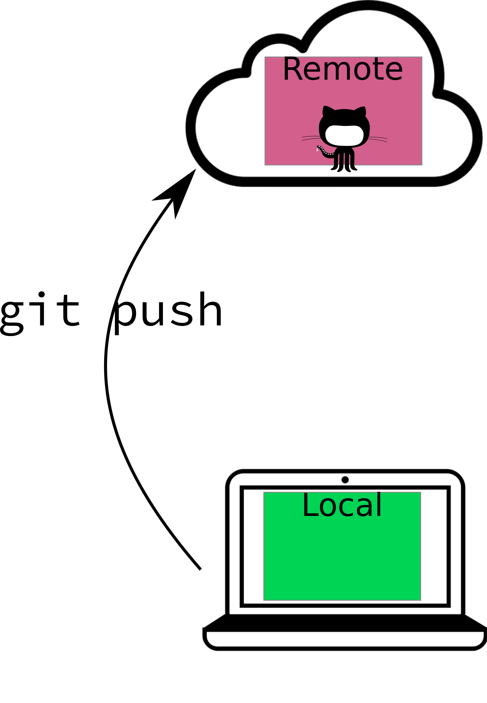
```
:::
::::


## Pulling Changes

:::: columns
::: column

<br>

Update the local copy of your repo (the copy on your computer) with the version on GitHub.

- **remote** to **local** ⬇ action

:::
::: column
```{r}
#| fig-align: center
#| out-width: 75%
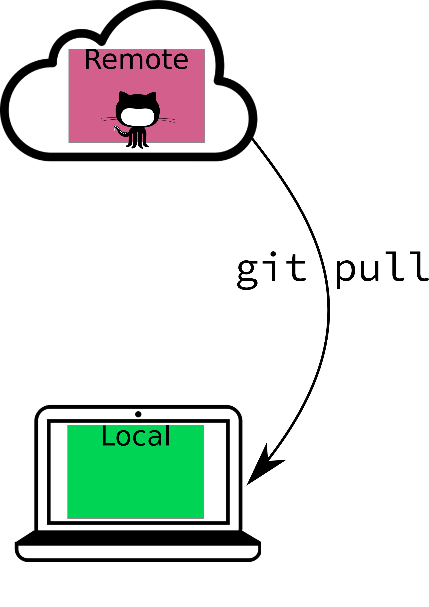
```
:::
::::


## Pushing and Pulling

```{r}
#| fig-align: center
#| out-width: 75%
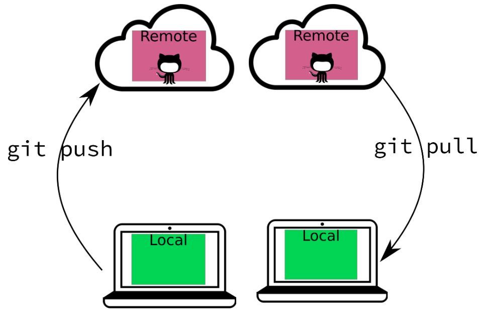
```


## Workflow

**When you have an existing local repo:**

::: incremental
1. Pull ⬇ the repo (especially if collaborating).
2. Make some changes locally.
4. Commit ✅ the changes to git.
5. Pull ⬇ any changes from the remote repository (again!).
6. Resolve any merge conflicts.
7. Push ⬆ your changes to GitHub.

:::

##

{width=80% fig-alt="On the left is a quote from Hadley Wickham and Jenny Bryan that says Using a Git commit is like using anchors and other protection when climbing…if you make a mistake you can’t fall past the previous commit. Commits are also helpful to others, because they show your journey, not just the destination. On the right, two little monsters climb a cliff face. Their ropes are secured by several anchors, each labeled Commit. Three monsters on the ground support the climbers."}

# Merge Conflicts

## Merge Conflicts

These occur when git encounters conflicting changes.

</br>

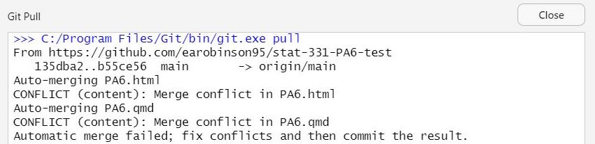

## Merge Conflicts

1. Maybe you are working in real time on the same line of code or text as a collaborator.
2. Maybe you forgot to push your changes the last time you finished working.
3. Maybe you forgot to pull your changes before you started working this time.


## Merge Conflicts

**We will work on resolving merge conflicts today!**

</br>

. . .

But when all else fails...

<center>
**delete your local repo and clone again.**
</center>

{width=50% fig-alt="A bunny and a mouse, both looking stressed and sweaty, look on at a smoking laptop as flames start to grown from it. Text reads: Plan on it."}

## Tips for Avoiding Merge Conflicts

+ Always **pull** before you start working and always **push** after you are done working!
  + If you do this, you will only have problems if two people are making local changes to **the same line in the same file at the same time**.

. . .

+ If you are working with collaborators in real time, **pull**, **commit**, and **push** often.

. . .

+ Git commits **lines** -- lines of code, lines of text, etc.
  + Practice good code format -- no overly long lines!


# Connect GitHub to RStudio


## Install + Load `R` Packages

Work in your console or an Rscript for this.

1. Install and load the `usethis` package.

```{r}
#| eval: false
#| echo: true
install.packages("usethis")
library(usethis)
```

2. Install and load the `gitcreds` Package.

```{r}
#| eval: false
#| echo: true
install.packages("gitcreds")
library(gitcreds)
```


## Configure git

3. Tell git your email and GitHub username.

```{r}
#| eval: false
#| echo: true
use_git_config(user.name = "JaneDoe2", user.email = "jane@example.org")
```

(Nothing should happen.)


## Generate your Personal Access Token

4. Generate a PAT.

```{r}
#| eval: false
#| echo: true
create_github_token()
```

+ This will open GitHub and ask you to log in.
+ Fill in a Note and an Expiration (AT LEAST 60 days from now).
+ Click `Generate Token`.

```{r}
#| fig-align: center
#| out-width: 50%
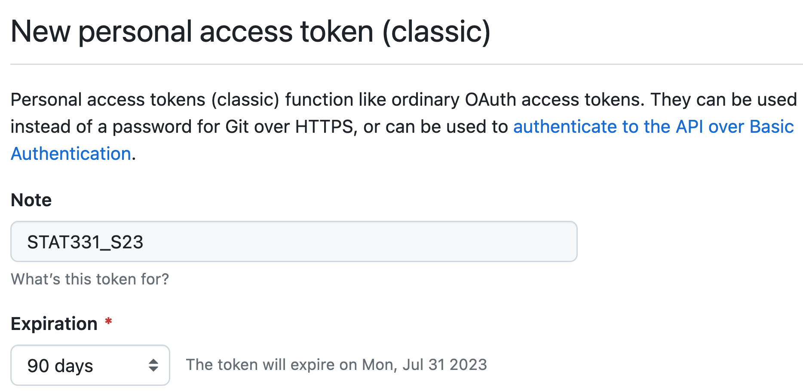
```


## Store your PAT

5. Copy your PAT.

```{r}
#| fig-align: center
#| out-width: 65%
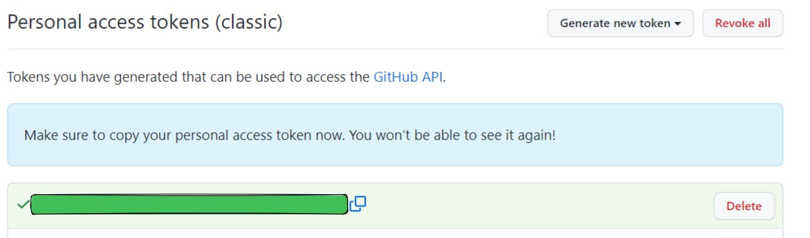
```

6. Run the following code.

```{r}
#| eval: false
#| echo: true
gitcreds_set()
```

When prompted to **Enter password or token:**, paste your PAT.


## Verify your PAT

7. Let's verify.

```{r}
#| echo: true
#| eval: false
git_sitrep()
```

```{r}
#| out-width: 90%
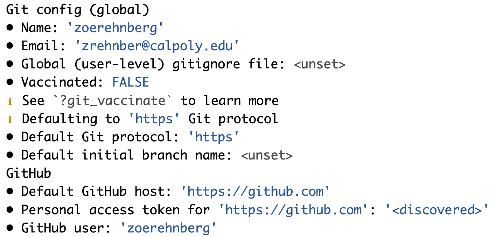
```


## PA 6: Merge Conflicts

You will be completing this activity in groups of 3-4.

::: callout-warning

##    **IMPORTANT**

This activity will only work if you follow the directions **in the exact order** that I have specified them. **Do not work ahead of your group members!**

:::

{width=50% fig-alt="Cartoon of the GitHub octocat mascot hugging a very sad looking little furry monster while the monster points accusingly at an open laptop with MERGE CONFLICT in red across the entire screen. The laptop has angry eyes and claws and a wicked smile. In text across the top reads gitHUG with a small heart."}


## To do...

+ **PA 6: Merge Conflicts**
  + Due **Monday, 5/4** at 11:59pm -- **TODAY**.

+ **Midterm Exam**
  + Wednesday, 5/6.
  

::: callout-note

## Office Hours

Tuesday from 9:30-11am and 2-3:30 pm.

None scheduled on Thursday but available upon request.
:::
  

  