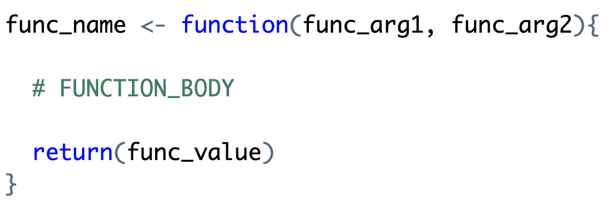
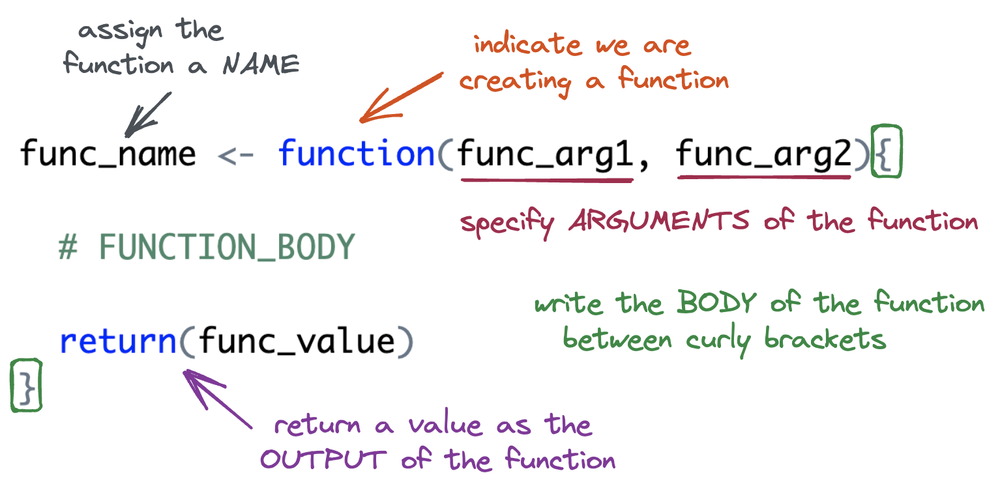
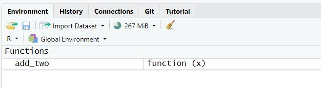

```{r setup}
#| include: false
#| message: false
library(tidyverse)
library(palmerpenguins)
library(countdown)
```

## Monday, May 11

Today we will...

+ Lecture
  + Function Basics
  + Variable Scope + Environment
+ PA 7: Writing Functions

:::callout-tip
## Follow along

Remember to download, save, and open up the [handout](../../student-versions/handouts/w7.1-handout.qmd) for today!
:::

## Why write functions?

Functions allow you to automate common tasks!

+ We've been using functions since Day 1, but when we write our own, we can **customize** them!
+ Have you found yourself copy-pasting code and only changing small parts?

. . .

**Writing functions has 3 big advantages over copy-paste:**

1. Your code is easier to read.
2. To change your analysis, simply change one function.
3. You avoid mistakes from copy-paste.


# Function Basics


## Function Syntax

<br>

{width=90%}


## Function Syntax




## A (very) Simple Function

Let's **define** the function.

+ You must run the code to define the function just **once**.


```{r my_fun}
#| echo: true
add_two <- function(x){
  x + 2
}
```

<br>

. . .

Let's **call** the function!

```{r}
#| echo: true
add_two(5)
```


## Naming: `add_two <- `

The **name** of the function is chosen by the author.

```{r}
#| echo: true
#| eval: false
add_two <- function(x){
  x + 2
}
```

. . .

**Caution:** Function names have no inherent meaning.

+ The name you give to a function does not affect what the function does.

```{r}
#| echo: true
add_three <- function(x){
  x + 7
}
```

```{r}
#| echo: true
add_three(5)
```


## Arguments 

The **argument(s)** of the function are chosen by the author.

+ Arguments are how we pass external values into the function.
+ They are temporary variables that only exist inside the function body.

:::: {.columns}
::: {.column width="60%"}

+ We give them general names:
  + `x`, `y`, `z` -- vectors
  + `df` -- dataframe
  + `i`, `j` -- indices
  
:::
::: {.column width="40%"}

<br>

```{r}
#| echo: true
#| eval: false
add_two <- function(x){
  x + 2
}
```

:::
::::


## Body: `{  }`

The **body** of the function is where the action happens.

+ The body must be specified within a set of curly brackets.
+ The code in the body will be executed (in order) whenever the function is called.

```{r}
#| echo: true
#| eval: false
#| code-line-numbers: "2"
add_two <- function(x){
  x + 2
}
```


## Output: Last Value

Your function will *give back* what would normally *print out* from the last line in the body...

```{r}
#| echo: true
add_two <- function(x){
  x + 2
}
```

<br>

```{r}
#| echo: true
add_two(7)
```


- an **implicit** return


## Output: `return()`

...you can also **explicitly** use the command `return()`.

```{r}
#| echo: true
#| eval: false
add_two <- function(x){
  return(x + 2)
}
```

. . .

</br> 

:::callout-note
## Style decision

The tidyverse style guide currently suggests using implicit returns since it is more concise and more "idiomatic" to R...

But using `return()` explicity is clearer to readers and new learners.

I leave this up to you!
:::

## Output: early returns

Explicit returns are necessary for early returns

. . .

</br> 

```{r}
#| code-line-numbers: false
#| echo: true

safe_square <- function(x) {
  if (!is.numeric(x)) return(NA)
  x^2
}

```

. . .

</br> 

:::columns
:::column

```{r}
#| code-line-numbers: false
#| echo: true

safe_square(2)
```


:::

:::column
```{r}
#| code-line-numbers: false
#| echo: true

safe_square("A")
```

:::

:::


## Output: more than one output

If you need to return **more than one object** from a function, wrap those objects in a **list**.

```{r}
#| echo: true
#| eval: true
#| code-line-numbers: false

min_max <- function(x){
  lowest <- min(x)
  highest <- max(x)
  
  list(min = lowest, max = highest)
}
```


```{r}
#| echo: true
#| eval: true
#| code-line-numbers: false

vec <- c(346,547,865,346,6758,78,79,362)
min_max(vec)
```


## Function Arguments 

What if we wanted to write a more general function, named `add_something()`. 
The function would take **two** inputs: 

1. `x` the vector to add to
2. `something` the value to add to `x`

How would your function change?

```{r}
countdown(minutes = 2)
```


## Arguments Cont.

::: panel-tabset

### Optional arguments

- If we supply a **default** value when *defining* the function, the argument is **optional** when *calling* the function.

```{r}
#| echo: true
add_something <- function(x, something = 2){
  x + something
}
```

- If a value is not supplied, `something` defaults to 2.

:::columns
:::column
```{r}
#| echo: true
add_something(x = 5)
```
:::
:::column
```{r}
#| echo: true
add_something(x = 5, something = 6)
```
:::
:::

### Required arguments

- If we **do not** supply a default value when *defining* the function, the argument is **required** when *calling* the function.

```{r}
#| echo: true
#| error: true
add_something <- function(x, something){
  x + something
}
```


```{r}
#| echo: true
#| error: true

add_something(x = 2)
```

:::

## Input Validation

When a function requires an input of a specific data type, check that the supplied argument is valid.

::: panel-tabset

### <font size=6> `stopifnot()` </font>
```{r}
#| echo: true
#| error: true
#| code-line-numbers: "2"
add_something <- function(x, something){
  stopifnot(is.numeric(x))
    x + something
}

add_something(x = "statistics", something = 5)
```

### <font size=6> `if() + stop()` </font>

```{r}
#| echo: true
#| error: true
#| code-line-numbers: "2-4"
add_something <- function(x, something){
  if(!is.numeric(x)){
    stop("Please provide a numeric input for the x argument.")
  }
  x + something
}

add_something(x = "statistics", something = 5)
```


:::


# Variable Scope + Environment


## Variable Scope

The location (environment) in which we can find and access a variable is called its **scope**.

+ We need to think about the scope of variables when we write functions.
+ What variables can we access **inside** a function?
+ What variables can we access **outside** a function?


## Global Environment

+ The top right pane of Rstudio shows you the **global environment**.
  + This is the *current state* of all objects you have created.
  + These objects can be accessed **anywhere**.

```{r}
#| fig-align: center
#| out-width: 80%

```


## Function Environment

+ The code inside a function executes in the **function environment**.
  + Function arguments and any variables created inside the function only exist inside the function.
    + They **disappear** when the function code is complete.
  + What happens in the function environment **does not affect** things in the global environment.

```{r}
#| echo: true
#| error: true
add_two <- function(x) {
  my_result <- x + 2
  return(my_result)
}
```

## Function Environment

We **cannot** access variables created inside a function outside of the function.

```{r}
#| echo: true
#| error: true
add_two <- function(x) {
  my_result <- x + 2
  return(my_result)
}

add_two(9)
my_result
```


## Name Masking

Name masking occurs when an object in the *function environment* has the **same name** as an object in the *global environment*.

```{r}
#| echo: true
#| code-line-numbers: "2"
add_two <- function(x) {
  my_result <- x + 2
  return(my_result)
}
```

```{r}
#| echo: true
my_result <- 2000
```

. . .

The `my_result` created **inside** the function is different from the `my_result` created **outside**.

:::: columns
::: column

```{r}
#| echo: true
add_two(5)
```
:::
::: column
```{r}
#| echo: true
my_result
```
:::
::::


## Dynamic Lookup

Functions look for objects FIRST in the function environment and SECOND in the global environment.

+ If the object doesn't exist in either, the code will give an error.

:::: columns
::: column
```{r}
#| error: true
#| echo: true
add_two <- function() {
  return(x + 2)
}

add_two()
```
:::
::: column
```{r}
#| echo: true
x <- 10

add_two()
```
:::
::::

. . .

**It is not good practice to rely on global environment objects inside a function!**


# Debugging

```{r}
#| fig-align: center
#| out-width: 75%
#| fig-cap: "(Allison Horst)"
knitr::include_graphics("https://cdn.myportfolio.com/45214904-6a61-4e23-98d6-b140f8654a40/51084276-ab7f-4c57-a0e7-5cf14a277359_rw_1920.png?h=825c5593149a63edef46664796766751")
```


## Debugging

You **will** make mistakes (create bugs) when coding.

+ Unfortunately, it becomes more and more complicated to **debug** your code as your code gets more sophisticated.
+ This is especially true with functions!


## Debugging Strategies

+ Interactive coding
  + Highlight lines within your function and run them one-by-one to see what happens.

. . .

+ `print()` debugging
  + Add `print()` statements throughout your code to make sure the values are what you expect.

. . .

+ Rubber Ducking
  + Verbally explain your code line by line to a rubber duck (or a human).


## General Function Writing Advice

When you have a concept that you want to turn into a function...

:::incremental

1. Write a simple **example** of the code without the function framework.

2. **Generalize** the example by assigning variables.

3. **Write** the code into a function.

4. **Call** the function on the desired arguments
:::

. . .

**This structure allows you to address issues as you go.**

# Let's Practice

## Base R Refresher 


- We can extract components of a vector using `[ ]`
- The inputs can be:
    + logical values (`TRUE`, `FALSE`)
    + indices (e.g., `1`, `2`, `3`)


```{r}
#| echo: true

x <- 1:5
```

```{r}
#| echo: true

x[c(TRUE, TRUE, TRUE, FALSE, FALSE)]
```


```{r}
#| echo: true

x[1:3]
```


## `above_average()`

::: {.midi}
> Goal: Keep only the elements of `x` greater than the mean.
:::

. . .

::: {.midi}
Fill in the code to create a function named `above_average()`. The
function should keep only the elements of `x` greater than the mean.

```{r}
#| echo: true

above_average <- function(x) {
  # Step 1: Compute mean of x
  
  
  # Step 2: Subset x to keep only values > mean
  
  
  # Step 3: Return the result
  
}
```
:::

```{r}
countdown(minutes = 5)
```


## Option 1: Using Logical Values

::: {.midi}
**Step 1:** Find locations where values of `x` are larger than the mean

```{r}
#| echo: true
#| code-line-numbers: false

x <- 15:25
x > mean(x)
```
:::

. . .

::: {.midi}
**Step 2:** Use this output to extract the desired values from `x`

```{r}
#| echo: true
#| code-line-numbers: false

x[x > mean(x)]
```
:::

. . .

::: {.midi}
**Step 3:** Make a function

```{r}
#| echo: true
#| code-line-numbers: false

above_average <- function(x) {
  x[x > mean(x)]
}
```
:::

## Option 2: Using Indices

::: {.midi}
**Step 1:** Find indices where values of `x` are larger than the mean

```{r}
#| echo: true
#| code-line-numbers: false

which(x > mean(x))
```
:::


::: {.midi}
**Step 2:** Use this output to extract the desired values from `x`

```{r}
#| echo: true
#| code-line-numbers: false

x[which(x > mean(x))]
```
:::


::: {.midi}
**Step 3:** Make a function

```{r}
#| echo: true
#| code-line-numbers: false

above_average <- function(x) {
  x[which(x > mean(x))]
}
```
:::

## `every_third()`

> Goal: Return every third element from a vector.

. . .

::: {.midi}
Write down the steps you would need to create a function named `every_third()` 
that takes in a vector and returns every third element from that vector 
(i.e., indices 1, 4, 7, 10, etc.). 

**Think about:**

- What inputs the function should take.
- How to identify which positions in the vector are "every third."
- How to select those elements from the vector.

:::

```{r}
countdown(minutes = 3)
```


## Generate Indices

> Represent the indices (positions) of each element of `x`.

. . .

```{r}
#| echo: true
#| code-line-numbers: false

x

1:length(x)
```

## Identify Every Third Position

> Identify which positions are "every third."

. . .

::: {.midi}

| index | Remainder (`index %% 3`) | Keep? |
| :---: | :----------------------: | :---: |
|   1   |             1            |   ✅   |
|   2   |             2            |   ❌   |
|   3   |             0            |   ❌   |
|   4   |             1            |   ✅   |
|   5   |             2            |   ❌   |
|   6   |             0            |   ❌   |
|   7   |             1            |   ✅   |

:::

## Identify Every Third Position

> Identify which positions are "every third."

```{r}
#| echo: true
#| code-line-numbers: false

1:length(x) %% 3 == 1
```

## Subset `x`

> Grab the elements of `x` we want to keep. 

```{r}
#| echo: true
#| code-line-numbers: false

x
```

</br>

```{r}
#| echo: true
#| code-line-numbers: false

x[1:length(x) %% 3 == 1]
```

## Make it into a function!

```{r}
#| echo: true
#| code-line-numbers: false

every_third <- function(x) {
  
  x[1:length(x) %% 3 == 1]

  }
```


# PA 7: Writing Functions

::: columns
::: {.column width="40%"}
You will write several small functions, then use them to unscramble a message. Many of the functions have been started for you, but none of them are complete as is.
:::

::: {.column width="5%"}
:::

::: {.column width="55%"}
{width="70%"}
:::
:::

## Collaborative Protocol

::: {.small}
During your collaboration, your group will alternate between three roles: 
:::


::: panel-tabset

### Project Manager
-   Reads out the prompt and ensures the group understands what is being asked. 
-   Manages resources (e.g., cheatsheets, textbook). 
-   Answers Coder's questions about syntax based on the resources.
-   Works with the group to debug the code.


### Computer

-   Encourages the Coder to vocalize and explain their thinking.
-   Types the code specified by the Coder into the Quarto document.
-   Runs the code provided by the Coder. 
-   Works with group to debug the code.
-   Evaluates the output against the question prompt. 


### Coder

-   Confirms they understand what the prompt is asking.
-   Talks with the group about their ideas. 
-   Explains their thinking.
-   Directs the Computer what to type. 
-   Works with the group to debug the code. 

:::


## Submission

- When you have completed the puzzle, you will end with 6 numbers that relate to a TV show. You will each individually submit the name of that TV show.
  - You can ask me if it is correct before you submit
- You do not need to submit your code, but you should check your code against the solutions when they are posted!
. . .

::: callout-tip

## Starting Roles Today

The person who has the most siblings starts as the coder, second as the project manager.

:::


## To do...
  
  
+ **PA 7: Writing Functions**
  + Due Tuesday by 11:59pm

+ **Project Checkpoint 2: Project Proposal and Group Contract**
  + Due Friday, 5/15 at 11:59pm.

+ **Lab 7: Searching for Efficiency**
  + Due Sunday 5/17 at 11:59pm.

  
  