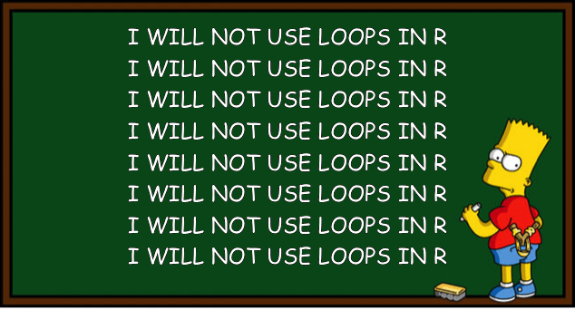
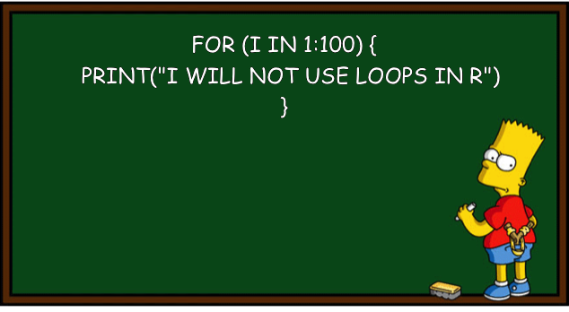
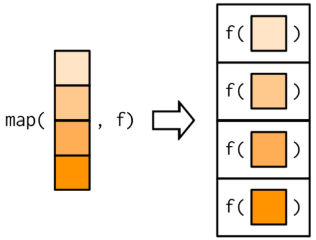
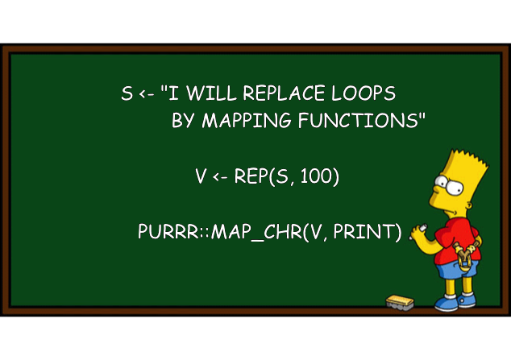
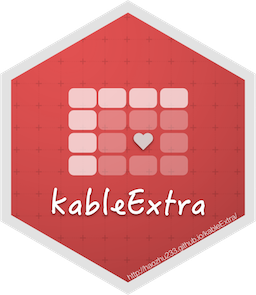
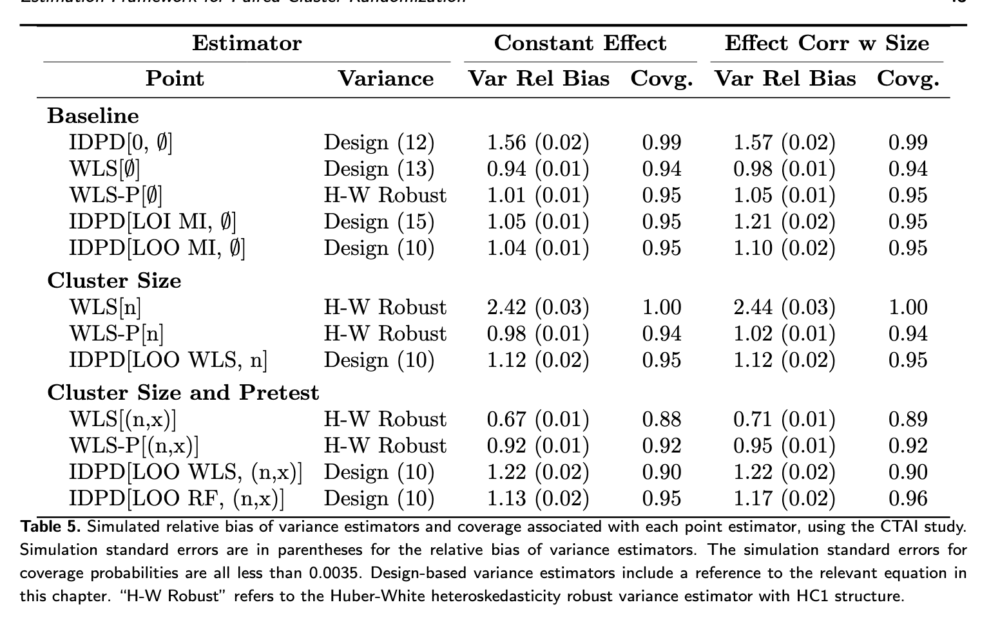

```{r setup}
#| include: false
#| message: false
library(tidyverse)
library(palmerpenguins)
library(glue)
library(knitr)
library(gt)
library(kableExtra)

data(penguins)
```


## Wednesday, 5/13
Today we will...

+ Project Checkpoint 2
+ New Material^[Material and images for today's lecture were modified from Dr. Theobold and [Hansjörg Neth's ds4psy text](https://bookdown.org/hneth/ds4psy/12.3-iter:functional-programming.html#iter:functional-programming)]
  + Iteration aka Performing Repeated Tasks
  + Efficient Iteration: the `map()` family
  + Nice Tables
+ Lab 7: Searching for Efficiency

## Project Proposal + Group Contract

Together your group must:

1. Write a group contract for how you will work together
2. Write a short project proposal, based on the project type that you chose

  + See your project page for detailed instructions on the proposal
  + Due on Canvas by 11:59pm on Friday, 5/23
  + "Group" Canvas assignment, so only one person needs to submit it in your group


# Performing Repeated Tasks


## Repetition

Type out the task over and over.

```{r}
#| echo: false
#| fig-align: center
#| fig-cap: "https://bookdown.org/hneth/ds4psyl"
#| out-width: 50%

```

. . .

Do not do this.

## Iteration

Repeatedly execute the *same* operation over and over.

+ Loops (e.g., `for()` and `while()`) allow us to iterate.

:::: {.columns}
::: {.column width="40%"}
```{r}
#| echo: true
for(i in 1:6){
  print(i^2)
}
```

:::
::: {.column width="60%"}
```{r}
#| echo: false
#| fig-align: center
#| out-width: 80%
#| fig-cap: "https://bookdown.org/hneth/ds4psyl"

```
:::
::::


## Iteration

Repeatedly execute the *same* operation over and over.

+ Loops (e.g., `for()` and `while()`) allow us to iterate.

:::: {.columns}
::: {.column width="40%"}
```{r}
#| echo: true
for(i in 1:6){
  print(i^2)
}
```

+ But loops tend to be **slow**!

:::
::: {.column width="60%"}
```{r}
#| echo: false
#| fig-align: center
#| out-width: 80%
#| fig-cap: "https://bookdown.org/hneth/ds4psyl"

```
:::
::::


## Vectorization

Many operations in R are **vectorized**.

+ These functions operate on *vectors* of values rather than a *single* value.
+ We can iterate *without* writing a loop.

. . .

```{r}
#| echo: true
x <- seq(from = -4, to = 6)
x
```

:::: {.columns}
::: {.column width="50%"}
Loop:

```{r}
for(i in 1:length(x)){
  x[i] <- abs(x[i])
}
x
```
:::
::: {.column width="50%"}

:::
::::


## Vectorization

Many operations in R are **vectorized**.

+ These functions operate on *vectors* of values rather than a *single* value.
+ We can iterate *without* writing a loop.

```{r}
#| echo: true
x <- seq(from = -4, to = 6)
x
```

:::: {.columns}
::: {.column width="50%"}
Loop:

```{r}
for(i in 1:length(x)){
  x[i] <- abs(x[i])
}
x
```
:::
::: {.column width="50%"}
Vectorized:

```{r}
#| echo: false
x <- seq(from = -4, to = 6)
```

```{r}
abs(x)
```
:::
::::


## Vectorization

**Not every function is vectorized.**

+ E.g., a function using `if()` statements **cannot** operate on vectors.

. . .

:::: {.columns}
::: {.column width="47%"}
```{r}
#| error: true
pos_neg_zero <- function(x){
  if(x > 0){
    return("Greater than 0!")
  } else if (x < 0){
    return("Less than 0!")
  } else {
    return("Equal to 0!")
  }
}

x <- seq(from = -4, to = 4)
pos_neg_zero(x)
```

:::
::: {.column width="53%"}

The `if(x > 0)` statement can only be checked for something of length 1 (a single number, not a vector).

:::
::::


## Vectorization

**Not every function is vectorized.**

+ E.g., a function using `if()` statements **cannot** operate on vectors.

:::: {.columns}
::: {.column width="47%"}
```{r}
#| error: true
pos_neg_zero <- function(x){
  if(x > 0){
    return("Greater than 0!")
  } else if (x < 0){
    return("Less than 0!")
  } else {
    return("Equal to 0!")
  }
}

x <- seq(from = -4, to = 3)
pos_neg_zero(x)
```

:::
::: {.column width="53%"}

```{r}
result <- rep(NA, length(x))
for(i in 1:length(x)){
  result[i] <- pos_neg_zero(x[i])
}

result
```
:::
::::


## Vectorization

**Not every function is vectorized.**

+ **Vectorized** versions of `if()` statements?

<center>

`if_else()` and `case_when()`

</center>

```{r}
pos_neg_zero <- function(x){
  state <- case_when(x > 0 ~ "Greater than 0!", 
                     x < 0 ~ "Less than 0!", 
                     .default = "Equal to 0!")
  return(state)
}

x <- seq(from = -4, to = 3)
pos_neg_zero(x)
```


## Some functions cannot be vectorized!

Applying `class()` to a **single** variable in a dataframe returns the data type of that column:

```{r}
class(penguins[[1]])

class(penguins$species)
```

Trying to apply `class()` to **every** variable in a dataframe returns the data type of the dataframe:

```{r}
class(penguins)
```


## What can we do instead?

Write a `for()` loop...

```{r}
data_type <- rep(NA, length = ncol(penguins))
for(i in 1:ncol(penguins)){
  data_type[i] <- class(penguins[[i]])
}

# format table nicely
data.frame(column = names(penguins), 
       type = data_type) |> 
  pivot_wider(names_from = column, 
              values_from = type) |>  
  knitr::kable() |>
  kableExtra::kable_styling(font_size = 30)
```

. . .

... but loops are computationally intensive!


## What can we do instead?

What about `across()`?

+ Easily perform the **same** operation on multiple columns.

```{r}
penguins |> 
  summarise(across(.cols = everything(), 
                   .fns = class)) |> 
  knitr::kable()
```

. . .

Ugh. Internally, `across()` uses a `for()` loop!

```
for (j in seq_fns) {
  fn <- fns[[j]]
  out[[k]] <- fn(col, ...)
  k <- k + 1L
```


## What can we do instead?

<br>

...


# Functional Programming with `purrr`

The `purrr` package breaks common list manipulations into small, independent pieces.


{width=30%}


## Brief Review: Lists

A list is a 1-dimensional, heterogeneous data structure.

+ There are no restrictions on what data type or structure it can contain -- values, vectors, other lists, dataframes, etc.
+ Lists are indexed with `[]` or `[[]]`.

. . .

:::: {.columns}
::: {.column width="50%"}
```{r}
#| echo: false
(my_list <- list(c(T, F, T, T), 
                matrix(c(6.7, 5.58, 4.4, 6.0), nrow = 2),
                "A"))
```
:::
::: {.column width="50%"}
```{r}
my_list[1]
my_list[[2]]
my_list[[2]][1,2]
```
:::
::::


## Brief Review: Lists

A dataframe / tibble is a specially formatted **list of columns**!

```{r}
small_penguins <- penguins[1:8,]
small_penguins[3]
small_penguins[[3]]
```

. . .

The `purrr` package works for lists, so it works for dataframes.


## `map()`

The `map()` function **iterates** through each item in a list (or vector) and applies a function, then returns the new list.

```{r}
#| fig-align: center
#| out-width: 30%
#| echo: false

```

Note: the first argument in `map()` is the list (or vector), so if we pipe into it, we **only** specify the function!


## `map()` + Dataframes

A dataframe is just a list of columns -- `map()` will apply a function to every column.

. . .

```{r}
penguins |> 
  select(bill_length_mm:body_mass_g) |>
  map(.f = ~ mean(.x, na.rm = TRUE))
```

Use a lambda function (with `~` and `.x`), just like in <font size=6> `across()`</font>!


## The `map()` Family

The `map_xxx()` variants allow you to specify the **type of output** you want.

+ `map()` creates a *list*.
+ `map_chr()` creates a *character vector*.
+ `map_lgl()` creates an *logical vector*.
+ `map_int()` creates a *integer vector*.
+ `map_dbl()` creates a *numeric vector*.

All take in a list or vector and a function as arguments.


## `map()` + penguins

::: panel-tabset

### `map_dbl()`

Calculate the mean of each column.

```{r}
penguins |> 
  select(bill_length_mm:body_mass_g) |> 
  map_dbl(~ mean(.x, na.rm = TRUE))
```

Output is a **vector of doubles**.


### `map_int()`

Calculate the number of `NA`s in each column.

```{r}
penguins |> 
  map_int(~ sum(is.na(.x)))
```

Output is a **vector of integers**.


### `map_lgl()`

Calculate if there are any `NA`s in each column.

```{r}

penguins |> 
  map_lgl(~ sum(is.na(.x)) > 0)
```

Output is a **vector of booleans**.


### Choosing a map


Calculate the number of `NA`s in each column.

```{r}
#| error: true
penguins |> 
  map_lgl(~ sum(is.na(.x)))
```


R returns an error if the output is of the wrong type!

:::


## `map_if()`

The `map_if()` function allows us to **conditionally** apply a function to each item in a list.

. . .

::: panel-tabset

### `across()`

```{r}
#| eval: false
penguins |> 
  mutate(across(.cols = where(is.numeric), 
                .fns = scale))
```

```{r}
#| echo: false
penguins |> 
  select(species:bill_depth_mm, sex) |> 
  mutate(across(.cols = where(is.numeric), 
                .fns = scale)) |> 
  head(n = 8)
```

### `map_if()`

```{r}
penguins |> 
  map_if(is.numeric, scale)
```

### `map_if()` to data (tibble)

```{r}
#| eval: false
penguins |> 
  map_if(is.numeric, scale) |> 
  bind_cols()
```

```{r}
#| echo: false
penguins |> 
  select(species:bill_depth_mm, sex) |> 
  map_if(is.numeric, scale) |> 
  bind_cols() |> 
  head(n = 8) |> 
  knitr::kable()
```

:::

## BUT DR. C we just figured out `across()` 😭😭😭!!!

:::{.incremental}
I promise there are good reasons to learn `purrr`!

1. `map()` is computationally faster than `across()`
2. You can complete a larger variety of data manipulations with `map()` functions 
3. `across()` is just for datasets, while `map()` can be used for many different tasks
:::

. . .

:::callout-tip
This doesn't mean that `across()` is bad practice at all, just that there are times when using `purrr` will be much better!
:::


## Use functional programming!

```{r}
#| echo: false
#| fig-align: center
#| out-width: 70%
#| fig-cap: "https://bookdown.org/hneth/ds4psy"

```
<!--
# Midterm Exam Feedback

## Midterm Exam - What went well!

- Overall, code formatting looks very nice!
- Pivoting data
- Data joins and cleaning on take-home
- Working with strings (`stringr`)
- Lot's of interesting and well-thought out open-ended analyses


## Midterm Exam - What we still are working on

- only saving needed intermediate objects
- working with logical variables
- quickly looking at variable values
- citing sources
- statistical language

## Review: Environment Junk

- Only save variables / data if you will **use it again** later

:::panel-tabset

# NO

```{r}
q1 <- penguins |> 
  group_by(species) |> 
  slice_max(bill_length_mm)
  
kable(q1)  
```

# YAY!


```{r}
penguins |> 
  group_by(species) |> 
  slice_max(bill_length_mm) |> 
  kable()
```

# Saving makes sense here

```{r}
penguins_long <- penguins |> 
  pivot_longer(cols = bill_length_mm:body_mass_g,
               names_to = "measure",
               values_to = "value")

penguins_long |> 
  slice_head(n = 3) |> 
  kable()
```
:::

## Review: Logical Variables

- Logical / Boolean variables take the *special* values `TRUE` and `FALSE`
  - can be treated like a numeric vector where 
  
  `TRUE == 1` and `FALSE == 0`

. . .

::: {style="font-size: 80%;"}
What proportion of penguins in each species have a bill length less than 45 mm?
:::

```{r}
penguins |> 
  group_by(species) |> 
  summarize(prop_shortbeak = mean(bill_length_mm < 45, na.rm = TRUE),
            n_penguins = sum(!is.na(bill_length_mm))) |> 
  kable(digits = 3)
```


## Review: Logical Variables

- Using this logic is very useful for function / output checks!

. . .

 > Lab 5 Q0.2: Design and implement a check that you created the `address_number` and `address_street_name` columns correctly.

```{r}
#| echo: false

url("https://raw.githubusercontent.com/manncz/stat-331-s25/main/labs/lab5/data/bCH_murder_data.Rdata") |> 
  load()

person <- person |> 
  mutate(address_number = as.numeric(str_extract(address, 
                                                 "\\d*")),
         address_street_name = str_extract(address,
                                           "[A-z].*"),
         .after = address)
```

```{r}
person |> 
  mutate(address_check = str_c(address_number,
                               address_street_name,
                               sep = " "),
         correct = address_check == address) |> 
  pull(correct) |> 
  mean()
```
## A Note: Logical Variables

- While it works *in some cases* to use strings to reference the values `TRUE` and `FALSE`, it is very **bad practice**

```{r}
#| error: true

TRUE == "TRUE"
sum(c("TRUE", "FALSE"))
sum(c(TRUE, FALSE))
```


## Review: Quickly Exploring Data

- If you want to look at all of the possible values/levels of a character/factor variable, you can use 


:::columns
:::column
`table()` (base) or
```{r}
table(penguins$island)
table(penguins$island, penguins$species)
```
:::

:::column
`count()` (dplyr):
```{r}
penguins |> 
  count(island)
```
:::
:::


## Reminder: Citing Coding Sources

- Part of responsible coding is giving credit to other's work if we use it
- "Assumed knowledge:" course textbook, course slides, and course assignments / solutions.
- You need to let me know if you use **any other resources**
- See [syllabus](https://manncz.github.io/stat-331-s25/course-info/syllabus-w25.html#academic-integrity-and-class-conduct)

## Review: Statistical Langauge

Specific statistical vocabulary (use *carefully* and *correctly*):

- Correlation: a statistic calculated between **two quantitative** variables
- Significant: referring to results of statistical **inference**

. . . 

Instead use general vocabulary:

- association
- relationship
- meaningful / large
- unsubstantial / small
- "appears to be"
-->

# Nice Tables 


## Report Ready Tables in `R`

- We have just shown data tables directly, midly formatting for html using `kable()`

. . .

- We can make report-ready tables using `kableExtra` or `gt`!


:::: {.columns}
::: {.column width="50%"}
{width=70%}
:::
::: {.column width="50%"}
{width=70%}
:::
:::


## Yay reproducibility!

- Formatting tables in code makes them completely reproducible
- No need to update results manually in a table
- No room for copy-paste error
- Can integrate directly into a report / paper

## Yay reproducibility!


```{r}
#| fig-align: center
#| fig-cap: "A table for one of my papers, produced directly in R"
#| echo: false
#| out-width: 80%

```


## Nice tables with `kable()` and `kableExtra` functions


::: {.columns}

::: {.column width="70%"}
- Great for tables that don't need to be *super* fancy but you want to clean up a bit
- Default options look nice in html
- Nice options for changing rows / columns individually
- Get started with these resources ([1](https://haozhu233.github.io/kableExtra/awesome_table_in_html.html#Overview)) ([2](https://bookdown.org/yihui/rmarkdown-cookbook/kable.html))
:::

::: {.column width="30%"}
{width=70%,fig-align="center"}
:::
:::


## Nice tables with the `gt` package

::: {.columns}

::: {.column width="70%"}
- Fancy, report tables
- Lots of formatting options for common variable types
- Syntax less error-prone
- Create labels directly with markdown!
- [Get started](https://gt.rstudio.com/articles/gt.html)
- [Full index of functions](https://gt.rstudio.com/reference/index.html)
:::

::: {.column width="30%"}
{width=70%,fig-align="center"}
:::
:::


## Table Design Example

"Raw" Table:

```{r}
#| echo: false

fish <- read_csv("data/BlackfootFish.csv")
```


```{r}
#| code-fold: true
#| eval: true

tab_dat <- fish |> 
  group_by(species) |> 
  summarize(avg_weight = mean(weight, na.rm = T),
            sd_weight = sd(weight, na.rm = T),
            n = n()) 

tab_dat |> 
  kable()
```
## Table Design Example - `kableExtra`

```{r}
#| code-fold: true
#| eval: true


tab_dat |> 
  arrange(desc(avg_weight)) |> 
  kable(digits = c(0, 1, 1, 0),
        col.names = c("Species", "Mean", "SD", "N. Samples"),
        caption = "Summaries of fish weights by species across all sampling years (between 1989 - 2006) trips and sites.") |>
  kable_classic(full_width = F,
                bootstrap_options = "striped") |> 
  add_header_above(c(" " = 1, "Weight (g)" = 2," " = 1),
                   bold = TRUE) |> 
  row_spec(row = 0, bold = T, align = "c")
```
## Table Design Example - `gt`


```{r}
#| code-fold: true
#| eval: true

tab_dat |> 
  arrange(desc(avg_weight)) |> 
  gt() |> 
  tab_options(table.font.size = 32) |> 
  tab_header(
    title = "Summary of Fish Weights by Species",
    subtitle = "all sampling years, trips, and sites"
  ) |> 
  tab_spanner(label = md("**Weight (g)**"), 
              columns = c(avg_weight, sd_weight)) |> 
  tab_style(style = cell_text(align = "center"),
    locations = cells_column_labels()) |> 
  cols_align(align = "left",
             columns = species) |> 
  fmt_number(columns = c(avg_weight, sd_weight),
             decimals = 1) |> 
  fmt_number(columns = n,
             decimals = 0) |> 
  cols_label(
    "avg_weight" = md("**Mean**"),
    "sd_weight" = md("**SD**"),
    "n" = md("**N. Samples**"),
    "species" = md("**Species**")
  )
```

## Table Design

:::incremental

- What do you want to communicate / emphasize?
- What should the rows and columns be?
  - What are clear labels?
  - Order of rows and columns?
- Is there any grouping of rows and/or columns that would be helpful?

:::

## To do...
  
+ **Project Proposal + Group Contract**
  + Due Friday 5/15 at 11:59pm.
  
+ **Lab 7: Searching for Efficiency**
  + Due Sunday 5/17 at 11:59pm.

+ **Required [Reading](../../reading/week-7.2.qmd)**
  +   Review all material from this week for the **group quiz on Monday**!

