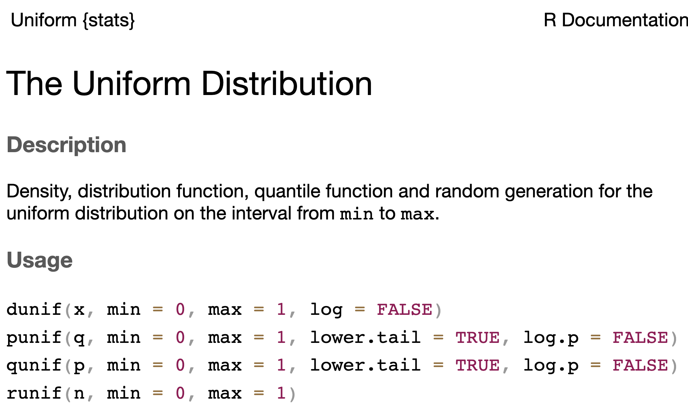
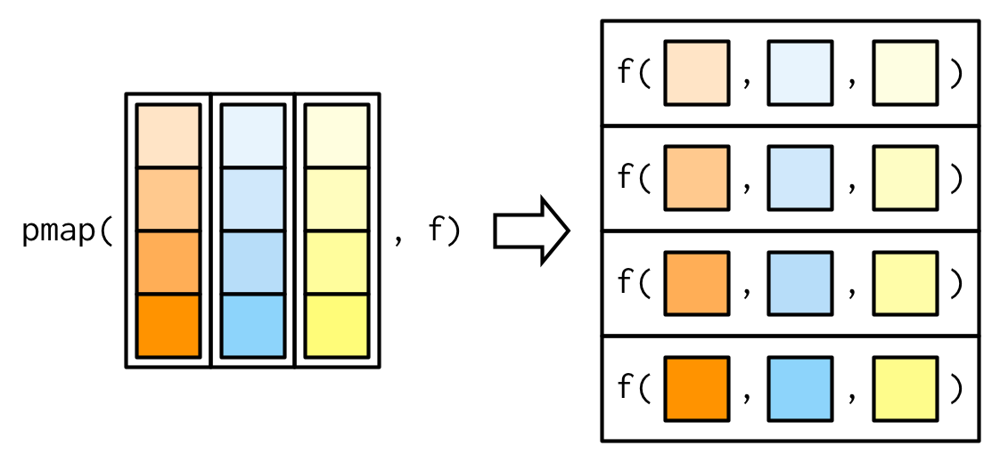

```{r setup}
#| include: false
#| message: false
library(tidyverse)
library(knitr)
library(kableExtra)
library(gt)
```

## Wednesday May 20

Today we will...

+ Statistical Distributions
+ Simulating Data
+ PA 8.2: Instrument Con

<!--
# Debugging Functions

## A couple of strategies

:::{.incremental}

- Don't write a whole function at once (if it is complicated)!
    - Write small parts and test each
    - test often
    
- Set up intermediate tests

- Print a lot

- Just staring at your code *probably* won't help

:::

-->

## Simulations -- Big Picture


# Statistical Distributions


## Statistical Distributions

Recall from your statistics classes...

::: panel-tabset

### Random Variable

A **random variable** is a value we don't know until we observe an **instance**.

+ Coin flip:  could be heads (0) or tails (1)
+ Person's height:  could be anything from 0 feet to 10 feet.
+ Annual income of a US worker:  could be anything from $0 to $1.6 billion

### Distribution

The **distribution** of a random variable tells us its **possible values** and **how likely they are**.

:::: {.columns}
::: {.column width=73%}
+ Coin flip: 50% chance of heads and tails.
+ Heights follow a bell curve centered at 5 foot 7.
+ Most American workers make under $100,000.
:::
::: {.column width=27%}

:::
::::
:::


## Statistical Distributions with Names!

::: panel-tabset

### `unif`

**Uniform Distribution**

:::: columns
::: column
+ When you know the **range** of values, but not much else.
+ All values in the range are **equally likely** to occur.
+ Defined by minimum and maximum values: $Unif(a, b)$
:::
::: column
```{r}
#| out-width: 100%
#| echo: false
my_samples <- data.frame(x = runif(1000))

ggplot(my_samples, aes(x)) + 
  geom_histogram(bins = 40, aes(y = ..density..), fill = "grey", col = "white") + 
  stat_function(fun=dunif, col = "cornflowerblue", lwd = 2) +
  theme_classic()
```
:::
::::
### `norm`

**Normal Distribution**

:::: columns
::: column
+ When you expect values to fall **near the center**.
+ Frequency of values follows a **bell shaped curve**.
+ Defined by mean and standard deviation (or variance): $N(\mu, \sigma^2)$
:::
::: column
```{r}
#| out-width: 100%
#| echo: false
my_samples <- data.frame(x = rnorm(1000))

ggplot(my_samples, aes(x)) + 
  geom_histogram(bins = 40, aes(y = ..density..), fill = "grey", col = "white") + 
  stat_function(fun=dnorm, col = "cornflowerblue", lwd = 2) +
  theme_classic()
```
:::
::::
### `t`

**t-Distribution**

:::: columns
::: column
+ A slightly **wider** bell curve.
+ Basically used in the same context as the **normal distribution**, but more common with  real data (when the *standard deviation* is unknown).
+ Defined by degrees of freedom: $t(df)$ 
:::
::: column
```{r}
#| out-width: 100%
#| echo: false

ggplot(my_samples, aes(x)) + 
  geom_histogram(bins = 40, aes(y = ..density..), fill = "grey", col = "white") + 
  stat_function(fun= function(x) dt(x, df = 5), col = "cornflowerblue", lwd = 2) +
  stat_function(fun = dnorm, col = "#fb6a4a", lwd = 1) +
  theme_classic()
```
:::
::::
### `chisq`

**Chi-Square Distribution**

:::: columns
::: column
+ Somewhat **skewed**, and only allows values **above zero**.
+ Commonly used in statistical testing.
+ Defined by degrees of freedom: $\chi^2_{df}$
:::
::: column
```{r}
#| out-width: 100%
#| echo: false
my_samples <- data.frame(x = rchisq(1000, df = 5))

ggplot(my_samples, aes(x)) + 
  geom_histogram(bins = 40, aes(y = ..density..), fill = "grey", col = "white") + 
  stat_function(fun= function(x) dchisq(x, df = 5), col = "cornflowerblue", lwd = 2) +
  theme_classic()
```
:::
::::

### `binom`

**Binomial Distribution**

:::: columns
::: column
+ There are **two possible outcomes**, and you are **counting** how many times one of the outcomes ("success") occurred out of a fixed number of trials.

:::
::: column
```{r}
#| out-width: 100%
#| echo: false
my_samples <- data.frame(x = rbinom(1000, 10, .8))

ggplot(my_samples, aes(x)) + 
  geom_bar(fill = "grey", col = "white") + 
  theme_classic()
```
:::
::::

+ Takes discrete values from 0 to the number of trials.
+ Defined by the number of trials ($n$) and the probability of success ($p$): $Binom(n, p)$
:::


## How do we use distributions?

+ Find the **probability** of an **event**.
  + If I flip 10 coins, what are the chances I get all heads?

+ Estimate a **proportion** of a **population**.
  + About what proportion of people are above 6 feet tall?
  
+ Quantify the **evidence** in your **data**.
  + In my survey of 100 people, 67 said they were voting for Measure A.  How confident am I that Measure A will pass?

## Distribution Functions in R

:::columns
:::column
+ There are four functions for each of these distributions to accomplish different tasks!
+ The parameters that define each distribution are arguments
  + e.g. `min` and `max` for the Uniform distribution
+ Documentation can be found for each distribution

:::
:::column


:::
:::

## Distribution Functions in R

::: panel-tabset
### `r`

`r` is for **random sampling**.

+ Generate `n` random values from a distribution.
+ We use this to **simulate** data (create pretend observations).

:::: columns
::: column
```{r}
runif(n = 3, min = 10, max = 20)
rnorm(n = 3)
rnorm(n = 3, mean = -100, sd = 50)
```
:::
::: column

```{r}
rt(n = 3, df = 11)
rbinom(n = 3, size = 10, prob = 0.7)
rchisq(n = 3, df = 11)
```
:::
::::

### `p`

`p` is for **probability**.

+ Compute the chances of observing a value **less than** `x`: $P(X < x)$
+ We use this for calculating **p-values**.

:::: {.columns}
::: {.column width=50%}
```{r}
pnorm(q = 70, mean = 67, sd = 3)

1 - pnorm(q = 70, mean = 67, sd = 3)
pnorm(q = 70, mean = 67, sd = 3, lower.tail = FALSE)
```
:::
::: {.column width=50%}
```{r}
#| echo: false

rnorm(10000, mean = 67, sd = 3) |> 
  enframe() |> 
  ggplot(aes(x = value)) +
  stat_function(fun = ~dnorm(.x, mean = 67, sd = 3), 
                col = "cornflowerblue", lwd = 1) +
  scale_x_continuous(breaks = c(55, 58, 61, 64, 67, 70, 73, 76, 79)) +
  geom_vline(xintercept = 70) +
  labs(y = "",
       x = "",
       title = "Density for N(67, 3)") +
  theme_classic() +
  theme(title = element_text(size = 16),
        axis.text.x = element_text(size = 16))
```
:::
::::

### `q`

`q` is for **quantile**.

+ Given a probability `p`, compute $x$ such that $P(X < x) = p$.
+ The `q` functions are "backwards" of the `p` functions.
+ We use this for calculating critical values (z*).

```{r}
qnorm(p = 0.95)
qnorm(p = 0.95, mean = 67, sd = 3)
```

### `d`

`d` is for **density**.

+ Compute the *height* of a distribution curve at a given `x`.
+ For **discrete** dist: probability of getting **exactly** `x`.
+ For **continuous** dist: usually meaningless.
+ Mostly useful for plotting the distribution!

Probability of *exactly* 12 heads in 20 coin tosses, with a 70% chance of tails?

```{r}
dbinom(x = 12, size = 20, prob = 0.3)
```

:::


## Empirical vs. Theoretical Distributions

```{r}
#| echo: false
set.seed(435)
data <- tibble(names   = charlatan::ch_name(1000),
        height  = rnorm(1000, mean = 67, sd = 3),
        age     = runif(1000, min = 15, max = 75),
        measure = rbinom(1000, size = 1, prob = 0.6)) |> 
  mutate(supports_measure_A = ifelse(measure == 1, "yes", "no"))
```


::: panel-tabset
### Empirical Distribution

Empirical: the observed data.

```{r}
#| fig-align: center
#| out-width: 60%
#| code-fold: true
data %>%
  ggplot(aes(x = height)) +
  geom_histogram(aes(y = after_stat(density)), 
                 bins = 10, 
                 color = "white") 
```

### Theoretical Distributions

Theoretical: the distribution curve.

```{r}
#| fig-align: center
#| out-width: 60%
#| code-fold: true
data %>%
  ggplot(aes(x = height)) +
  stat_function(fun = ~dnorm(.x, mean = 67, sd = 3),
                col = "steelblue", lwd = 2) +
  stat_function(fun = ~dnorm(.x, mean = 67, sd = 2),
                col = "orange2", lwd = 2)
```
:::


## Plotting Both Distributions

::: panel-tabset

### <font size = 6> `geom_histogram` </font>

:::: {.columns}
::: {.column width=76%}
```{r hist}
#| code-line-numbers: "3"
#| fig-align: center
#| out-width: 80%
data |> 
  ggplot(aes(x = height)) +
  geom_histogram(bins = 10, color = "white")
```
:::
::: {.column width=24%}
1. Plot your data.
:::
::::

### <font size = 6> `dnorm` </font>
:::: {.columns}
::: {.column width=76%}
```{r}
#| code-line-numbers: "4"
#| fig-align: center
#| out-width: 80%
data |> 
  ggplot(aes(x = height)) +
  geom_histogram(bins = 10, color = "white") +
  stat_function(fun = ~ dnorm(.x, mean = 67, sd = 3),
                color = "steelblue", lwd = 2)
```
:::
::: {.column width=24%}
2. Add a density curve.
:::
::::

### <font size = 6> `after_stat(density)` </font>

:::: {.columns}
::: {.column width=76%}
```{r}
#| code-line-numbers: "3"
#| fig-align: center
#| out-width: 80%
data |> 
  ggplot(aes(x = height)) +
  geom_histogram(aes(y = after_stat(density)),
                 bins = 10, color = "white") +
  stat_function(fun = ~ dnorm(.x, mean = 67, sd = 3),
                color = "steelblue", lwd = 2)
```
:::
::: {.column width=24%}
3. Change the y-axis of the histogram to match the y-axis of the density.
:::
::::

:::

# Simulation - Sampling From Probability Distributions

## Generating Simulated Data - The Idea

- We can generate fake ("synthetic") data based on the assumption that a variable follows a certain distribution.

- We randomly sample observations from the distribution.

```{r}
age <- runif(1000, min = 15, max = 75)
```


## Reproducible samples: `set.seed()`

Since there is randomness involved, we will get a different result each time we run the code.

:::: {.columns}
::: {.column width=50%}
```{r}
runif(3, min = 15, max = 75)
```
:::
::: {.column width=50%}
```{r}
runif(3, min = 15, max = 75)
```
:::
::::

<br>

. . .

To generate a **reproducible** random sample, we first **set the seed**:

:::: {.columns}
::: {.column width=50%}
```{r}
set.seed(94301)

runif(3, min = 15, max = 75)
```
:::
::: {.column width=50%}
```{r}
set.seed(94301)

runif(3, min = 15, max = 75)
```
:::
::::

. . .

:::callout-tip
# Whenever you are doing an analysis that involves a random element, you should set the seed!
:::


## Simulate a Dataset

:::panel-tabset

##  `tibble`
```{r}
#| code-line-numbers: "3-5" 
set.seed(435)
fake_data <- tibble(names   = charlatan::ch_name(1000),
        height  = rnorm(1000, mean = 67, sd = 3),
        age     = runif(1000, min = 15, max = 75),
        measure = rbinom(1000, size = 1, prob = 0.6)) |> 
  mutate(supports_measure_A = ifelse(measure == 1, "yes", "no"))
```

```{r}
#| eval: false
head(fake_data) 
```

```{r}
#| echo: false
head(fake_data) |> 
  knitr::kable() |> 
  kableExtra::scroll_box(height = "200px") |> 
  kableExtra::kable_styling(font_size = 25)
```

## visualize

Check to see the ages look uniformly distributed.

```{r}
#| code-fold: true
#| fig-align: center
#| out-width: 60%
fake_data |> 
  ggplot(aes( x = age,
             fill = supports_measure_A)) +
  geom_histogram(show.legend = F) +
  facet_wrap(~ supports_measure_A,
             ncol = 1) +
  scale_fill_brewer(palette = "Paired") +
  theme_bw() +
  labs(x = "Age (years)",
       y = "",
       subtitle = "Support for Measure A",)
```

:::


# Simulation - Random Samples from a Fixed Population

## Draw a Random Sample

Use `sample()` to take a random sample of values from a vector.

```{r}
my_vec <- c("dog", "cat", "bunny", "horse", "goat", "chicken")

sample(x = my_vec, size = 3)

set.seed(1)
sample(x = my_vec, size = 5, replace = T)

sample(c(0, 1), size = 10, 
       prob = c(.8, .2), replace = T)
```

. . .

:::callout-warning
Whenever you take a sample, think about if you want to take a sample with or without **replacement**. The default is to sample without replacement.
:::


## Draw a Random Sample

Use `slice_sample()` to take a random sample of observations (rows) from a dataset.

```{r}
#| eval: false
fake_data |> 
  slice_sample(n = 3) 
```

. . .

```{r}
#| echo: false
fake_data |> 
  slice_sample(n = 3) |> 
  knitr::kable() |> 
  kableExtra::scroll_box(height = "200px") |> 
  kableExtra::kable_styling(font_size = 25)
```

. . .

```{r}
#| eval: false
fake_data |> 
  slice_sample(prop = .005) 
```

. . .

```{r}
#| echo: false
fake_data |> 
  slice_sample(prop = .005) |> 
  knitr::kable() |> 
  kableExtra::scroll_box(height = "200px") |> 
  kableExtra::kable_styling(font_size = 25)
```


## Example: Birthday Simulation

Suppose there is a group of 50 people.

+ Simulate the approximate probability that at least two people have the same birthday (same day of the year, not considering year of birth or leap years).


## Example: Birthday Simulation

Write a function to ...

+ ... simulate the birthdays of `n` random people (assuming it is equally likely to be born any day of the year).
+ ... count how many birthdays are shared.
+ ... return whether or not a shared birthday exists.

. . .

```{r}
bday_prob <- function(n = 50){
  bday_data <- tibble(person = 1:n,
                      bday   = sample(1:365, size = n, replace = T))
  
  double_bdays <- bday_data |> 
    count(bday) |> 
    filter(n >= 2) |> 
    nrow()
  
  return(double_bdays > 0)
}
```


## Example: Birthday Simulation

Use a `map()` function to repeat this simulation 1,000 times.

+ What proportion of the iterations contain at least two people with the same birthday?

```{r}
sim_results <- map_lgl(.x = 1:1000,
                       .f = ~ bday_prob(n = 50))

mean(sim_results)
```


## In-line Code

We can automatically include code output in the written portion of a Quarto document using `` `r ` ``.

+ This ensures reproducibility when you have results from a random generation process.

```{r}
mean(sim_results)
```

Type this: ```r knitr::inline_expr("mean(sim_results)*100")`% of the iterations contain at least two people with the same birthday. ``

To get this: `r mean(sim_results)*100`% of the iterations contain at least two people with the same birthday.


# Simulating Multiple Datasets


## Simulate Multiple Datasets - Step 1

::: {.small}
Write a function to simulate height data from a population with some mean and SD
height. 

The user should be able to input:

- how many observations to simulate
- the mean and standard deviation of the Normal distribution to use when 
simulating
:::


::: columns
::: {.column width="60%"}
::: {.fragment}
::: {.small}
```{r}
#| code-line-numbers: false

sim_ht <- function(n = 200, avg, std){
  
  tibble(person = 1:n,
         ht = rnorm(n = n, mean = avg, sd = std))
  
}
```
:::
:::
:::

::: {.column width="5%"}
:::

::: {.column width="35%"}
::: {.fragment}
::: {.small}
```{r}
#| code-line-numbers: false

sim_ht(n = 5, 
        avg = 66, 
        std = 3)
```
:::
:::
:::
:::


## Simulate Multiple Datasets - Step 2

Create a set of parameters (mean and SD) for each population.

```{r}
#| code-line-numbers: false

crossing(mean_ht = seq(from = 60, to = 78, by = 6),
         std_ht  = c(3, 6))
```

## Simulate Multiple Datasets - Step 3

Goal: Simulate datasets with all of these different parameters.

In other words, we want to **iterate** across all of these parameter combinations.

Sounds like a job for `purrr`!


## The `pmap()` Family

These functions take in a **list of vectors** and a **function**.

+ The function must accept a number of arguments equal to the length of the list,

```{r}
#| fig-align: center
#| out-width: 65%
#| echo: false

```


## The `pmap()` Family

The vectors need to have the **same names** as the arguments of the function you are applying.

```{r}
fruit <- data.frame(string = c("apple", "banana", "cherry"),
                    pattern = c("p", "n", "h"),
                    replacement = c("P", "N", "H"))
fruit
```

```{r}
pmap(.l = fruit,
     .f = str_replace_all)
```


## Simulate Multiple Datasets - Step 3

Simulate datasets with different mean and SD heights.

::: {.small}
```{r}
#| code-line-numbers: "4-7"

crossing(mean_ht = seq(from = 60, to = 78, by = 6),
         std_ht  = c(3, 6)
         ) |> 
 mutate(ht_data = pmap(.l = list(avg = mean_ht, std = std_ht), 
                       .f = sim_ht
                       )
        )
```
:::

. . .

::: {.small}
::: {.callout-tip}
# Why am I getting a tibble in the `ht_data` column?
:::
:::

## Simulate Multiple Datasets - Step 4

Extract the contents of each list!

::: {.small}
```{r}
#| code-line-numbers: "8"
#| eval: false

crossing(mean_ht = seq(from = 60, to = 78, by = 6),
         std_ht  = c(3, 6)
         ) |> 
 mutate(ht_data = pmap(.l = list(avg = mean_ht, std = std_ht), 
                       .f = sim_ht
                       )
        ) |> 
  unnest(cols = ht_data)
```
:::

::: columns
::: {.column width="50%"}
::: {.small}
```{r}
#| echo: false
#| eval: true

crossing(mean_ht = seq(from = 60, to = 78, by = 6),
         std_ht  = c(3, 6)
         ) |> 
 mutate(ht_data = pmap(.l = list(avg = mean_ht, std = std_ht), 
                       .f = sim_ht
                       )
        ) |> 
  unnest(cols = ht_data)
```
:::
:::

::: {.column width="5%"}
:::

::: {.column width="45%"}
::: {.midi}
::: {.fragment}
Why do I now have `person` and `ht` columns?
:::

::: {.fragment}
How many rows should I have for each `mean_ht`, `std_ht` combo?
:::
:::
:::
:::

## A note: `nest()` and `unnest()`

-   We can pair functions from the `map()` family very nicely with two `tidyr`
functions: `nest()` and `unnest()`.
-   These allow us to easily map functions onto subsets of the data.

. . .

- `nest()` subsets the data (as tibbles) inside a tibble.

```{r}
mtcars |> 
  nest(.by = cyl)
```

. . .

- `unnest()` the data by row binding the subsets back together.


## Simulate Multiple Datasets - Step 5

Plot the samples simulated from each population.

::: {.small}
```{r}
#| echo: false
#| code-line-numbers: false

fake_ht_data <- crossing(mean_ht = seq(from = 60, to = 78, by = 6),
         std_ht  = c(3, 6)
         ) |> 
 mutate(ht_data = pmap(.l = list(avg = mean_ht, std = std_ht), 
                       .f = sim_ht
                       )
        ) |> 
  unnest(cols = ht_data)
```

```{r}
#| code-fold: true
#| fig-width: 8
#| fig-height: 4
#| fig-align: center

fake_ht_data |> 
  mutate(across(.cols = mean_ht:std_ht, 
                .fns = ~as.character(.x)), 
         mean_ht = fct_recode(mean_ht, 
                              `Mean = 60` = "60", 
                              `Mean = 66` = "66", 
                              `Mean = 72` = "72", 
                              `Mean = 78` = "78"), 
         std_ht = fct_recode(std_ht, 
                             `Std = 3` = "3", 
                             `Std = 6` = "6")
         ) |> 
  ggplot(mapping = aes(x = ht)) +
  geom_histogram(color = "white") +
  facet_grid(std_ht ~ mean_ht) +
  labs(x = "Height (in)",
       y = "",
       subtitle = "Frequency of Observations",
       title = "Simulated Heights from Eight Different Populations")
```
:::

# Communicating Findings from Statistical Computing

## Remember the Data Science Process

```{r}
#| out-width: "90%"
#| fig-align: center
#| echo: false
knitr::include_graphics("../week-4/images/data-science-workflow.png")
```

. . .

Communicating about your analysis and findings is a key element of statistical computing.

## Describing data

- Data source(s)
- Observational unit / level (e.g. county and year)
- Overview of what is included (e.g. demographic incormation and weekly median childcare costs for each county and year)
- Years or geographies included (e.g. 2008-2018, CA only)

## Describing data cleaning

- What does the audience need to know about any **choices / decisions** that you make while cleaning the data?
  - how did you handle missing data?
  - how did you define variables?
  - did you drop any observations? How many and why?
  
. . .  
  
- This doesn't include
  - discussing specific file, variable, or function names
  - data cleaning that has no impact on *interpretating* the resulting analysis
    - e.g. changing the type of a variable
  
  
## Describing data cleaning

Which is clearer to a general audience?:


> In this analysis, we use data from the US Department of Labor which includes a variety of measurements of a state's minimum wage for US states and territories by year. We additionally include information from a dataset provided by the Harvard Dataverse on state party leanings by year. Our analysis includes the years 1976 - 2020 and the 50 US states. 

> In this analysis, we use `inner_join()` to join `us-party-data.csv` and `us-minimum-wage-data.csv` by `year` and `state`.
  

## PA 8.2: Instrument Con

:::{columns}
:::{.column width=50%}
Work with statistical distributions to determine if an instrument salesman is lying.
:::
:::{.column width=50%}
{width=80%}
:::
:::

-->

## Lab 8: Data Frame Functions and Simulation


## To do...

:::columns

::: {.column width=70%}
+ **PA 8.2: Instrument Con**
  + Due Friday 5/22 at 11:59pm.
    
+ **Project Checkpoint 3**
  + Due Friday 5/22 at 11:59pm.
  
+ **Lab 8: Data Frame Functions and Simulation**
  + Due **Tuesday** 5/26 at 11:59pm.
  
+ **Required [Reading](../../reading/week-8.2.qmd)**
  + Review all material from this week for the **group quiz Wed 5/27**!

:::

:::{.column width=30%}

:::callout-note
## See you in a week!
Enjoy the long weekend! A reminder that we do not have class on Monday 5/25.
:::

:::
:::

  
