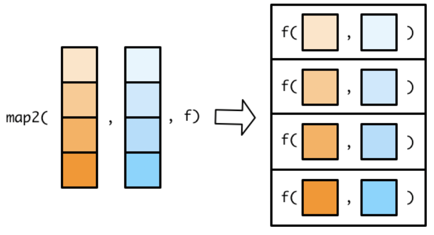

```{r setup}
#| include: false
#| message: false
library(tidyverse)
library(gt)
library(gtsummary)
```

## Wednesday, May 27

Today we will...

+ Group Quiz 8
+ New Material
  + Review of Simple Linear Regression
  + Assessing Model Fit
+ Work Time
  + Lab 9: Regression Exploration
  + Group Project


# Simple Linear Regression 


## NC Births Data

This dataset contains a random sample of 1,000 births from North Carolina in 2004 (sampled from a larger dataset).

+ Each case describes the birth of a single child, including characteristics of the:
  + child (birth weight, length of gestation, etc.).
  + birth parents (age, weight gained during pregnancy, smoking habits, etc.). 


## NC Births Data

```{r}
#| eval: false

library(openintro)
data(ncbirths)
slice_sample(ncbirths, n = 10) |> 
  knitr::kable() |> 
  kableExtra::scroll_box(height = "400px") |> 
  kableExtra::kable_styling(font_size = 30)
```

```{r}
#| echo: false
#| 
library(openintro)
slice_sample(ncbirths, n = 10) |> 
  knitr::kable() |> 
  kableExtra::scroll_box(height = "400px") |> 
  kableExtra::kable_styling(font_size = 30)
```

# Relationships Between Variables


## Relationships Between Variables

In statistical models, we generally have one variable that is the response and one or more variables that are explanatory.

:::: columns
::: column
+ **Response variable**
  + Also: $y$, dependent variable
  + This is the quantity we want to understand.
:::
::: column
+ **Explanatory variable**
  + Also: $x$, independent variable, predictor
  + This is something we think might be related to the response.
:::
::::


## Visualizing a Relationship

The scatterplot has been called the most "generally useful invention in the history of statistical graphics."

:::: {.columns}
::: {.column width="42%"}
```{r}
#| echo: false
#| fig-width: 5
#| fig-height: 4
#| fig-align: center
ggplot(data = bdims, aes(y = wgt, x = hgt)) + 
  geom_point() +
  scale_x_continuous("Explanatory Variable", labels = NULL) + 
  scale_y_continuous("Response Variable", labels = NULL) +
  theme(axis.title = element_text(size = 20))
```
:::
::: {.column width="58%"}

**Characterizing Relationships**

+ Form: linear, quadratic, non-linear?
+ Direction: positive, negative?
+ Strength: how much scatter/noise?
+ Unusual observations: do points not fit the overall pattern?

:::
::::


## Your turn!

How would you characterize this relationship? 

:::: {.columns}
::: {.column width="30%"}
- Shape?
- Direction?
- Strength?
- Outliers?
:::
::: {.column width="70%"}
```{r}
#| echo: false
#| fig-height: 5
#| fig-width: 10
ncbirths |> 
ggplot(aes(x = weeks, y = weight)) +
  geom_jitter() + 
  labs(x = "Length of pregnancy (in weeks)",
       y = "Birth weight of baby (in lbs)") +
  theme(axis.title = element_text(size = 20),
        axis.text = element_text(size = 18))
```
:::
::::

. . .

Note: Much of what we are doing at this stage involves making judgment calls!

::: {.notes}
As we work through these, please keep in mind that much of what we are doing at this stage involves making judgment calls. This is part of the nature of statistics, and while it can be frustrating - especially as a beginner - it is inescapable. For better or for worse, statistics is not a field where there is one right answer. There are of course an infinite number of indefensible claims, but many judgments are open to interpretation.

There isn’t a universal, hard-and-fast definition of what constitutes an outlier, but they are often easy to spot in a scatterplot.

+ What observations would you consider to be outliers?
+ How would you go about removing these outliers from the data?
:::


## Fitting a Model

We often assume the value of our response variable is **some function** of our explanatory variable, plus some random noise.

$$response = f(explanatory) + noise$$

+ There is a mathematical function $f$ that can translate values of one variable into values of another.
+ But there is some randomness in the process. 


## Simple Linear Regression (SLR)

If we assume the relationship between $x$ and $y$ takes the form of a **linear function**...

$$
  response = intercept + slope \times explanatory + noise
$$

. . .

We use the following notation for this model:

:::: columns
::: column
**Population** Regression Model

$Y_i = \beta_0 + \beta_1 X_i + \varepsilon_i$  

where $\varepsilon \sim N(0, \sigma)$ is the random noise.
:::
::: column

**Fitted** Regression Model 

$\hat{y}_i = \hat{\beta}_0 + \hat{\beta}_1 x_i$

where &nbsp; $\hat{}$ &nbsp; indicates the value was estimated.
:::
::::


## Fitting an SLR Model 

::: panel-tabset

### Question

Regress baby birthweight (response variable) on the pregnant parent's weight gain (explanatory variable).

+ We are assuming there is a linear relationship between how much weight the parent gains and how much the baby weighs at birth.

### <font size = 6> `geom_smooth` </font>

When visualizing data, fit a regression line ($y$ on $x$) to your scatterplot.

```{r}
#| code-line-numbers: "4"
#| fig-width: 5
#| fig-height: 2.8
#| fig-align: center
ncbirths |> 
  ggplot(aes(x = gained, y = weight)) +
  geom_jitter() + 
  geom_smooth(method = "lm") 
```

### <font size = 6> `lm` </font>

The `lm()` function fits a **l**inear regression **m**odel.

+ We use *formula* notation to specify the response variable (LHS) and the explanatory variable (RHS) `y ~ x`.
+ This code creates an `lm` object.

```{r}
ncbirth_lm <- lm(weight ~ gained, 
                 data = ncbirths)
```

:::

## Model Outputs

::: panel-tabset

### `lm` object

```{r}
summary(ncbirth_lm)
```

### Coefficients `broom`

```{r}
#| eval: false
broom::tidy(ncbirth_lm)
```

```{r}
#| echo: false
broom::tidy(ncbirth_lm) |>  
  knitr::kable() |> 
  kableExtra::kable_styling(font_size = 30)
```

:::: {.columns}
::: {.column width="50%"}

+ **Intercept**: expected *mean* of $y$, when $x$ is 0.
  + Someone gaining 0 lb, will have a baby weighing 6.63 lbs, on average.

:::
::: {.column width="50%"}

+ **Slope**: expected change in the *mean* of $y$, when $x$ increases by 1 unit.
  + For each pound gained, the baby will weigh 0.016 lbs more, on average.

:::
::::


### Residuals

The difference between *observed* (point) and *expected* (line).

<br>

:::: {.columns}
::: {.column width="50%"}
```{r}
ncbirth_lm$residuals |> 
  head(3)
```
:::
::: {.column width="50%"}
```{r}
resid(ncbirth_lm) |> 
  head(3)
```

:::
::::

```{r}
#| eval: false
broom::augment(ncbirth_lm) |> 
  head(3)
```

```{r}
#| echo: false
broom::augment(ncbirth_lm) |> 
  head(3) |> 
  knitr::kable() |> 
  kableExtra::scroll_box(height = "175px") |> 
  kableExtra::kable_styling(font_size = 25)
```


:::

# Diagnostics

## Model Diagnostics

There are four conditions that must be met for  a linear regression model to be appropriate:

1. **L**inear relationship.
2. **I**ndependent observations.
3. **N**ormally distributed residuals.
4. **E**qual variance of residuals.


## Model Diagnostics

::: panel-tabset

### Linearity

**Is the relationship linear?**

:::: {.columns}
::: {.column width="38%"}
+ Almost nothing will look perfectly linear.
+ Be careful with relationships that have curvature.
+ Try transforming your variables!
:::
::: {.column width="62%"}
```{r}
#| echo: false
#| fig-width: 10
#| fig-height: 6
library(patchwork)
## curvature
p1 <- ggplot(ncbirths, aes(x = weeks, y = weight)) +
  geom_jitter(alpha = 0.5) +
  geom_smooth(method = "lm") +
  labs(x = "Length of pregnancy (in weeks)", y = "Birth weight of baby (in lbs)")

p2 <- ggplot(ncbirths, aes(x = weeks, y = weight)) +
  scale_y_log10() +
  scale_x_log10() +
  geom_jitter(alpha = 0.5) +
  geom_smooth(method = "lm") +
  labs(x = "Length of pregnancy (in log weeks)", y = "Birth weight of baby (in log lbs)")

p1 + p2
```
:::
::::

### Independence

**Are the observations independent?**  &emsp;  Difficult to tell!

:::: {.columns}
::: {.column width=45%}
**What does independence mean?**

Should not be able to know the $y$ value for one observation based on the $y$ value for another observation. 
:::
::: {.column width=55%}
**Independence violations:**

+ Stock market prices over time.
+ Geographical similarities.
+ Biological conditions of family members.
+ Repeated observations.
:::
::::

### Normality

**Are the residuals normally distributed?**

Less important than linearity or independence: 

```{r}
#| echo: false
#| fig-height: 4
ncbirth_lm |> 
  broom::augment() |> 
  ggplot(aes(x = .resid)) +
  geom_histogram(aes(y = ..density..)) +
  stat_function(fun = ~ dnorm(.x, mean = 0, sd = 1),
                color = "steelblue", lwd = 1.5) +
  xlab("Residuals") +
  theme(aspect.ratio = 1)
```


### Equal Variance

**Do the residuals have equal (constant) variance?**

:::: columns
::: column
- The variability of points around the regression line is roughly
constant.
- Data with non-equal variance across the range of $x$ can seriously mis-estimate the variability of the slope. 

:::
::: column

```{r}
#| eval: false
ncbirth_lm |> 
  augment() |> 
  ggplot(aes(x = .fitted, y = .resid)) +
  geom_point() +
  geom_hline(yintercept = 0, linetype = "dashed", 
             color = "red", lwd = 1.5)
```

```{r}
#| echo: false
p1 <- ncbirths |> 
  filter(weeks > 26) %>% 
  ggplot(aes(x = weeks, y = weight)) +
  geom_jitter() +
  geom_smooth(method = "lm") +
  labs(x = "Length of pregnancy (in weeks)", y = "Birth weight of baby (in lbs)") +
  theme(axis.title = element_text(size = 24),
        axis.text = element_text(size = 20))

p2 <- ggplot(data = ncbirth_lm, aes(x = .fitted, y = .resid)) +
  geom_point() +
  geom_hline(yintercept = 0, linetype = "dashed", color = "red", lwd = 1.5) +
  xlab("Fitted values") +
  ylab("Residuals") +
  theme(axis.title = element_text(size = 24),
        axis.text = element_text(size = 20))

p1 + p2
```
:::
::::
:::


## Assessing Model Fit

**Sum of Square Errors (SSE)**

  + This is calculated as the sum of the squared residuals.
  + A small SSE means small differences between observed and fitted values.
  + Also: *Sum Sq of Residuals* or *deviance*.


## Assessing Model Fit

**Root Mean Square Error (RMSE)**

:::: {.columns}
::: {.column width=44%}
  + The standard deviation of the residuals.
  + A small RMSE means small differences between observed and fitted values.
  + Also: *Residual standard error* or *sigma*.
  
:::
::: {.column width=55%}

```{r}
summary(ncbirth_lm)
```

:::
::::

## Assessing Model Fit

**R-squared**

  + The proportion of variability in response accounted for by the linear model.
  + A large R-squared means the explanatory variable is good at explaining the response.
  + R-squared is between 0 and 1.

```{r}
broom::glance(ncbirth_lm) |> 
  knitr::kable()
```


## Model Comparison

Regress baby birthweight on...

:::: columns
::: column
... gestation weeks.
```{r}
weight_weeks <- lm(weight ~ weeks, 
                   data = ncbirths)
```

- SSE = 1246.55 
- RMSE = 1.119
- $R^2$ = 0.449
:::
::: column
... number of doctor visits.
```{r}
weight_visits <- lm(weight ~ visits, 
                    data = ncbirths)
```

- SSE = 2152.74
- RMSE = 1.475
- $R^2$ = 0.01819
:::
::::

. . .

Why does it make sense that the left model is better?


## Multiple Linear Regression

When fitting a linear regression, you can include...

...multiple explanatory variables.

`lm(y ~ x1 + x2 + x3 + ... + xn)`

...interaction terms.

`lm(y ~ x1 + x2 + x1:x2)`

`lm(y ~ x1*x2)`

...quadratic relationships.

`lm(y ~ I(x1^2) + x1)`


## Communicating Regression Model Results

- You can report the estimated linear model:

$$\hat{y}_i = 6.6 + .016x_i$$

where $\hat{y}_i$ is the estimated birth weight in pounds and $x_i$ is the weight gained during pregnancy by the birthing parent in pounds.

- Discuss the slope:
  - Think about units that are helpful for interpretation!
  - e.g.: We estimate that for every **10** pounds gained during pregnancy by the birthing parent the baby will weigh around **2.5 ounces** more, on average.
  
## Regression Table

- Commonly researchers will include a table like this to report the estimated coefficients and inference:

```{r}
ncbirth_lm |> 
  tbl_regression(intercept = TRUE)
```
- This is a nice build-it function from an extension of the `gt` package (`gtsummary`)

# Putting it together: Fitting SLR On Subsets

## The `map2()` Family

These functions allow us to iterate over **two** lists at the same time.

{width=60%}

. . .

Each function has **two** list arguments, denoted `.x` and `.y`, and a function argument.

## Small `map2()` Example

Find the minimum.

```{r}
a <- c(1, 2, 4)
b <- c(6, 5, 3)

map2_chr(.x = a, 
         .y = b,
         ~ str_glue("The minimum of {.x} and {.y} is {min(.x, .y)}."))
```


## `nest()` and `unnest()`

+ We can pair functions from the `map()` family very nicely with two `tidyr` functions: `nest()` and `unnest()`.
+ These allow us to easily map functions onto subsets of the data.


## `nest()`

**Nest** subsets the data (as tibbles) inside a tibble.

+ Specify the column(s) to create subsets on.

:::: {.columns}
::: {.column width="50%"}
```{r}
#| echo: true
ncbirths |> 
  nest(premie_dat = -premie)
```
:::
::: {.column width="50%"}
```{r}
ncbirths |> 
  nest(ph_dat = -c(premie, habit))
```

:::
::::

## `unnest()`

**Un-nest** the data by row binding the subsets back together.

+ Specify the column(s) that contains the subsets.

```{r}
#| echo: true
ncbirths |> 
  nest(premie_dat = -premie) |> 
  unnest(premie_dat) |> 
  head()
```


## Big `map2()` Example - Regression

::: panel-tabset

### `nest()`

```{r}
ncbirths_clean <- ncbirths |> 
    filter(!if_any(.cols = c(premie, habit, weight, gained),
                 .fns = is.na))

ncbirths_clean |> 
  nest(ph_dat = -c(premie, habit))
```

### `lm()`

```{r}
ncbirths_clean |> 
  nest(premie_smoke_dat = -c(premie, habit)) |> 
  mutate(mod = map(premie_smoke_dat, 
                   ~ lm(weight ~ gained, data = .x)))
```

### `predict()`

```{r}
ncbirths_clean |> 
  nest(premie_smoke_dat = -c(premie, habit)) |> 
  mutate(mod = map(premie_smoke_dat, 
                   ~ lm(weight ~ gained, data = .x)),
         pred_weight = map2(.x = mod,
                         .y = premie_smoke_dat, 
                         .f = ~ predict(object = .x, data = .y)))
```

### `unnest()`

```{r}
ncbirths_clean |> 
  nest(premie_smoke_dat = -c(premie, habit)) |> 
  mutate(mod = map(premie_smoke_dat, 
                   ~ lm(weight ~ gained, data = .x)),
         pred_weight = map2(.x = mod,
                         .y = premie_smoke_dat, 
                         .f = ~ predict(object = .x, data = .y))) |> 
  select(-mod) |> 
  unnest(cols = c(premie_smoke_dat, pred_weight)) |> 
  select(premie, habit, weight, gained, pred_weight) |> 
  head()
```

:::


## Example Cont. - Regression Coefficients

::: panel-tabset

### `nest()` + `lm()`

```{r}
ncbirths_clean |> 
  nest(premie_smoke_dat = -c(premie, habit)) |> 
  mutate(mod = map(premie_smoke_dat, 
                   ~ lm(weight ~ gained, data = .x)),
         coefs = map(mod,
                      ~ broom::tidy(.x))) 
```


### Pull Coefficients

```{r}
#| code-line-numbers: "7-8"

ncbirths_clean |> 
  nest(premie_smoke_dat = -c(premie, habit)) |> 
  mutate(mod = map(premie_smoke_dat, 
                   ~ lm(weight ~ gained, data = .x)),
         coefs = map(mod,
                      ~ broom::tidy(.x))) |> 
  select(premie, habit, coefs) |> 
  unnest(cols = coefs)
```

### Format Table


```{r}
#| code-fold: true

ncbirths_clean |> 
  nest(premie_smoke_dat = -c(premie, habit)) |> 
  mutate(mod = map(premie_smoke_dat, 
                   ~ lm(weight ~ gained, data = .x)),
         coefs = map(mod,
                      ~ broom::tidy(.x))) |> 
  select(premie, habit, coefs) |> 
  unnest(cols = coefs) |> 
  mutate(term = fct_recode(.f = term,
                            "Intercept" = "(Intercept)",
                            "Mother Weight Gain (lb.)" = "gained"
                            )) |> 
  select(-std.error, -statistic) |> 
  mutate(p.value = case_when(p.value < .0001 ~ "<.001",
                             TRUE ~ as.character(round(p.value, 3)))) |> 
  arrange(premie, habit, term) |> 
  gt() |> 
  fmt_number(estimate,
             decimals = 3) |> 
  tab_row_group(
    label = md("**Premature + Smoker**"),
    rows = premie == "premie" & habit == "smoker") |> 
  tab_row_group(
    label = md("**Premature + Non-Smoker**"),
    rows = premie == "premie" & habit == "nonsmoker") |> 
  tab_row_group(
    label = md("**Full Term + Smoker**"),
    rows = premie == "full term" & habit == "smoker") |> 
  tab_row_group(
    label = md("**Full Term + Non-Smoker**"),
    rows = premie == "full term" & habit == "nonsmoker") |> 
  cols_hide(c(premie, habit)) |> 
  cols_align(align = "left",
             columns = term) |> 
  tab_style(
    style = cell_fill(color = "gray85"),
    locations = cells_row_groups()) |> 
  cols_label(
    "term" = md("**Model & Term**"),
    "estimate" = md("**Est. Coef.**"),
    "p.value" = md("**p-value**")
  ) 
```

:::


## Lab 9: Regression Exploration


## To do...

+ **Optional Project Checkpoint 4**
  + Due Friday 5/29 at 11:59pm.
  
+ **Lab 9: Simulation Exploration**
  + Due Tuesday 6/2 at 11:59pm.

+ **Required [Reading](../../reading/week-9.qmd)**
  + Review the material from this week for the final Group Quiz Monday
